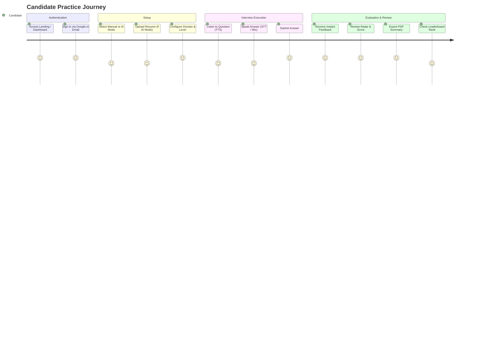

# Document 01 — Product Requirements Document (PRD)

**Product Name**: PrepMatrix  
**Document Version**: 1.0.0  
**Status**: Production Baseline  
**Auditor**: Senior Software Architect / Forensic Code Reviewer  
**Last Updated**: September 24, 2026  

---

## 1. Product Overview

### 1.1 Product Name & Brand Identity
**PrepMatrix** (Internal codebase identifiers: `prepmatrix`, `prep-matrix`, `ai-interview-simulator-auth`).  
Brand Motto: *"Prepare Smarter. Perform Better. Get Hired."*

### 1.2 Purpose & Product Summary
PrepMatrix is a comprehensive interview preparation Software-as-a-Service (SaaS) web application. It bridges the gap between passive study and active interview performance by providing structured practice across two complementary paradigms:
1. **Manual Practice Mode**: A structured, deterministic question runner covering **97 career domains** across 15 industries, calibrated across 3 difficulty tiers with automated scoring based on keyword coverage, synonyms, semantic relevance, and structural completeness.
2. **AI Multimodal Interview Mode**: A resume-aware, adaptive simulation powered by **Google Gemini 2.5 Flash**, combining client-side PDF resume parsing, dynamic question synthesis, live camera preview, real-time speech-to-text response capture, structured rubric grading, and instant PDF report generation.

### 1.3 Problem Addressed
- **Scattered & Uncalibrated Questions**: Most online interview resources provide static, generic question lists that lack domain specialization or difficulty progression.
- **Absence of Objective Feedback**: Independent practice does not provide structured feedback on technical depth, communication clarity, or structure.
- **Disconnect from Candidate Resumes**: General mock interviews do not test candidates on the specific claims, frameworks, or metrics stated in their resumes.
- **Mobile Usability Gaps**: Most technical prep tools lack native-feeling mobile gesture navigation for practice on the go.

### 1.4 Target Users
- Software Engineers, Developers, and DevOps practitioners.
- Data Scientists, AI Engineers, and Machine Learning Specialists.
- Product Managers, Business Analysts, and Management Consultants.
- Healthcare, Legal, Finance, Education, Hospitality, and Public Sector professionals.
- Career switchers, university graduates, and active job seekers.

### 1.5 Product Scope
- **In-Scope**: Web-based responsive single page application, user authentication (email/password & Google OAuth), profile configuration, avatar and resume storage, manual question bank runner, Gemini AI proxy integration, resume parsing & ATS evaluation, public leaderboard, public candidate directory, admin user management, dark/light theme toggle, and mobile swipe navigation.
- **Out-of-Scope / Future**: Real-time peer-to-peer mock interviews with human recruiters, video recording persistence/playback to cloud storage, payment gateways / subscription billing, and native iOS/Android mobile apps.

---

## 2. Product Goals

### 2.1 Implemented Goals (Verified from Code)
- Provide immediate, structured manual practice across 97 distinct professional disciplines.
- Parse candidate resumes entirely client-side without requiring server-side OCR dependencies.
- Synthesize customized interview questions from resume content and evaluate answers with structured rubrics via Gemini AI.
- Enable multimodal practice using browser-native Speech Synthesis (TTS), Speech Recognition (STT), and WebRTC camera preview.
- Track session histories, score percentiles, and display global leaderboards.
- Deliver high-performance mobile gesture navigation using simulated spring physics.

### 2.2 Inferred Goals
- Create a recruiter-facing candidate discovery portal (`/candidates`) allowing hiring teams to inspect top-performing candidate profiles.
- Enable administrative oversight of platform usage, user roles, and system statistics.

### 2.3 Undocumented / Unimplemented Goals
- Automated scheduled email reminders or weekly digest newsletters (EmailJS is configured only for outbound user feedback).
- Paid tiers, paywalls, or Stripe billing integrations.

---

## 3. User Personas

| Persona | Role / Background | Primary Needs | Key PrepMatrix Feature Fit | Evidence Source |
|---|---|---|---|---|
| **Priya Sharma** | CS College Graduate | Structured practice questions, progressive difficulty tiers, foundational feedback. | Manual Mode (97 domains, 5,820 questions), Results radar chart, Leaderboard | `src/app/pages/ManualMode.tsx` |
| **Marcus Vance** | Senior DevOps Engineer (8+ yrs) | Tough scenario-based questions tailored directly to his AWS/Kubernetes resume experience. | AI Mode resume upload, Gemini dynamic question generator, PDF report export | `src/app/modules/aiMode/AIInterviewPage.tsx` |
| **David Chen** | Career Switcher to Product Management | Constructive AI feedback on structured thinking (STAR method), ATS resume optimization. | Resume ATS Analyzer (`/resume-analysis`), Gemini instant answer feedback | `src/app/pages/ResumeAnalysis.tsx` |
| **Amina Al-Mansoor**| Mobile Learner / Commuter | Smooth mobile navigation, gesture support, quick 5-question practice sessions. | Mobile swipe drawer (`useMobileSwipeDrawer.ts`), 5-question manual mode | `src/app/components/drawerGesturePhysics.ts` |
| **System Admin** | Platform Administrator | Overseeing users, promoting administrators, purging abusive accounts, tracking platform stats. | Admin Panel (`/admin`), guarded by `AdminRoute` | `src/app/pages/AdminPanel.tsx` |

---

## 4. User Problems & Solutions

| Identified Problem | Implemented Solution in PrepMatrix | Evidence |
|---|---|---|
| Inability to gauge how an applicant tracking system (ATS) evaluates a resume. | Algorithmic ATS analyzer scoring keyword density, missing domain skills, soft skills, and action verbs. | `src/app/utils/resumeAnalyzer.ts` |
| Practicing aloud alone feels unrealistic and unstructured. | Speech-to-text voice answering and optional live camera preview in an immersive full-screen shell. | `src/app/modules/aiMode/components/ImmersiveInterviewShell.tsx` |
| LLM API rate limits or network outages blocking candidate practice. | Dual-layer resilience: automated retry backoff (3 attempts) on proxy + client-side heuristic question generator fallback. | `Frontend/PrepMatrix/server/geminiProxy.js`, `geminiClient.ts` |
| Inability to share or review interview feedback offline. | Automated client-side PDF report generation summarizing questions, scores, confidence levels, and strengths. | `src/app/modules/aiMode/utils/generateInterviewReportPdf.ts` |
| Accidental horizontal gestures conflicting with vertical scrolling on mobile. | Strict directional locking algorithm requiring dominant horizontal vector before activating drawer. | `src/app/components/drawerGesturePhysics.ts` |

---

## 5. Core Features Breakdown

### 5.1 Manual Practice Mode
- **Purpose**: Provide predictable, repeatable practice against standardized questions.
- **Target User**: Candidates seeking domain-focused question drilling.
- **Workflow**: Select Category -> Select Domain (from 97) -> Select Difficulty (Beginner / Intermediate / Advanced) -> Select Question Count (5, 10, 15, 20) -> Launch Session -> Read / Hear Question -> Type / Speak Answer -> Submit -> Review Instant Feedback -> View Session Summary.
- **Inputs**: Domain ID, difficulty tier, question count, candidate text/audio answers.
- **Outputs**: Score (0-100), matched keywords, strengths, improvements, radar visualization.
- **Dependencies**: Static question bank (`src/app/data/questionBank.ts`), evaluation engine (`src/app/utils/evaluation.ts`), Supabase `interview_sessions`.

### 5.2 AI Multimodal Interview Mode
- **Purpose**: Tailor questions directly to a candidate's resume and grade answers using Gemini AI.
- **Target User**: Experienced professionals and job applicants preparing for specific roles.
- **Workflow**: Upload PDF resume or paste text -> Configure question count (5, 7, 10, 12) & difficulty -> Preview parsed profile & camera -> Enter Immersive Shell -> Answer questions via voice/text -> Receive Gemini score & rubric feedback -> Review Session Summary -> Export PDF report.
- **Inputs**: Resume PDF/text, microphone audio stream, webcam video stream, answer text.
- **Outputs**: AI score, confidence level (Low/Medium/High), clarity rating, actionable improvement bullets, downloadable PDF report.
- **Dependencies**: `pdfjs-dist`, Vercel `/api/gemini` proxy, Web Speech API, `jspdf`.

### 5.3 Resume ATS Scanner & Analyzer
- **Purpose**: Benchmark resumes against target domain requirements.
- **Target User**: Job applicants optimizing their resumes for ATS screening.
- **Workflow**: Upload resume -> Select target domain -> Run analysis -> Review ATS score, missing skills list, recommended action verbs, and priority improvements.
- **Inputs**: File upload (PDF/DOCX/TXT) or pasted text, target domain ID.
- **Outputs**: ATS match score (0-100), present skills list, top 10 missing skills, experience tier ('entry', 'mid', 'senior', 'expert').
- **Dependencies**: `resumeAnalyzer.ts`, Supabase `resumes` and `resume_analysis` tables, Supabase storage bucket `resumes`.

### 5.4 Global Leaderboard & Talent Directory
- **Purpose**: Gamify preparation and showcase top candidates.
- **Target User**: All registered candidates and prospective employers.
- **Workflow**: Completed sessions automatically record scores; the leaderboard aggregates average scores and total sessions; the Candidates page exposes searchable public profiles.
- **Dependencies**: Supabase `interviews` table, RPC `get_leaderboard`, RPC `get_public_candidates`.

### 5.5 Administration Panel
- **Purpose**: Platform administration and user governance.
- **Target User**: Users with `role === 'admin'`.
- **Workflow**: Admin logs in -> Navigates to `/admin` -> Views platform KPIs -> Searches users -> Promotes/demotes user roles -> Deletes user accounts.
- **Dependencies**: `AdminRoute`, `AdminPanel.tsx`, RPC `admin_list_users`, `admin_update_user_role`, `admin_delete_user`, `admin_platform_stats`.

---

## 6. User Journeys

---

## 7. Functional Requirements

| ID | Actor | Trigger | Expected System Behavior | Source Evidence |
|---|---|---|---|---|
| **FR-001** | User | Submits signup form | Validates email, enforces password length >= 6, creates Supabase auth account and profile row. | `src/services/authService.ts#L17-L42` |
| **FR-002** | User | Clicks "Continue with Google" | Initiates Supabase Google OAuth flow with redirect back to application origin. | `src/services/authService.ts#L44-L63` |
| **FR-003** | User | Logs out | Terminates Supabase session, removes stored auth tokens from localStorage and cookies, redirects to `/login`. | `src/lib/supabaseClient.ts#L67-L86` |
| **FR-004** | Candidate | Selects domain in Manual Mode | Filters question catalog to requested domain; loads 20 questions per level. | `src/app/data/questions.ts#L47-L58` |
| **FR-005** | Candidate | Starts Manual Interview | Shuffles question bank, limits question count to selected count (5, 10, 15, or 20), creates session record. | `src/app/data/questions.ts#L83-L107` |
| **FR-006** | Candidate | Clicks read aloud icon | Speaks question text aloud using `window.speechSynthesis` at 0.9x speed. | `src/app/utils/speech.ts#L10-L36` |
| **FR-007** | Candidate | Clicks microphone button | Activates speech recognition, streams interim transcript, debounces final transcript into input. | `src/app/utils/speech.ts#L115-L215` |
| **FR-008** | Candidate | Submits manual answer | Runs heuristic evaluation: calculates weighted keywords, cosine similarity, structural punctuation, and relevance. | `src/app/utils/evaluation.ts#L185-L403` |
| **FR-009** | Candidate | Completes manual session | Calculates overall session score average, creates `public.interviews` summary, navigates to `/results/:id`. | `src/app/pages/Interview.tsx#L270-L330` |
| **FR-010** | Candidate | Uploads PDF resume in AI Mode | Uses `pdfjs-dist` to extract plain text up to 7,000 characters; displays preview. | `src/app/modules/aiMode/utils/resumeTextExtractor.ts#L14-L56` |
| **FR-011** | Candidate | Requests AI interview prep | Dispatches prompt to `/api/gemini`; extracts domain, skills, summary, strengths, and customized questions. | `src/app/modules/aiMode/services/geminiClient.ts#L504-L533` |
| **FR-012** | System | Gemini API times out or fails | Gracefully falls back to offline heuristic question generator matching extracted resume skills. | `src/app/modules/aiMode/services/geminiClient.ts#L573-L645` |
| **FR-013** | Candidate | Toggles camera preview | Requests `navigator.mediaDevices.getUserMedia`; renders mirror video stream in corner of interview shell. | `src/app/modules/aiMode/components/CameraPreview.tsx#L55-L95` |
| **FR-014** | Candidate | Submits answer in AI Mode | Calls Gemini evaluation rubric; parses JSON score, confidence level, clarity, strengths, and improvements. | `src/app/modules/aiMode/services/geminiClient.ts#L535-L571` |
| **FR-015** | Candidate | Clicks "Download PDF Report" | Compiles interview performance summary, score cards, and question feedback into PDF using `jspdf`. | `src/app/modules/aiMode/utils/generateInterviewReportPdf.ts#L1-L180` |
| **FR-016** | Candidate | Uploads resume in ATS Scanner | Parses resume, computes match against 20 domain skills, lists missing competencies and action verb suggestions. | `src/app/utils/resumeAnalyzer.ts#L47-L133` |
| **FR-017** | User | Toggles Dark / Light mode | Switches HTML root class between `dark` and `light`; updates state and local storage. | `src/app/contexts/SettingsContext.tsx#L40-L75` |
| **FR-018** | User | Edits Profile | Updates name, bio, target role, experience, skills, social links in `public.profiles`. | `src/services/profileService.ts#L320-L365` |
| **FR-019** | User | Uploads Avatar | Stores image file in Supabase `avatars` bucket and saves public URL in profile record. | `src/services/profileService.ts#L368-L415` |
| **FR-020** | Candidate | Navigates to Leaderboard | Fetches top 100 entries via `get_leaderboard` RPC; merges manual and AI stats; renders rank table. | `src/services/leaderboardService.ts#L18-L73` |
| **FR-021** | User | Accesses `/admin` as candidate | Route guard intercepts navigation; redirects non-admin user to `/dashboard`. | `src/app/components/ProtectedRoute.tsx#L15-L22` |
| **FR-022** | Admin | Updates user role in Admin Panel | Invokes RPC `admin_update_user_role` to toggle user between 'admin' and 'user'. | `src/services/profileService.ts#L524-L547` |
| **FR-023** | Admin | Deletes user in Admin Panel | Confirms deletion dialog; invokes RPC `admin_delete_user` to purge user records. | `src/services/profileService.ts#L549-L563` |
| **FR-024** | User | Submits Contact form in footer | Validates inputs; dispatches email via EmailJS client library using hardcoded service parameters. | `src/app/components/Footer.tsx#L62-L99` |

---

## 8. Non-Functional Requirements

### 8.1 Performance & Responsiveness
- **Initial Load Time**: Vite bundle chunks are code-split across routes; main index chunk is 1.56 MB (compressed gzip 439 kB).
- **Client Route Transitions**: Near-instantaneous SPA transitions (< 50ms) managed by React Router v7.
- **AI Latency Budget**: Upstream Gemini proxy timeout set to 12s per attempt, with a cumulative deadline budget of 30s.

### 8.2 Reliability & Fault Tolerance
- **AI Proxy Retry Policy**: 3 automatic retries with exponential backoff delays (`1s`, `2s`, `4s`) for HTTP 429, 500, and 503.
- **Offline Question Fallback**: If Gemini fails completely, AI mode falls back to deterministic rule-based question generation so candidates are never blocked.
- **Database Fallback**: If relational tables (`interviews`, `questions`, `responses`) are missing in Supabase, AI mode falls back to browser `localStorage`.

### 8.3 Accessibility
- **ARIA Primitives**: Built on Radix UI primitives ensuring keyboard accessibility, focus trapping in dialogs, and proper ARIA labeling.
- **Color Contrast**: Dark mode uses high contrast `#F4F7FB` text against deep slate `#0B0F17` backgrounds.

---

## 9. Verified Business Rules

1. **Manual Difficulty Scaling**:
   - Beginner: Emphasizes core terminology, definitions, and basic syntax.
   - Intermediate: Emphasizes real-world trade-offs, error handling, and component interaction.
   - Advanced: Emphasizes architectural patterns, edge cases, scalability, and distributed systems.
2. **Scoring Weight Distribution (Manual Mode)**:
   - Relevance: 35%
   - Weighted Keyword Coverage: 25%
   - Technical Depth: 25%
   - Structure & Articulation: 15%
3. **Keyword Density Penalty**:
   - If an answer has >12 tokens but <8% keyword density, a 15-point penalty is applied.
   - If an answer is identified as pure keyword stuffing (keywords with no sentence structure or explanation signals), score is penalized.
4. **Leaderboard Aggregation**:
   - Sorted primarily by `averageScore` descending, secondarily by `totalInterviews` descending, and thirdly by `highestScore` descending.
5. **Role-Based Authorization**:
   - Only users with `role === 'admin'` can access `/admin`.
   - Users cannot alter their own role or delete their own account from the Admin Panel.

---

## 10. External Integrations

1. **Supabase (Backend-as-a-Service)**: Authentication, PostgreSQL 15, Storage buckets (`avatars`, `resumes`).
2. **Google Gemini API**: Upstream generative language model (`gemini-2.5-flash`) for interview question generation and response grading.
3. **EmailJS**: Browser-based email forwarding for contact inquiries and bug reports.
4. **Vercel**: Edge hosting and serverless functions (`/api/gemini`).

---

## 11. Product Constraints & Known Gaps

- **Missing SQL Migrations**: Several RPC functions invoked by the client (`admin_list_users`, `admin_update_user_role`, `admin_delete_user`, `admin_platform_stats`, `get_public_candidates`, `get_leaderboard`) are missing from `Backend/supabase/schema.sql`.
- **Client-Side Admin Enforcement**: Route protection for `/admin` is evaluated on the client; database RPCs must enforce role security at the PostgreSQL level.
- **Hardcoded EmailJS Credentials**: Public keys are embedded directly in source code (`Footer.tsx`).
- **Live Deployment Desynchronization**: `https://prep-matrix.vercel.app` is currently hosting an older Next.js quiz platform.
