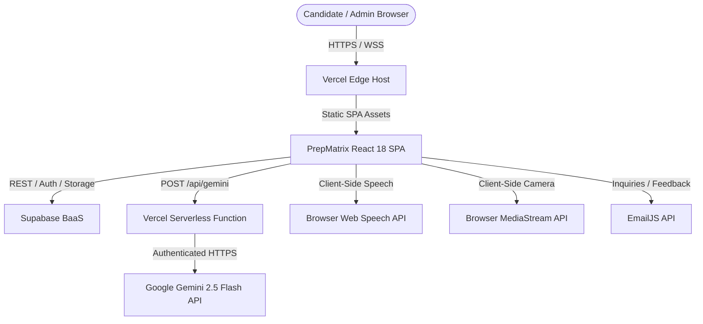

# Document 02 — Software Requirements Specification (SRS)

**Project**: PrepMatrix  
**Document Version**: 1.0.0  
**Status**: Production Baseline Specification  
**Auditor**: Senior Software Architect / Forensic Code Reviewer  
**Standard**: IEEE 830-1998 Adapted  
**Last Updated**: September 24, 2026  

---

## 1. Introduction

### 1.1 Purpose
This Software Requirements Specification (SRS) provides a definitive, engineering-grade specification of the **PrepMatrix** platform. It details the functional requirements, external interfaces, system behaviors, data models, error handling strategies, and non-functional constraints as verified from the production codebase.

### 1.2 Scope
PrepMatrix is a Single Page Application (SPA) with serverless backend capabilities designed to deliver automated, multimodal, domain-calibrated interview simulations. The system encompasses candidate authentication, profile management, manual practice drilling (97 domains, 5,820 questions), AI-powered resume interview generation (Gemini 2.5 Flash), automated answer evaluation, performance analytics, global leaderboards, candidate talent indexing, and administrative management.

### 1.3 Definitions, Acronyms, and Abbreviations
- **ATS**: Applicant Tracking System.
- **BaaS**: Backend-as-a-Service (specifically Supabase).
- **Cosine Similarity**: Vector space metric measuring term frequency alignment between candidate answers and reference answers.
- **HMR**: Hot Module Replacement (provided by Vite).
- **PGRST**: PostgREST error code format emitted by Supabase.
- **RLS**: Row-Level Security (PostgreSQL security policy mechanism).
- **SPA**: Single Page Application.
- **STT**: Speech-to-Text (speech recognition).
- **TTS**: Text-to-Speech (speech synthesis).
- **WebRTC**: Web Real-Time Communication (used for local camera preview).

### 1.4 References
- IEEE Std 830-1998: Recommended Practice for Software Requirements Specifications.
- PrepMatrix Source Code Repository (`https://github.com/Anilchetri01/Prep-Matrix.git`).
- Supabase Platform Documentation (`https://supabase.com/docs`).
- Google Gemini API Reference (`https://ai.google.dev/api`).

---

## 2. Overall System Description

### 2.1 Product Perspective
PrepMatrix operates as a client-centric web platform deployed on Vercel edge infrastructure. It delegates identity, persistent relational storage, and file assets to Supabase, while delegating LLM inference to the Google Gemini API through an intermediary serverless proxy.

### 2.2 User Classes & Roles
1. **Unauthenticated Visitor**: Can view the landing page (redirected to `/dashboard` which prompts login), sign up, log in, or initiate Google OAuth.
2. **Authenticated Candidate (`role: 'user'` or `'candidate'`)**: Can take manual interviews, take AI resume interviews, upload resumes, run ATS analysis, edit profiles, view dashboards, view histories, and inspect the leaderboard and candidate directory.
3. **Administrator (`role: 'admin'`)**: All candidate capabilities, plus access to `/admin` to view platform KPI charts, list all registered accounts, change user roles, and delete user accounts.

### 2.3 Operating Environment
- **Browser Compatibility**: Modern ECMAScript 2022+ browsers supporting Web Speech API (`webkitSpeechRecognition` or `SpeechRecognition`), `SpeechSynthesis`, and `navigator.mediaDevices.getUserMedia` (Google Chrome, Microsoft Edge, Brave, Safari, Firefox).
- **Client Resolution**: Mobile (min 320px width), tablet (768px), desktop (1024px to 1920px+).
- **Serverless Runtime**: Node.js 20 on Vercel Edge Serverless Functions.
- **Database Engine**: PostgreSQL 15 on Supabase Cloud.

### 2.4 Design Constraints
- All LLM API keys (`GEMINI_API_KEY`) must remain strictly server-side; the browser client communicates only through `/api/gemini`.
- The manual question bank must operate deterministically without requiring external API connectivity.
- Resume text parsing must be executed entirely on the client using WebAssembly/JavaScript (`pdfjs-dist`) to protect user data from unnecessary server-side storage.

---

## 3. Specific Functional Requirements (SRS-FR)

### Module 1: Authentication & Identity Management

#### SRS-FR-001: Email/Password Registration
- **Description**: The system shall register new user accounts using email and password.
- **Preconditions**: User must not be logged in. Email must not already exist in `auth.users`.
- **Inputs**: Email (valid email format), password (minimum 6 characters), full name.
- **Processing**: Client calls `authService.signup()`, which invokes `supabase.auth.signUp()`. Database trigger `on_auth_user_created` fires, creating a row in `public.profiles`.
- **Outputs**: Authenticated session tokens; User object with role 'user'.
- **Postconditions**: User is redirected to `/dashboard`.
- **Errors**: HTTP 400 if email is already registered or password < 6 chars.
- **Evidence**: `src/services/authService.ts#L17-L42`, `Backend/supabase/schema.sql#L203-L230`.

#### SRS-FR-002: Google OAuth Authentication
- **Description**: The system shall support one-click sign-in using Google credentials.
- **Preconditions**: User browser must allow popup or redirect to `accounts.google.com`.
- **Inputs**: Google OAuth grant token.
- **Processing**: `authService.signInWithGoogle()` calls `supabase.auth.signInWithOAuth({ provider: 'google' })`. Redirect URL is set to `window.location.origin`. Upon return, `AuthContext` consumes OAuth tokens from the URL hash.
- **Outputs**: Authenticated session; automatically provisioned profile.
- **Postconditions**: User is redirected to `/dashboard`.
- **Evidence**: `src/services/authService.ts#L44-L63`, `src/app/contexts/AuthContext.tsx#L59-L97`.

#### SRS-FR-003: Session Hydration & Expiry Management
- **Description**: The system shall restore existing sessions on application reload and purge expired credentials.
- **Preconditions**: Stored session exists in browser storage.
- **Processing**: On app bootstrap, `AuthContext` queries `supabase.auth.getSession()`. If session is expired or corrupt, `recoverInvalidSession()` clears `ai-interview-simulator-auth` and signs out locally.
- **Evidence**: `src/app/contexts/AuthContext.tsx#L141-L206`.

---

### Module 2: Manual Practice Interview Engine

#### SRS-FR-004: Domain Catalog Loading
- **Description**: The system shall load the curated career domain catalog of exactly 97 domains.
- **Inputs**: Category filter ID (`all`, `technology`, `ai-careers`, `business-management`, etc.).
- **Processing**: Filters `DOMAIN_CONFIGS` array by `category`.
- **Outputs**: Array of `DomainConfig` objects with id, name, icon, description, category.
- **Evidence**: `src/app/data/domains.config.ts#L50-L185`.

#### SRS-FR-005: Question Selection & Randomization
- **Description**: The system shall generate a randomized question set for a practice session.
- **Inputs**: `domainId`, `difficulty` ('beginner' | 'intermediate' | 'advanced'), `requestedCount` (5, 10, 15, or 20).
- **Processing**: `createManualInterviewQuestions()` retrieves the 20 pre-configured questions for that domain and tier from `questionBank.ts`, applies Fisher-Yates shuffle algorithm (`shuffleQuestions`), and slices to `requestedCount`.
- **Outputs**: Array of `Question` objects.
- **Evidence**: `src/app/data/questions.ts#L83-L115`.

#### SRS-FR-006: Heuristic Answer Scoring
- **Description**: The system shall deterministically grade manual answers in real time without external LLM calls.
- **Inputs**: Candidate answer string, Question object (keywords, weightedKeywords, expectedAnswer, concepts, expectedLength).
- **Processing**:
  1. *Weighted Keyword Score* ($S_k$): Calculates presence of target terms and mapped synonyms from `SYNONYM_MAP`.
  2. *Relevance Score* ($S_r$): $0.55 \times \text{KeywordCov} + 0.15 \times \text{ExpectedAnsCov} + 0.10 \times \text{QuestionTermCov} + 0.10 \times \text{ConceptCov} + 0.10 \times \text{CosineSim}$.
  3. *Technical Depth Score* ($S_d$): $0.60 \times \text{ExpectedAnsCov} + \min(30, \text{TechKeywordCov} \times 30) + \text{SignalBonus}$.
  4. *Structure Score* ($S_s$): Punctuation checks and explanation signal words ('because', 'therefore', 'helps', etc.).
  5. *Overall Score*: Weighted combination minus penalties for keyword stuffing or non-answers.
- **Outputs**: `EvaluationResult` with `score` (0-100), `confidenceScore`, `relevanceScore`, `feedback`, `matchedKeywords`, `strengths`, `improvements`.
- **Evidence**: `src/app/utils/evaluation.ts#L185-L403`.

---

### Module 3: AI Multimodal Interview Mode

#### SRS-FR-007: Client-Side Resume Parsing
- **Description**: The system shall extract text content from candidate PDF resumes in the browser.
- **Inputs**: User selected `.pdf` File object.
- **Processing**: `extractResumeText()` loads the file array buffer into `pdfjs-dist`, iterates through pages, extracts text tokens, normalizes whitespace, and truncates to 7,000 characters.
- **Outputs**: Plain text resume string.
- **Errors**: Emits toast error if file is encrypted or unreadable.
- **Evidence**: `src/app/modules/aiMode/utils/resumeTextExtractor.ts#L14-L56`.

#### SRS-FR-008: Dynamic AI Question Synthesis
- **Description**: The system shall generate personalized interview questions based on candidate resumes.
- **Inputs**: Resume text, difficulty level, question count (5, 7, 10, or 12).
- **Processing**: Dispatches JSON request to `/api/gemini` with system prompt `buildResumeAnalysisPrompt()`. Enforces strict JSON schema: `skills`, `domain`, `summary`, `strengths`, and `questions[]`.
- **Fallback**: If Gemini fails or times out, executes `buildFallbackQuestions()` using regex domain detection (`DOMAIN_HINTS`) and skill extraction (`SKILL_HINTS`).
- **Outputs**: `AIResumeInsights` object containing parsed metadata and customized questions.
- **Evidence**: `src/app/modules/aiMode/services/geminiClient.ts#L504-L645`.

#### SRS-FR-009: WebRTC Camera Preview
- **Description**: The system shall display a mirrored video preview of the candidate during the interview.
- **Inputs**: User camera permission grant.
- **Processing**: Invokes `navigator.mediaDevices.getUserMedia({ video: true, audio: false })`. Binds active `MediaStream` to HTML `<video autoplay playsinline muted>`.
- **Outputs**: Real-time camera feed in corner overlay. Video frames are never recorded or transmitted to any server.
- **Evidence**: `src/app/modules/aiMode/components/CameraPreview.tsx#L55-L95`.

#### SRS-FR-010: Gemini AI Answer Evaluation
- **Description**: The system shall grade AI interview answers across a four-dimensional rubric.
- **Inputs**: Domain, skills, difficulty, question text, candidate answer, time spent (seconds).
- **Processing**: Dispatches request to `/api/gemini` with prompt `buildAnswerEvaluationPrompt()`. Enforces schema requiring: `score` (0-100), `confidenceScore` (0-100), `confidenceLevel` ('low' | 'medium' | 'high'), `clarity` (0-100), `feedback`, `strengths[]`, `improvements[]`.
- **Outputs**: `AIAnswerEvaluation` object.
- **Evidence**: `src/app/modules/aiMode/services/geminiClient.ts#L535-L571`.

#### SRS-FR-011: PDF Performance Report Generation
- **Description**: The system shall export a formatted PDF report of completed AI sessions.
- **Inputs**: `AIInterviewSession` data.
- **Processing**: Uses `jsPDF` to render header, overall performance metrics, domain mastery, individual question transcripts, scores, and feedback bullets.
- **Outputs**: Triggered file download (`PrepMatrix_Interview_Report_<id>.pdf`).
- **Evidence**: `src/app/modules/aiMode/utils/generateInterviewReportPdf.ts#L1-L180`.

---

### Module 4: Resume ATS Scanner

#### SRS-FR-012: Domain Skill Gap Analysis
- **Description**: The system shall benchmark uploaded resumes against target domain skill sets.
- **Inputs**: Resume plain text, target domain ID.
- **Processing**: `analyzeResume()` matches text against `DOMAIN_SKILLS[domainId]`, `SOFT_SKILLS`, and `ACTION_VERBS`. Computes overall ATS score, identifies present skills, lists top 10 missing skills, and categorizes suggestions by priority.
- **Outputs**: `ResumeAnalysis` object.
- **Evidence**: `src/app/utils/resumeAnalyzer.ts#L47-L133`.

---

### Module 5: Talent Directory & Leaderboard

#### SRS-FR-013: Public Leaderboard Computation
- **Description**: The system shall display top candidate rankings.
- **Processing**: Calls RPC `get_leaderboard(limit_count: 100)`. Merges manual interview records from `public.interviews` with AI session statistics from `aiInterviewStatsService`. Sorts by `averageScore` desc, then `totalInterviews` desc.
- **Outputs**: Array of `LeaderboardEntry`.
- **Evidence**: `src/services/leaderboardService.ts#L18-L73`.

#### SRS-FR-014: Candidate Directory Exploration
- **Description**: The system shall allow exploration of public candidate profiles.
- **Processing**: Calls RPC `get_public_candidates`. Returns candidates with skills, experience level, portfolio links, and interview performance metrics.
- **Outputs**: Searchable and filterable candidate grid.
- **Evidence**: `src/services/profileService.ts#L450-L493`, `src/app/pages/Candidates.tsx`.

---

### Module 6: Administration Panel

#### SRS-FR-015: User Role Management
- **Description**: The system shall allow administrators to promote or demote user roles.
- **Preconditions**: Authenticated user must have `role === 'admin'`. Target user must not be self.
- **Processing**: Invokes RPC `admin_update_user_role({ target_user_id, new_role })`.
- **Evidence**: `src/services/profileService.ts#L524-L547`.

#### SRS-FR-016: User Deletion
- **Description**: The system shall allow administrators to delete user accounts.
- **Processing**: Invokes RPC `admin_delete_user({ target_user_id })`. Cascades deletion across profiles and user data.
- **Evidence**: `src/services/profileService.ts#L549-L563`.

---

## 4. External Interface Requirements

### 4.1 User Interfaces (UI Screens Inventory)

| Screen Name | Client Route | Route Guard | Description | Key Components |
|---|---|---|---|---|
| **Login** | `/login` | Public | Candidate email/password and Google OAuth sign in | `Login.tsx`, `GoogleAuthButton.tsx` |
| **Signup** | `/signup` | Public | Candidate account registration | `Signup.tsx` |
| **Dashboard** | `/dashboard` | `ProtectedRoute` | High-level performance KPIs, weekly activity charts, recent sessions | `Dashboard.tsx`, Recharts, `Navbar`, `Footer` |
| **Manual Practice Mode**| `/manual-mode` | `ProtectedRoute` | Domain grid (97 careers), category tabs, difficulty selector | `ManualMode.tsx` |
| **Manual Interview** | `/interview` | `ProtectedRoute` | Active practice session, chatbot runner, speech synthesis, microphone input | `Interview.tsx`, `speech.ts` |
| **Manual Results** | `/results/:id` | `ProtectedRoute` | Score breakdown, radar chart, strengths, suggestions, confetti animation | `Results.tsx`, `canvas-confetti` |
| **AI Interview Mode** | `/ai-mode` | `ProtectedRoute` | Multi-phase resume upload, camera check, immersive AI shell, PDF export | `AIInterviewPage.tsx`, `ImmersiveInterviewShell.tsx` |
| **AI Session Detail** | `/interview/:id` | `ProtectedRoute` | Detailed transcript review of an AI interview session | `AIInterviewSessionDetail.tsx` |
| **Interview History** | `/history` | `ProtectedRoute` | Tabular and card archive of completed manual and AI sessions | `InterviewHistory.tsx` |
| **Resume ATS Scanner** | `/resume-analysis`| `ProtectedRoute` | ATS score breakdown, missing skills, action verbs, role suggestions | `ResumeAnalysis.tsx` |
| **Leaderboard** | `/leaderboard` | `ProtectedRoute` | Global rankings by average score, total sessions, mastery badges | `Leaderboard.tsx` |
| **Candidates Directory**| `/candidates` | `ProtectedRoute` | Public talent search, candidate cards, detailed modal views | `Candidates.tsx` |
| **User Profile** | `/profile` | `ProtectedRoute` | Profile details, skills editor, social links, avatar uploader | `Profile.tsx` |
| **Settings** | `/settings` | `ProtectedRoute` | Dark/light theme toggle, sound effects, voice readout toggle | `Settings.tsx` |
| **Admin Panel** | `/admin` | `AdminRoute` | User administration, role toggles, deletion, platform statistics | `AdminPanel.tsx` |

### 4.2 Application Programming Interfaces (API Inventory)

| Method | Endpoint / Function | Auth Required | Request Body / Parameters | Response Payload | Error Statuses | Source File |
|---|---|---|---|---|---|---|
| `POST` | `/api/gemini` | None (Serverless Proxy) | `{ model?: string, contents: [...], generationConfig: {...} }` | Raw Gemini upstream JSON | 400 (Bad JSON), 405 (Not POST), 500 (No Key), 502 (Upstream Error), 504 (Timeout) | `Frontend/PrepMatrix/server/geminiProxy.js` |
| `RPC` | `ensure_user_profile` | Supabase Auth | `{ user_id, user_email, ... }` | `ProfileRow` | PGRST202 (Missing RPC) | `src/services/profileService.ts#L186` |
| `RPC` | `get_public_candidates` | Public / Auth | None | `PublicCandidateRow[]` | PGRST202 | `src/services/profileService.ts#L453` |
| `RPC` | `admin_list_users` | Admin Auth | None | `AdminUserRow[]` | PGRST202, 403 | `src/services/profileService.ts#L501` |
| `RPC` | `admin_update_user_role` | Admin Auth | `{ target_user_id, new_role }` | `ProfileRow` | PGRST202, 403 | `src/services/profileService.ts#L530` |
| `RPC` | `admin_delete_user` | Admin Auth | `{ target_user_id }` | `boolean` | PGRST202, 403 | `src/services/profileService.ts#L555` |
| `RPC` | `admin_platform_stats` | Admin Auth | None | `AdminStatsRpcPayload` | PGRST202, 403 | `src/services/interviewService.ts#L232` |
| `RPC` | `get_leaderboard` | Public / Auth | `{ limit_count: number }` | `LeaderboardRow[]` | PGRST202 | `src/services/leaderboardService.ts#L24` |
| `REST` | `emailjs.send` | Public Key | `{ from_email, from_name, message, reply_to, to_name }` | EmailJS OK (200) | 400, 403 | `src/app/components/Footer.tsx#L75` |

---

## 5. Non-Functional Requirements Matrix

| Requirement | Metric / Specification | Verification Status | Code Evidence |
|---|---|---|---|
| **Max AI Request Duration** | Timeout capped at 12s per attempt, 30s cumulative budget | Verified from code | `server/geminiProxy.js#L4-L5` |
| **Retry Policy** | 3 retries on HTTP 429, 500, 503 with delays [1s, 2s, 4s] | Verified from code | `server/geminiProxy.js#L6-L8` |
| **Max Resume Character Size**| 7,000 characters maximum forwarded to Gemini LLM | Verified from code | `src/app/modules/aiMode/services/geminiClient.ts#L12` |
| **Gesture Spring Settling** | Damped spring settles under 350ms with zero oscillation | Verified from tests | `scripts/testMobileDrawerGesture.mjs#L140-L165` |
| **Database Access Control** | Row Level Security enabled across 100% of tables | Verified from code | `Backend/supabase/schema.sql` |
| **Static Asset Caching** | Immutable 1-year cache headers (`max-age=31536000`) on `/assets/*` | Verified from configuration | `Frontend/PrepMatrix/vercel.json#L3-L12` |
| **Question Bank Scale** | 5,820 questions across 97 domains with zero validation warnings | Verified from tests | `scripts/validateManualQuestionBank.mjs` |
