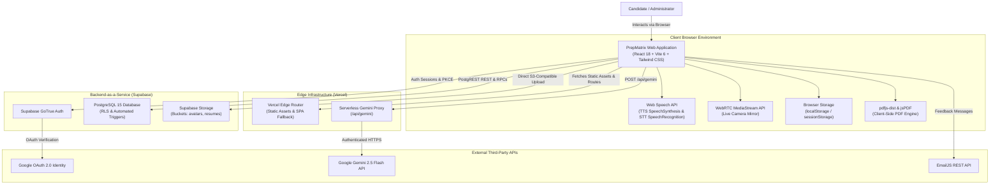
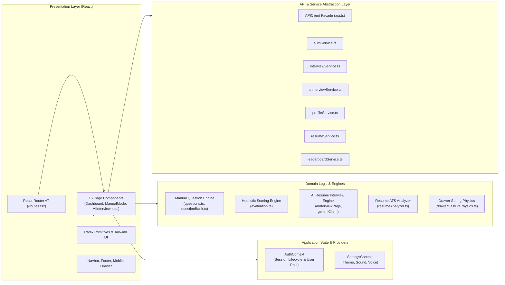
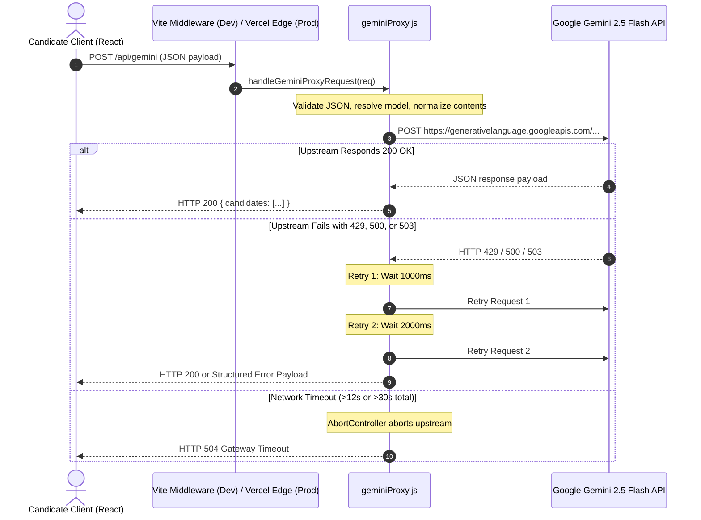
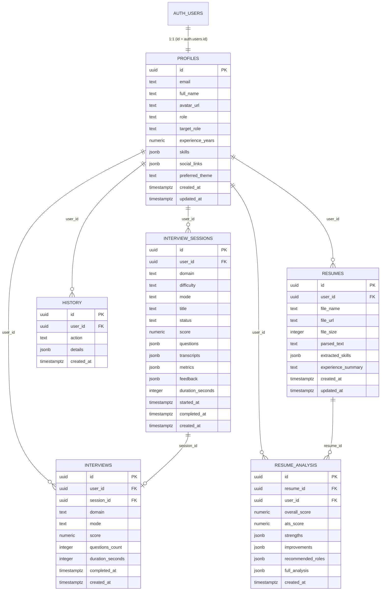
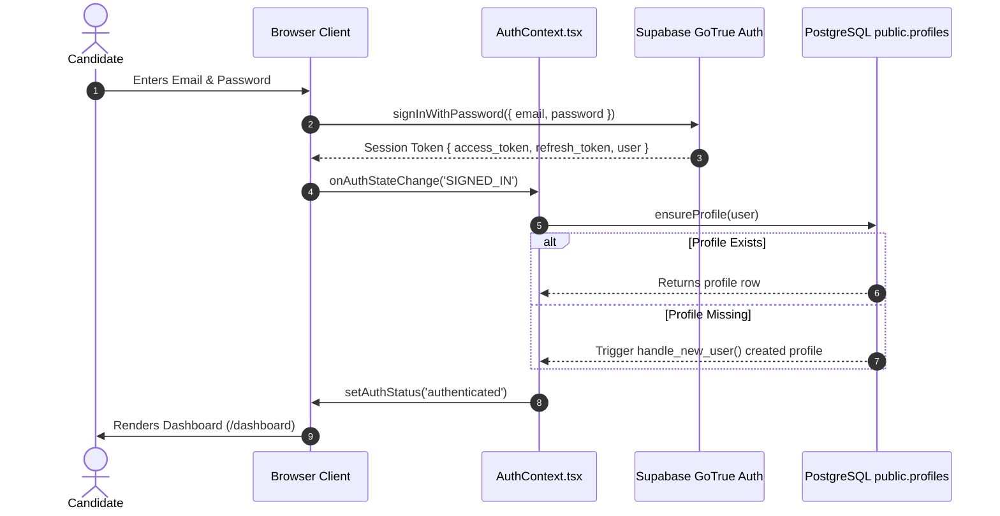
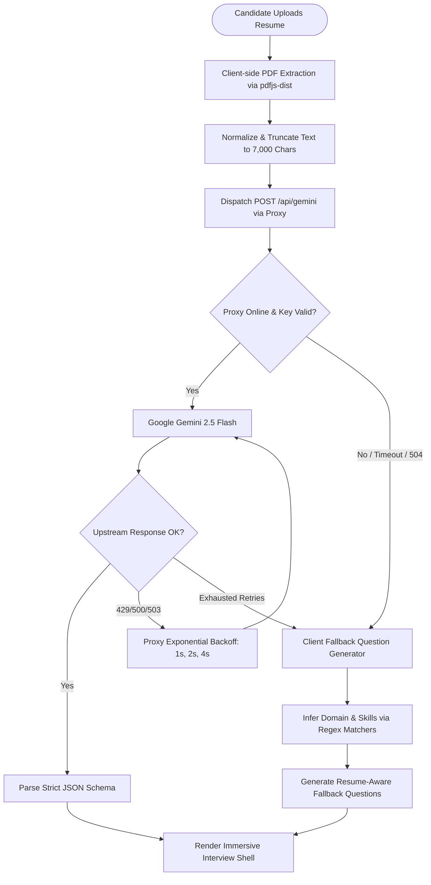

# Document 03 — Software Architecture Document (SAD)

**Project**: PrepMatrix  
**Document Version**: 1.0.0  
**Status**: Production Baseline  
**Auditor**: Senior Software Architect / Forensic Code Reviewer  
**Standard**: 4+1 Architectural View Model Adapted  
**Last Updated**: September 24, 2026  

---

## 1. Architecture Overview

PrepMatrix is engineered as a modern, decoupled **Single Page Application (SPA)** with serverless proxy capabilities and a managed **Backend-as-a-Service (BaaS)** persistence layer.

The architectural pattern centers on client-side state orchestration:
- The user interface is built on **React 18** and **TypeScript**, bundled via **Vite 6** using modern ES modules.
- Client-side routing is handled declaratively by **React Router v7** with lazy-loaded route boundaries.
- Authentication, relational PostgreSQL data, and binary object storage are provided by **Supabase**.
- Generative AI capabilities are decoupled from the browser via an intermediary **Vercel Serverless Function** proxy (`/api/gemini`), shielding upstream Google Gemini API keys while providing timeout guarding and automated exponential backoff retries.
- Client-side heuristic fallbacks ensure zero-downtime offline practice even when upstream AI services or custom database functions are unavailable.

---

## 2. High-Level Architecture Diagrams

### 2.1 System Context Diagram (C4 Level 1)



### 2.2 Component Architecture (C4 Level 2)



---

## 3. Frontend Architecture

### 3.1 Directory Organization
```
Frontend/PrepMatrix/src/
├── app/
│   ├── components/         # Reusable presentation components
│   │   ├── ui/             # Radix UI and Tailwind design primitives
│   │   ├── Navbar.tsx      # Main desktop/tablet navigation header
│   │   ├── Footer.tsx      # Application footer with EmailJS contact form
│   │   ├── ProtectedRoute.tsx # Route guards (ProtectedRoute & AdminRoute)
│   │   ├── useMobileSwipeDrawer.ts # High-performance gesture hook
│   │   └── drawerGesturePhysics.ts # Spring physics and vector algorithms
│   ├── constants/          # Static branding and design tokens
│   ├── contexts/           # React Context providers (AuthContext, SettingsContext)
│   ├── data/               # Static question banks and domain configurations
│   ├── modules/            # Isolated domain modules (aiMode)
│   ├── pages/              # 15 Route page components
│   ├── routes.tsx          # React Router v7 browser router configuration
│   ├── types/              # TypeScript interface definitions
│   └── utils/              # Client-side domain utilities (evaluation, speech, api)
├── lib/
│   ├── browserStorage.ts   # Safe localStorage/sessionStorage wrapper
│   └── supabaseClient.ts   # Configured Supabase JavaScript SDK client
└── services/               # Data access and business service classes
```

### 3.2 State Management Paradigm
PrepMatrix avoids heavy third-party global state managers (like Redux or Zustand) in favor of targeted, highly cohesive **React Contexts** combined with component-level state and browser storage synchronization:
1. **`AuthContext`**: Manages global session state (`user`, `authStatus`, `isAuthenticated`, `isLoading`). Subscribes to Supabase `onAuthStateChange` events and enforces automatic recovery when sessions become invalid.
2. **`SettingsContext`**: Manages user visual and auditory preferences (`darkMode`, `soundEnabled`, `voiceEnabled`). Syncs directly with `localStorage` and toggles the `dark` class on the HTML root element without hydration flicker.
3. **Module-Level State**: Active interview session state (current question, elapsed timers, interim transcripts, answer history) is maintained in parent page controllers (`Interview.tsx` and `AIInterviewPage.tsx`) and backed by Supabase or `aiInterviewLocalStore`.

### 3.3 Mobile Gesture Architecture (Spring Physics)
The mobile navigation drawer implements a native-feeling gesture system based on damped harmonic oscillation:
- **State Machine**: Transitions from `idle` -> `tracking` -> `settling` -> `open/closed`.
- **Directional Locking**: Vector angle analysis prevents horizontal gestures from firing when the user scrolls vertically through navigation links.
- **Physical Constants**:
  - Spring Stiffness ($k$): `380`
  - Spring Damping ($c$): `34`
  - Spring Mass ($m$): `1`
  - Boundary Resistance Factor: `0.18` (rubber-banding overshoot past 0px or -340px)
- **Settling Convergence**: Guarantees sub-350ms settling with zero oscillation, verified by automated unit tests (`scripts/testMobileDrawerGesture.mjs`).

---

## 4. Backend & Serverless Architecture

### 4.1 Serverless AI Proxy (`/api/gemini`)
To prevent client-side exposure of Google Gemini API keys and provide resilient upstream handling, all LLM communication routes through a serverless function:



### 4.2 Supabase BaaS Integration Layer
- **PostgREST Client**: Standard CRUD operations on `profiles`, `interview_sessions`, `interviews`, `history`, `resumes`, and `resume_analysis`.
- **Database Functions & RPC**: Remote procedure calls (`ensure_user_profile`, `get_public_candidates`, `admin_list_users`, `admin_update_user_role`, `admin_delete_user`, `admin_platform_stats`, `get_leaderboard`).
- **Binary Asset Storage**: S3-compatible endpoints for user avatar images and uploaded PDF resumes.

---

## 5. Data Architecture

### 5.1 Database Entity Relationship (ER) Diagram



---

## 6. Authentication & Session Architecture



---

## 7. AI System Architecture

### 7.1 Multi-Layer AI Resilience Flow



---

## 8. Deployment Architecture

```mermaid
flowchart TD
    subgraph GitHubRepo ["GitHub Repository (main branch)"]
        GitCommit[Git Push / Commit]
        GHActions[GitHub Actions CI Pipeline]
    end

    subgraph CIEnvironment ["CI Runner (Ubuntu Latest)"]
        NodeSetup[Node.js 20 Setup]
        ValidateQuestions[npm run validate:manual-questions<br/>(97 domains / 5,820 Qs)]
        TestGestures[npm run test:gestures<br/>(9 Spring Physics Suites)]
        BuildCheck[npm run build<br/>(Vite Rollup Compilation)]
    end

    subgraph VercelEdge ["Vercel Production Edge Deployment"]
        EdgeCDN[Vercel Global Edge Network]
        ServerlessFn[Vercel Serverless Function: /api/gemini]
        SPAFallback[Rewrite /.* -> /index.html]
        AssetCache[Immutable Asset Caching: /assets/*]
    end

    GitCommit --> GHActions
    GHActions --> NodeSetup
    NodeSetup --> ValidateQuestions
    ValidateQuestions --> TestGestures
    TestGestures --> BuildCheck
    
    BuildCheck -->|Successful Push to Main| VercelEdge
    VercelEdge --> EdgeCDN
    VercelEdge --> ServerlessFn
    VercelEdge --> SPAFallback
    VercelEdge --> AssetCache
```

---

## 9. Architectural Risks & Technical Debt

1. **Monolithic Bundle Warning**: Vite compilation produces a single `index-*.js` chunk of **1.56 MB** (> 500 kB recommended threshold). Rollup `manualChunks` splitting is required for Recharts, PDF.js, and Lucide.
2. **Missing Remote Migrations**: Custom PostgreSQL RPCs called by client services (`admin_list_users`, `admin_update_user_role`, `admin_delete_user`, `admin_platform_stats`, `get_public_candidates`, `get_leaderboard`) are missing from source control.
3. **Database Schema Divergence**: `interview_sessions` column names in `schema.sql` differ from the write payload generated by `interviewService.ts` and `aiInterviewService.ts`.
4. **Client-Side Authorization Vulnerability**: Route gating for `/admin` depends solely on React Router client evaluation (`AdminRoute`), which could be bypassed in devtools if Supabase RPCs do not strictly enforce database-level caller roles.
5. **Hardcoded Third-Party Credentials**: `Footer.tsx` embeds EmailJS keys directly in the component rather than sourcing them from environment variables.
6. **Live Deployment Desynchronization**: The deployed website at `https://prep-matrix.vercel.app` runs an older Next.js quiz platform rather than the current Vite SPA codebase.
