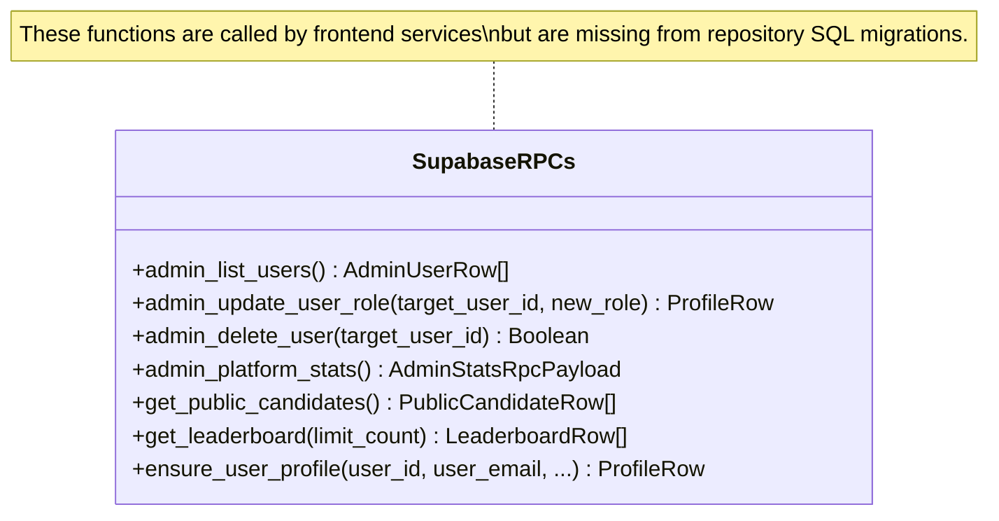

# Document 05 — API Documentation

**Project**: PrepMatrix  
**Document Version**: 1.0.0  
**Status**: Production Baseline  
**Auditor**: Senior Software Architect / API Designer  
**Last Updated**: September 24, 2026  

---

## 1. API Architecture Overview

PrepMatrix employs a hybrid API design:
1. **Serverless AI Proxy (`/api/gemini`)**: A backend endpoint deployed on Vercel Edge Serverless Functions (mirrored locally in development via Vite middleware). It proxies requests to the upstream Google Gemini REST API, guarding private API keys while implementing retry policies and strict schema enforcement.
2. **Supabase PostgREST Client Layer**: Client services interact with PostgreSQL tables through `@supabase/supabase-js`, translating JavaScript method calls into authenticated PostgREST queries guarded by Row Level Security.
3. **Database Remote Procedure Calls (RPC)**: Specialized aggregation and administrative operations executed via PostgreSQL functions (`supabase.rpc`).
4. **Third-Party Integrations**: Direct client integrations for EmailJS (contact form) and browser-native APIs (Web Speech API and WebRTC MediaStream).

---

## 2. Serverless Function: `/api/gemini`

### 2.1 Endpoint Specification

- **Route**: `/api/gemini`
- **Method**: `POST`
- **Source Location**:
  - Production Entrypoint: `Frontend/PrepMatrix/api/gemini.js`
  - Core Implementation: `Frontend/PrepMatrix/server/geminiProxy.js`
  - Local Dev Middleware: `Frontend/PrepMatrix/vite.config.ts` (`localGeminiProxyPlugin`)
- **Authentication**: None required from client; serverless function injects `process.env.GEMINI_API_KEY` into upstream requests.
- **Request Headers**:
  - `Content-Type: application/json`
- **Response Headers**:
  - `Content-Type: application/json; charset=utf-8`
  - `Cache-Control: no-store`

### 2.2 Request Schema

```json
{
  "model": "gemini-2.5-flash",
  "contents": [
    {
      "parts": [
        {
          "text": "Prompt text string..."
        }
      ]
    }
  ],
  "generationConfig": {
    "temperature": 0.3,
    "responseMimeType": "application/json",
    "responseJsonSchema": {
      "type": "object",
      "properties": { ... },
      "required": [ ... ]
    },
    "maxOutputTokens": 2048,
    "thinkingConfig": {
      "thinkingBudget": 0
    }
  }
}
```

### 2.3 Upstream Proxy Logic & Resilience Rules

1. **Model Resolution**:
   - Matches `parsedBody.model` against `/^gemini-[a-z0-9.\-]+$/i`.
   - If invalid or omitted, defaults to `process.env.GEMINI_MODEL || 'gemini-2.5-flash'`.
2. **Timeout Budgets**:
   - `GEMINI_REQUEST_TIMEOUT_MS`: **12,000ms** (12 seconds) per upstream attempt.
   - `GEMINI_TOTAL_TIMEOUT_MS`: **30,000ms** (30 seconds) cumulative execution deadline.
3. **Retry Policy with Exponential Backoff**:
   - Maximum Retries: **3 attempts**.
   - Backoff Delays: `1,000ms` (1s), `2,000ms` (2s), `4,000ms` (4s).
   - Retryable HTTP Status Codes: `429` (Rate Limited), `500` (Internal Error), `503` (Service Unavailable).
   - Retryable Errors: Network fetch errors (`TypeError`) and `AbortError`.

### 2.4 Response Payloads & Error Codes

| Status Code | Condition | Error Response Payload |
|---|---|---|
| **200 OK** | Upstream generation succeeded | Standard Gemini candidates JSON payload containing generated structured JSON text. |
| **400 Bad Request** | Request body not JSON, missing contents array, or missing generationConfig | `{"message": "Request body must include Gemini contents.", "error": {"status": 400, "message": "..."}}` |
| **405 Method Not Allowed** | HTTP method is not `POST` | `{"message": "Method not allowed.", "error": {"status": 405, "message": "Method not allowed."}}` with header `Allow: POST` |
| **500 Server Error** | `GEMINI_API_KEY` not configured on server | `{"message": "GEMINI_API_KEY is not configured on the server.", "error": {"status": 500}}` |
| **502 Bad Gateway** | Non-retryable upstream failure or malformed JSON | `{"message": "Gemini request failed.", "error": {"status": 502, "attempt": 3, "retryable": false}}` |
| **504 Gateway Timeout** | Upstream request exceeded 12s attempt budget or 30s total budget | `{"message": "Gemini request timed out.", "error": {"status": 504, "attempt": 3}}` |

---

## 3. Client Service Layer APIs

### 3.1 `authService` (`src/services/authService.ts`)

| Method | Parameters | Return Type | Description |
|---|---|---|---|
| `signup` | `email: string, password: string, name: string` | `Promise<User>` | Registers user with Supabase Auth; attaches `full_name` metadata. |
| `login` | `email: string, password: string` | `Promise<User>` | Authenticates credentials; returns resolved User object. |
| `signInWithGoogle` | None | `Promise<void>` | Redirects browser to Google OAuth consent screen. |
| `logout` | None | `Promise<void>` | Clears Supabase auth session across local scopes. |
| `getCurrentUser` | None | `Promise<User \| null>` | Retrieves current session user from memory/Supabase. |
| `changePassword` | `currentPassword: string, newPassword: string` | `Promise<void>` | Re-authenticates and updates user password in Supabase. |

---

### 3.2 `interviewService` (`src/services/interviewService.ts`)

| Method | Parameters | Return Type | Description |
|---|---|---|---|
| `saveInterview` | `session: InterviewSession` | `Promise<{ id: string, status: string, score: number \| null }>` | Upserts manual practice session into `public.interview_sessions`. |
| `getInterviews` | None | `Promise<InterviewSession[]>` | Retrieves all historical manual sessions for authenticated user. |
| `getInterview` | `id: string` | `Promise<InterviewSession>` | Retrieves specific manual practice session by UUID. |
| `deleteInterview`| `id: string` | `Promise<void>` | Deletes session record from `interview_sessions`. |
| `getAdminStats` | None | `Promise<AdminStats>` | Invokes RPC `admin_platform_stats` (with fallback parsing). |

---

### 3.3 `aiInterviewService` (`src/app/modules/aiMode/services/aiInterviewService.ts`)

| Method | Parameters | Return Type | Description |
|---|---|---|---|
| `saveSession` | `session: AIInterviewSession` | `Promise<AIInterviewSession>` | Persists session into relational tables (`interviews`, `questions`, `responses`) or falls back to `aiInterviewLocalStore`. |
| `getSession` | `id: string` | `Promise<AIInterviewSession \| null>` | Loads session from database or local store fallback. |
| `listSessions` | None | `Promise<AIInterviewSession[]>` | Lists all AI interview sessions for current user. |
| `deleteSession`| `id: string` | `Promise<void>` | Removes session from database and local storage. |
| `syncPending` | None | `Promise<void>` | Attempts to flush local fallback sessions to Supabase once tables exist. |

---

### 3.4 `profileService` (`src/services/profileService.ts`)

| Method | Parameters | Return Type | Description |
|---|---|---|---|
| `ensureProfile` | `user: SupabaseAuthUser` | `Promise<User>` | Syncs profile; calls RPC `ensure_user_profile` or inserts fallback. |
| `getCurrentProfile`| None | `Promise<User>` | Fetches authenticated user's profile row. |
| `updateProfile` | `updates: ProfileUpdateInput` | `Promise<User>` | Updates bio, experience, skills, social links. |
| `uploadAvatar` | `file: File` | `Promise<string>` | Uploads image to Supabase `avatars` bucket and updates profile URL. |
| `deleteAvatar` | `publicUrl: string` | `Promise<void>` | Removes avatar image from bucket and clears profile URL. |
| `getPublicCandidates`| None | `Promise<User[]>` | Invokes RPC `get_public_candidates` for candidate discovery. |
| `getAdminUsers` | None | `Promise<AdminUser[]>` | Invokes RPC `admin_list_users` for admin dashboard table. |
| `updateUserRole`| `userId: string, role: 'admin' \| 'user'` | `Promise<User>` | Invokes RPC `admin_update_user_role`. |
| `deleteUser` | `userId: string` | `Promise<{ success: boolean }>` | Invokes RPC `admin_delete_user`. |

---

### 3.5 `resumeService` (`src/services/resumeService.ts`)

| Method | Parameters | Return Type | Description |
|---|---|---|---|
| `saveResume` | `resume: Resume` | `Promise<Resume>` | Uploads PDF to `resumes` bucket; inserts rows into `resumes` and `resume_analysis`. |
| `getResumes` | None | `Promise<Resume[]>` | Fetches candidate's uploaded resumes joined with analysis feedback. |
| `getResume` | `id: string` | `Promise<Resume>` | Fetches single resume record by UUID. |
| `deleteResume`| `id: string` | `Promise<void>` | Deletes file from storage bucket and cascades record deletion. |

---

### 3.6 `leaderboardService` (`src/services/leaderboardService.ts`)

| Method | Parameters | Return Type | Description |
|---|---|---|---|
| `getLeaderboard`| `limit = 100` | `Promise<LeaderboardEntry[]>` | Calls RPC `get_leaderboard(limit_count: limit)`; merges AI stats from `aiInterviewStatsService`; sorts descending. |

---

## 4. Supabase RPC Catalog & Missing Migration Audit



---

## 5. Third-Party Integrations

### 5.1 EmailJS API (`src/app/components/Footer.tsx`)
- **Transport**: HTTPS POST to `https://api.emailjs.com/api/v1.0/email/send`.
- **Payload**:
  ```json
  {
    "service_id": "service_ity2tkc",
    "template_id": "template_o917511",
    "user_id": "IelSj4qTjRselKe8k",
    "template_params": {
      "from_name": "<name>",
      "from_email": "<email>",
      "message": "<message>",
      "reply_to": "support@prepmatrix.com",
      "to_name": "PrepMatrix Team"
    }
  }
  ```
- **Finding**: Credentials are hardcoded in the client bundle.

### 5.2 Browser Web Speech API (`src/app/utils/speech.ts`)
- **Text-to-Speech**: `window.speechSynthesis` using `SpeechSynthesisUtterance` (rate: 0.9, pitch: 1.0, lang: 'en-US').
- **Speech-to-Text**: `window.SpeechRecognition || window.webkitSpeechRecognition` with auto-restart, interim streaming, and 450ms debounce before committing text to input.
