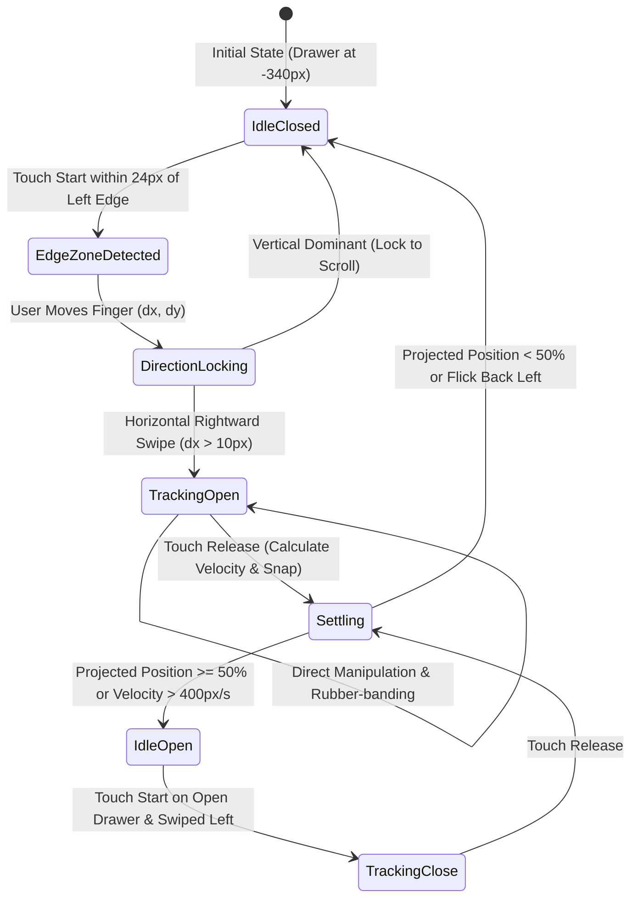

# Document 06 — UI/UX Documentation

**Project**: PrepMatrix  
**Document Version**: 1.0.0  
**Status**: Production Baseline  
**Design System**: "Midnight Signal" Anti-Slop SaaS UI  
**Auditor**: Senior Frontend Architect / UI/UX Engineer  
**Last Updated**: September 24, 2026  

---

## 1. Design System & Theme Foundations

PrepMatrix implements the **"Midnight Signal"** visual rebrand, an engineered design system characterized by deep slate backgrounds, precise borders, subtle electric accents, and functional typography.

### 1.1 Color Palette Tokens

| Token Name | Hex Code (Dark) | Hex Code (Light) | Role in Design System |
|---|---|---|---|
| **Background Primary** | `#0B0F17` | `#F8FAFC` | Core application canvas background |
| **Background Surface** | `#141C2B` | `#FFFFFF` | Card surfaces, dialog backgrounds, and panels |
| **Background Subtle** | `#172235` | `#F1F5F9` | Table rows, code blocks, and hover backgrounds |
| **Border Subtle** | `#263449` | `#E2E8F0` | Structural card borders and divider lines |
| **Border Active** | `#3B82F6` / `#6D5EF9` | `#6366F1` | Focused inputs and selected domain cards |
| **Brand Accent** | `#6D5EF9` | `#5B4BE7` | Primary buttons, active indicators, progress bars |
| **Brand Accent Bright** | `#8174FF` | `#6D5EF9` | Active state hover overlays and badge fills |
| **Text Strong** | `#F4F7FB` | `#0F172A` | Primary headers, card titles, and high-emphasis labels |
| **Text Muted** | `#AAB7CA` | `#475569` | Secondary text, descriptions, and metadata |
| **Success High** | `#34D399` | `#059669` | Scores >= 75%, completed badges, passing status |
| **Warning Mid** | `#FBBF24` | `#D97706` | Scores 50-74%, warning indicators, medium priority |
| **Danger Low** | `#FB7185` | `#E11D48` | Scores < 50%, delete buttons, validation error text |

### 1.2 Typography
- **Display Headings**: Clean, high-legibility sans-serif with tight tracking (`tracking-tight`).
- **Body & Controls**: Inter-style sans-serif (`text-sm`, `text-xs`) with medium to bold weights for scannability.
- **Monospace Elements**: Code snippets, timers (`font-mono`), and score percentages.

---

## 2. Complete Screen Inventory

| Screen Name | Route Path | Access Control | Primary User | Purpose | Implementation Source |
|---|---|---|---|---|---|
| **Login** | `/login` | Public | Unauthenticated | Email/password sign-in and Google OAuth authentication | `src/app/pages/Login.tsx` |
| **Signup** | `/signup` | Public | Unauthenticated | New account registration with validation | `src/app/pages/Signup.tsx` |
| **Dashboard** | `/dashboard` | `ProtectedRoute` | Authenticated | High-level practice metrics, score trends, weekly activity, quick launches | `src/app/pages/Dashboard.tsx` |
| **Manual Practice Mode**| `/manual-mode` | `ProtectedRoute` | Candidate | 97-domain catalog, category filter tabs, difficulty selection, launch modal | `src/app/pages/ManualMode.tsx` |
| **Manual Interview** | `/interview` | `ProtectedRoute` | Candidate | Step-by-step chatbot interview runner, speech TTS/STT, real-time grading | `src/app/pages/Interview.tsx` |
| **Results Summary** | `/results/:id` | `ProtectedRoute` | Candidate | Session performance breakdown, radar chart, strengths, suggestions, confetti | `src/app/pages/Results.tsx` |
| **AI Interview Mode** | `/ai-mode` | `ProtectedRoute` | Candidate | Resume-driven interview setup, camera preview, immersive AI shell, PDF export | `src/app/modules/aiMode/AIInterviewPage.tsx` |
| **AI Session Detail** | `/interview/:id` | `ProtectedRoute` | Candidate | Granular review of past AI session transcripts and per-question AI feedback | `src/app/pages/AIInterviewSessionDetail.tsx` |
| **Interview History** | `/history` | `ProtectedRoute` | Candidate | Archive of all manual and AI practice sessions with search and filtering | `src/app/pages/InterviewHistory.tsx` |
| **Resume ATS Scanner** | `/resume-analysis`| `ProtectedRoute` | Candidate | Upload resume, view ATS score, missing domain skills, action verb recommendations | `src/app/pages/ResumeAnalysis.tsx` |
| **Leaderboard** | `/leaderboard` | `ProtectedRoute` | Candidate / Public | Global rankings by average score, total sessions completed, and domain mastery | `src/app/pages/Leaderboard.tsx` |
| **Candidates Directory**| `/candidates` | `ProtectedRoute` | Candidate / Public | Directory of public candidate profiles with skills, links, and performance stats | `src/app/pages/Candidates.tsx` |
| **Profile Settings** | `/profile` | `ProtectedRoute` | Candidate | Edit profile metadata, target role, experience, skills, social links, avatar | `src/app/pages/Profile.tsx` |
| **Application Settings**| `/settings` | `ProtectedRoute` | Candidate | Toggle dark/light theme, audio effects, text-to-speech read aloud, password | `src/app/pages/Settings.tsx` |
| **Admin Panel** | `/admin` | `AdminRoute` | Administrator | Platform KPI charts, user roster, role management (user/admin), user deletion | `src/app/pages/AdminPanel.tsx` |

---

## 3. Screen Specifications & Interactions

### 3.1 Screen: Dashboard (`/dashboard`)
- **Layout**: Sticky header (`Navbar`), hero welcome greeting, 4 top KPI stat cards (Total Interviews, Average Score, Top Domain, Current Streak), split-view charts (Recharts AreaChart for weekly practice, BarChart for score distribution), quick action cards, and recent practice history feed.
- **States**:
  - *Loading*: Displays animated `SkeletonCard` placeholders.
  - *Empty State*: Displays `EmptyAnalytics` component with "Start an interview" CTA if 0 sessions completed.
  - *Loaded*: Fully interactive charts with tooltips.

### 3.2 Screen: Manual Mode (`/manual-mode`)
- **Layout**: Filter bar with 15 category pills (All, Technology, AI Careers, Business, Healthcare, etc.), responsive grid of 97 career cards displaying category badges and descriptions, and a configuration modal.
- **Modal Interaction**: Clicking any domain card opens a launcher dialog allowing the user to select difficulty (`Beginner`, `Intermediate`, `Advanced`) and question count (`5`, `10`, `15`, `20`). Clicks "Start Interview" to navigate to `/interview?domain=...&difficulty=...&count=...`.

### 3.3 Screen: Manual Interview Runner (`/interview`)
- **Layout**: Top progress bar showing completed question fraction, conversational message feed displaying bot questions and user answers, bottom input dock with microphone button, text area, and submit button.
- **Interactions**:
  - *TTS Readout*: Speaker icon triggers browser speech synthesis.
  - *Microphone STT*: Mic icon pulses with red indicator during active listening. Speech is transcribed and debounced directly into the text input.
  - *Instant Feedback*: On answer submission, the chatbot immediately posts structured feedback with score badge and matched keywords before advancing.

### 3.4 Screen: AI Interview Mode (`/ai-mode`)
- **Four Distinct Lifecycle Phases**:
  1. `setup`: Dropzone for PDF resume or raw text input, question count selector (5, 7, 10, 12), difficulty selector.
  2. `ready`: Displays extracted candidate domain, detected skill tags, profile summary, question list preview, and camera preview toggle.
  3. `interview`: Immersive focus shell with countdown timer, active question card, live video mirror in corner, speech-to-text voice input, and submission button.
  4. `complete`: Session summary with overall score, confidence level, clarity score, individual question breakdown, and "Download PDF Report" button.

### 3.5 Screen: Results Summary (`/results/:id`)
- **Layout**: Congratulatory header firing `canvas-confetti` for scores >= 75%, score badge, Recharts RadarChart showing multi-axis competence, question review accordions, and domain improvement suggestions.

### 3.6 Screen: Admin Panel (`/admin`)
- **Layout**: KPI metric cards (Total Users, Total Practice Sessions, Platform Average Score), Recharts line chart of daily activity, search input, and responsive users table.
- **Actions**:
  - *Role Toggle*: "Promote to Admin" / "Demote to User" with confirmation toast.
  - *User Deletion*: Red trash button with browser native confirmation dialog (`confirm(...)`). Self-deletion is strictly blocked.

---

## 4. Mobile Swipe Navigation Drawer Specification

PrepMatrix features an engineered mobile navigation drawer powered by high-performance gesture physics:

### Key Physical Characteristics:
- **Left Edge Zone**: Only touch events within `24px` of the screen's left edge initiate the open gesture when closed, preventing interference with in-page interactions.
- **Directional Locking**: A 10px movement threshold calculates vector angle. If `|dy| > |dx|`, the gesture locks to native vertical page scroll; if `dx > 0` and `|dx| > |dy|`, it locks to horizontal drawer drag.
- **Damped Spring Dynamics**: Spring settlement convergence achieves zero oscillation in under 350ms ($k=380, c=34, m=1$).
- **Direct Manipulation**: Backdrop opacity scales linearly with displacement: `opacity = clamp((x + 340) / 340 * 0.5, 0, 0.5)`.

---

## 5. UI Accessibility & Dialog Patterns

- **Dialog Focus Trapping**: Implemented in Radix UI `<Dialog>` and `ProfileModal`, storing previous focused element on mount and trapping Tab / Shift-Tab cycling within the modal boundary.
- **Keyboard Navigation**: Pressing `Escape` universally dismisses open dialogs, drawers, and full-screen camera previews.
- **Screen Reader Support**: ARIA attributes (`aria-expanded`, `aria-controls`, `aria-label`, `role="dialog"`) are configured across interactive buttons, menus, and drawer handles.
