# Document 07 — User Manual

**Product**: PrepMatrix  
**Guide Version**: 1.0.0  
**Target Audience**: Candidates, Job Seekers, and Students  
**Last Updated**: September 24, 2026  

---

## 1. Getting Started with PrepMatrix

Welcome to **PrepMatrix**, the AI-powered and domain-specific interview preparation platform designed to help you prepare smarter, perform better, and land your target role.

### System Requirements
- **Supported Browsers**: Google Chrome (recommended for full speech recognition), Microsoft Edge, Brave, Safari, or Mozilla Firefox.
- **Hardware Requirements**:
  - Microphone (required for voice-based answer input).
  - Webcam (optional for live video mirror during AI practice).
  - Internet connection (required for login, AI evaluation, and resume uploads).

---

## 2. Account Setup & Authentication

### 2.1 Creating an Account
1. Open PrepMatrix in your browser.
2. If not already logged in, you will be directed to the **Login** screen.
3. Click **"Don't have an account? Sign up"** or navigate directly to `/signup`.
4. Enter your **Full Name**, **Email Address**, and a **Password** (minimum 6 characters).
5. Click **"Create Account"**. Upon successful signup, your profile will be provisioned automatically and you will be taken to your **Dashboard**.

### 2.2 Google One-Click Sign-In
1. On either the Login or Signup screen, click **"Continue with Google"**.
2. Select your Google account and grant authentication permissions.
3. You will be redirected directly back into PrepMatrix with your Google profile photo and name automatically synchronized.

---

## 3. Navigating the Platform

PrepMatrix organizes your preparation across focused modules accessible via the top navigation bar (or the mobile swipe menu):

- 📊 **Dashboard** (`/dashboard`): Overview of your practice streaks, scores, and recent sessions.
- 🧠 **Manual Practice** (`/manual-mode`): Practice curated questions across 97 specialized career tracks.
- 🤖 **AI Mode** (`/ai-mode`): Generate resume-tailored interviews graded by Gemini AI.
- 📄 **Resume ATS** (`/resume-analysis`): Benchmark your resume against domain keyword expectations.
- 🏆 **Leaderboard** (`/leaderboard`): Compare your performance against global candidate percentiles.
- 👥 **Candidates** (`/candidates`): Discover candidate profiles and skill competencies.
- 👤 **Profile** (`/profile`): Customize your experience, skills, social links, and avatar.
- ⚙️ **Settings** (`/settings`): Toggle Dark/Light themes, audio cues, and voice readout options.

---

## 4. Manual Practice Mode Step-by-Step

Manual Mode is ideal for structured, predictable practice when you want to master specific domain questions without relying on AI synthesis.

```mermaid
flowchart LR
    SelectCat[1. Choose Category] --> SelectDomain[2. Pick Domain Card]
    SelectDomain --> ConfigModal[3. Set Difficulty & Count]
    ConfigModal --> StartSession[4. Launch Interview]
    StartSession --> AnswerFlow[5. Listen, Speak or Type]
    AnswerFlow --> ViewFeedback[6. Review Instant Feedback]
    ViewFeedback --> NextQuestion[7. Repeat for all Questions]
    NextQuestion --> SummaryRadar[8. Review Radar & Results]
```

### Step 1: Selecting a Career Domain
1. Click **Manual Practice** in the top navigation.
2. Filter by category pills (e.g., *Technology*, *AI Careers*, *Business & Management*, *Healthcare*, *Finance*, etc.).
3. Browse the **97 available domain cards** and click on your target profession (e.g., *Frontend Developer*, *DevOps Engineer*, *Product Manager*, *Data Scientist*).

### Step 2: Configuring Session Parameters
A setup dialog will appear:
- **Difficulty Tier**:
  - *Beginner*: Core definitions, fundamental syntax, and basic concepts.
  - *Intermediate*: Real-world implementation, trade-offs, and error scenarios.
  - *Advanced*: System architecture, performance optimization, and distributed edge cases.
- **Question Count**: Choose `5`, `10`, `15`, or `20` questions.
- Click **"Start Interview"**.

### Step 3: Answering Questions
1. **Listen to Question**: Click the **Speaker icon** to hear the question read aloud using browser speech synthesis.
2. **Speak Your Answer**:
   - Click the **Microphone icon** (allow browser microphone permissions when prompted).
   - Speak your answer clearly. Your spoken words will stream into the input field in real time.
   - Click the mic again to stop recording.
3. **Type or Edit**: You can edit or type your answer directly in the text area.
4. Click the **Send button** (or press Enter) to submit.

### Step 4: Reviewing Instant Feedback & Results
- PrepMatrix instantly evaluates your answer against key technical concepts, keyword coverage, and structure.
- Review your score badge, identified keywords, and feedback recommendations before clicking **"Next Question"**.
- At the end of the session, you will be taken to your **Results Summary** (`/results/:id`), displaying your overall score, completion time, multi-dimensional competence **Radar Chart**, and study suggestions.

---

## 5. AI Multimodal Interview Mode Step-by-Step

AI Mode provides dynamic, resume-aware simulations tailored directly to your actual experience and projects.

### Step 1: Uploading Your Resume
1. Navigate to **AI Mode** (`/ai-mode`).
2. Drag and drop your **PDF Resume** into the upload dropzone (or paste your resume text directly into the text box).
3. PrepMatrix extracts your text entirely inside your browser—no personal document is stored until you choose to save it.

### Step 2: Customizing the AI Session
- Select your target question count: `5`, `7`, `10`, or `12` questions.
- Select your difficulty tier: `Beginner`, `Intermediate`, or `Advanced`.
- Click **"Prepare Interview"**.

### Step 3: Readiness & Camera Check
- Review the extracted candidate domain, detected skill badges, and 2-sentence profile summary.
- **Enable Video Mirror**: Toggle the **Camera Preview** switch to see your video feed in the corner of your screen (simulating a video conference environment). Video frames remain strictly local and are never recorded or transmitted.
- Click **"Enter Interview"**.

### Step 4: Taking the Interview
- The session launches in an **Immersive Focus Shell**.
- Read the question and monitor the countdown timer.
- Use speech-to-text or typing to craft your response.
- Submit your response. Gemini AI evaluates your answer across:
  - *Score* (0-100)
  - *Confidence Level* (Low, Medium, High)
  - *Clarity Rating* (0-100)
  - *Specific Strengths & Actionable Improvements*
- Click **"Next Question"** until all questions are completed.

### Step 5: Exporting Your PDF Performance Report
- In the Session Summary, review your overall rating and per-question score cards.
- Click **"Download PDF Report"** to instantly generate an official interview summary document (`PrepMatrix_Interview_Report_<id>.pdf`) to save or share with mentors.

---

## 6. Resume ATS Scanner

1. Navigate to **Resume ATS** (`/resume-analysis`).
2. Upload a resume file and select your **Target Career Domain**.
3. View your **ATS Readiness Score** (0-100).
4. Review the **Skills Found** vs. **Top 10 Missing Skills** required for that role.
5. Review **Action Verb Utilization** suggestions to improve the impact of your resume bullets.

---

## 7. Profile & Settings Customization

### Profile Customization (`/profile`)
- **Avatar**: Upload a custom photo (PNG/JPEG) or choose a distinct profile color badge.
- **Career Aspirations**: Set your target role, years of experience, and location.
- **Skill Tags**: Add and remove comma-separated skill badges.
- **Social Profiles**: Connect your GitHub, LinkedIn, and Portfolio links.

### Application Settings (`/settings`)
- **Theme**: Toggle between **Dark Mode** (Midnight Signal deep slate) and **Light Mode** (clean high-contrast white).
- **Audio Feedback**: Enable or disable sound effects during button clicks and submissions.
- **Auto Read-Aloud**: Enable automatic Text-to-Speech playback when new questions appear.

---

## 8. Mobile Gesture Navigation

When using PrepMatrix on a mobile phone:
- **Swipe-to-Open**: Swipe your finger gently rightward from the **extreme left edge** (within 24px of the screen edge) to pull open the navigation drawer.
- **Scroll Protection**: If you swipe vertically, the drawer will not open, ensuring you can scroll smoothly through long domain lists without interruptions.
- **Flick-to-Close**: Swipe the open drawer leftward or tap the dimmed backdrop to close it.

---

## 9. Troubleshooting & Frequently Asked Questions

| Issue | Cause | Solution |
|---|---|---|
| **"Microphone permission denied"** | Browser microphone permissions blocked. | Click the camera/lock icon in your browser address bar, set Microphone to "Allow", and reload the page. |
| **"No voice detected"** | Microphone was silent or audio level was too low. | Check your device input level in OS sound settings and speak clearly into the mic after clicking. |
| **"Unable to parse PDF"** | The uploaded PDF is scanned as pure images or encrypted. | Use a text-searchable PDF exported from Word, Google Docs, or LaTeX, or paste your resume text into the text box. |
| **"Gemini request timed out"** | High latency or upstream Gemini rate limiting. | PrepMatrix will automatically retry 3 times. If upstream remains unreachable, the system automatically activates the offline question fallback. |
| **"Session expired"** | Auth token refresh failed or browser storage was cleared. | Log in again. Your past completed sessions and profile data remain securely saved in Supabase. |
