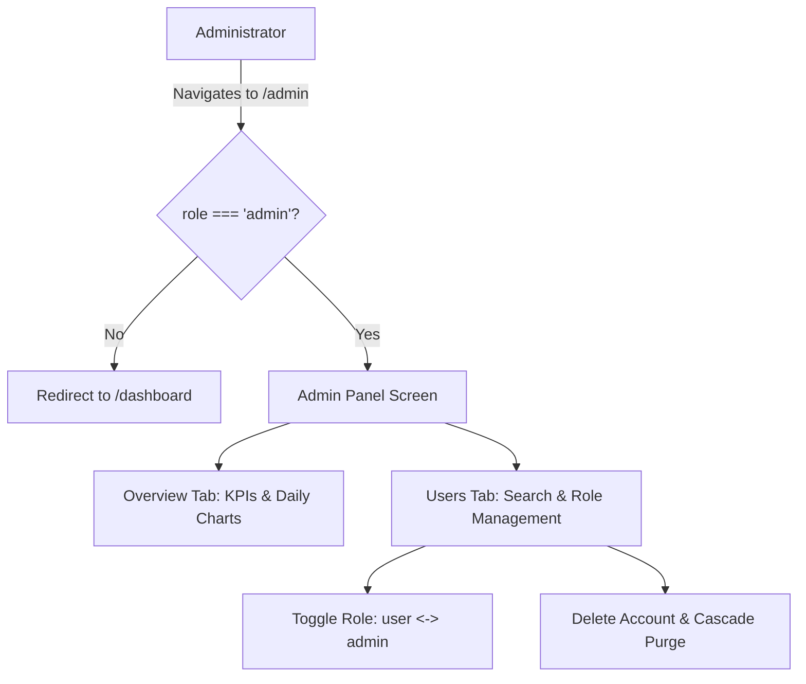

# Document 08 — Admin Manual

**Product**: PrepMatrix  
**Document Version**: 1.0.0  
**Target Audience**: Platform Administrators, DevOps Engineers, and System Operators  
**Auditor**: Senior Software Architect / Security Reviewer  
**Last Updated**: September 24, 2026  

---

## 1. Overview & Administrator Scope

The PrepMatrix **Admin Panel** (`/admin`) provides system administrators with governance capabilities over user accounts, permission roles, and aggregate practice analytics.

### Administrator Capabilities:
- Monitor platform-wide metrics: Total registered users, total practice sessions completed, average platform score, and 30-day activity trends.
- Search and audit registered users across email addresses and full names.
- Promote standard users to the **`admin`** role or demote existing administrators to **`user`**.
- Permanently delete user accounts and cascade removal across profiles, resumes, and interview histories.

### Strict Safety Constraints:
- **No Self-Demotion**: Administrators cannot alter their own permission tier (`userId === currentUser.id`).
- **No Self-Deletion**: Administrators cannot delete their own active account from the Admin Panel.
- **Permanent Purge**: User deletion is irreversible and purges all records linked by foreign key cascades.

---

## 2. Administrator Access & Authentication

### 2.1 Role Verification
Access to administrative routes is guarded by the `AdminRoute` component in `src/app/components/ProtectedRoute.tsx`:

```tsx
export function AdminRoute({ children }: { children: React.ReactNode }) {
  const { user, isAuthenticated, isLoading } = useAuth();

  if (isLoading) return <LoadingSpinner fullPage message="Restoring your session..." />;
  if (!isAuthenticated) return <Navigate to="/login" replace />;
  if (user?.role !== 'admin') return <Navigate to="/dashboard" replace />;
  return <>{children}</>;
}
```

If an unauthenticated user or a candidate without the `admin` role attempts to access `/admin`, they are immediately redirected to `/dashboard`.

### 2.2 Promoting an Initial Administrator
Because new accounts receive `role: 'candidate'` by default, the initial administrator must be granted administrative status directly in the Supabase PostgreSQL database:

```sql
-- Grant administrator role to a designated user email
update public.profiles
set role = 'admin'
where email = 'admin@example.com';
```

---

## 3. Admin Panel Navigation & Features



### 3.1 Overview Tab: Platform Analytics
- **Total Users KPI**: Aggregate count of provisioned candidate accounts.
- **Total Interviews KPI**: Sum of completed Manual and AI practice sessions.
- **Average Platform Score KPI**: Mean score across all finished evaluations.
- **Activity Line Chart**: Recharts line visualization illustrating daily interview volume over the past 30 days.

### 3.2 Users Tab: User Governance
- **Search Bar**: Real-time client filtering by candidate full name or email address.
- **User Roster Table**:
  - *User Information*: Avatar badge, display name, and registered email address.
  - *Current Role*: Badge displaying `admin` (purple) or `user` (gray).
  - *Practice Volume*: Total interviews completed and candidate average score.
  - *Actions*:
    - **Shield Icon Button**: Toggles user between `admin` and `user`.
    - **Trash Icon Button**: Triggers a confirmation dialog to delete the user.

---

## 4. Administrative Workflows

### 4.1 Modifying a User's Role
1. Navigate to `/admin` and select the **Users** tab.
2. Locate the target user using the search bar.
3. Click the **Shield Icon** on the right side of the row.
4. The system invokes `api.updateUserRole(userId, newRole)`:
   - If the user was `user`, their role updates to `admin`.
   - If the user was `admin`, their role updates to `user`.
5. A confirmation toast displays: `"User role updated to <role>"`.

### 4.2 Deleting a User Account
1. Locate the target user in the **Users** tab.
2. Click the **Red Trash Icon** on the right side of the row.
3. A browser confirmation dialog appears:
   > *"Delete user \"<name>\"? All their data will be permanently removed."*
4. Click **OK** to confirm.
5. The system invokes `api.deleteUser(userId)`.
6. Upon successful execution, the user is removed from the table and platform statistics are refreshed.

---

## 5. Technical Architecture & Database RPC Prerequisites

The frontend Admin Panel delegates database operations through `profileService.ts` and `interviewService.ts` via Supabase Remote Procedure Calls (RPC). 

> [!IMPORTANT]
> **Database Prerequisite Notice**: The following PostgreSQL functions must be present in the Supabase instance to enable admin panel operations:

```sql
-- 1. List Users with Practice Metrics
create or replace function public.admin_list_users()
returns table (
  id uuid,
  email text,
  full_name text,
  avatar_url text,
  role text,
  target_role text,
  experience_years numeric,
  skills jsonb,
  social_links jsonb,
  preferred_theme text,
  created_at timestamptz,
  updated_at timestamptz,
  total_interviews bigint,
  average_score numeric
) as $$
begin
  -- Security Check: Only admins may execute
  if not exists (select 1 from public.profiles where id = auth.uid() and role = 'admin') then
    raise exception 'Access denied: Administrator role required.';
  end if;

  return query
  select 
    p.id, p.email, p.full_name, p.avatar_url, p.role, p.target_role,
    p.experience_years, p.skills, p.social_links, p.preferred_theme,
    p.created_at, p.updated_at,
    coalesce(count(i.id), 0) as total_interviews,
    coalesce(round(avg(i.score)), 0) as average_score
  from public.profiles p
  left join public.interviews i on i.user_id = p.id
  group by p.id;
end;
$$ language plpgsql security definer;

-- 2. Update User Role
create or replace function public.admin_update_user_role(target_user_id uuid, new_role text)
returns setof public.profiles as $$
begin
  if not exists (select 1 from public.profiles where id = auth.uid() and role = 'admin') then
    raise exception 'Access denied: Administrator role required.';
  end if;

  return query
  update public.profiles
  set role = new_role, updated_at = now()
  where id = target_user_id
  returning *;
end;
$$ language plpgsql security definer;

-- 3. Delete User Account
create or replace function public.admin_delete_user(target_user_id uuid)
returns boolean as $$
begin
  if not exists (select 1 from public.profiles where id = auth.uid() and role = 'admin') then
    raise exception 'Access denied: Administrator role required.';
  end if;

  delete from auth.users where id = target_user_id;
  return true;
end;
$$ language plpgsql security definer;

-- 4. Aggregate Platform Statistics
create or replace function public.admin_platform_stats()
returns jsonb as $$
declare
  v_users bigint;
  v_interviews bigint;
  v_avg numeric;
begin
  if not exists (select 1 from public.profiles where id = auth.uid() and role = 'admin') then
    raise exception 'Access denied: Administrator role required.';
  end if;

  select count(*) into v_users from public.profiles;
  select count(*), coalesce(round(avg(score)), 0) into v_interviews, v_avg from public.interviews;

  return jsonb_build_object(
    'totalUsers', v_users,
    'totalInterviews', v_interviews,
    'averageScore', v_avg,
    'dailyActivity', '{}'::jsonb,
    'difficultyCounts', '{}'::jsonb,
    'topDomains', '[]'::jsonb
  );
end;
$$ language plpgsql security definer;
```

---

## 6. Security Considerations for Administrators

1. **Database Role Enforcement**: Do not rely solely on the frontend `AdminRoute`. Ensure all administrative SQL RPCs check `auth.uid()` against `public.profiles` where `role = 'admin'` with `security definer`.
2. **Audit Logging**: Major administrative actions should be recorded in `public.history` with timestamp, acting admin UUID, target user ID, and previous role state.
3. **Storage Hygiene**: When an administrator deletes a user, their associated avatars in the `avatars` bucket and resumes in the `resumes` bucket should be purged via Supabase Storage API.
