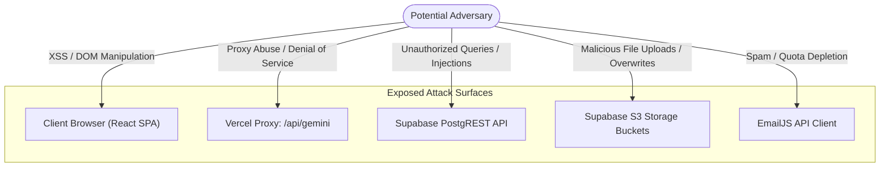

# Document 09 — Security Documentation & Code-Level Audit

**Project**: PrepMatrix  
**Document Version**: 1.0.0  
**Status**: Forensic Security Review  
**Auditor**: Senior Application Security Engineer / Penetration Tester  
**Assessment Date**: September 24, 2026  

---

## 1. Security Architecture Overview

PrepMatrix implements a multi-tier security model combining client-side boundary sanitation, serverless proxy encapsulation, and database-level Row Level Security (RLS) managed by PostgreSQL.

### Key Security Controls:
1. **Authentication Boundary**: Delegated to Supabase Auth (GoTrue), utilizing JSON Web Tokens (JWT) with automatic token refresh, secure cookie sanitation, and PKCE-compliant Google OAuth.
2. **AI Secrets Isolation**: The upstream Google Gemini API key (`GEMINI_API_KEY`) is isolated strictly within serverless execution environments (`Frontend/PrepMatrix/server/geminiProxy.js`), preventing browser leakage.
3. **Database Authorization**: PostgreSQL enforces Row Level Security across all data tables, validating that queries match `auth.uid() = user_id`.
4. **Client-Side Data Protection**: Resume parsing is executed in-memory via `pdfjs-dist`, ensuring that unconfirmed resumes are not persisted to cloud storage.

---

## 2. Threat Modeling & Attack Surface



---

## 3. Vulnerability Findings Register

| Finding ID | Severity | Finding Summary | Exact Evidence / Location | Impact | Remediation Recommendation | Status |
|---|---|---|---|---|---|---|
| **SEC-001** | **Medium** | Hardcoded Third-Party API Credentials in Client Code | `src/app/components/Footer.tsx#L71-L73` | Public disclosure of EmailJS `serviceId`, `templateId`, and `publicKey`. Malicious actors could deplete monthly email quota with spam. | Move EmailJS parameters to serverless endpoint or configure strict domain-origin restrictions in EmailJS console. | Open |
| **SEC-002** | **High** | Client-Side-Only Route Authorization for Admin Interface | `src/app/components/ProtectedRoute.tsx#L15-L22` | Gating of `/admin` is evaluated on the client (`user?.role !== 'admin'`). Attackers modifying client memory could view the Admin UI. | Enforce database-level role verification (`auth.uid() = user_id AND role = 'admin'`) within all administrative PostgreSQL RPCs. | Open |
| **SEC-003** | **Low** | Unauthenticated Public Read on Completed Interviews Table | `Backend/supabase/schema.sql#L111-L113` | Policy `using (true)` on `public.interviews` allows any unauthenticated caller to scrape session scores and user IDs. | Scope read access to authenticated users or create an aggregated view that strips `user_id` foreign keys. | Open |
| **SEC-004** | **Medium** | Missing SQL Source Control for Stored Procedures | `Backend/supabase/schema.sql`, `migrations/` | Administrative RPCs (`admin_list_users`, `admin_update_user_role`, etc.) are missing from repository SQL, risking schema drift. | Commit formal migration defining all RPCs with `SECURITY DEFINER` and caller role validation. | Open |
| **SEC-005** | **Low** | Client-Only Avatar File Validation | `src/services/profileService.ts#L368-L415` | Avatar upload verifies file size and extension on the client; lack of server-side magic-byte inspection could allow non-image uploads. | Implement Supabase Storage RLS policies restricting MIME types to `image/jpeg`, `image/png`, `image/webp`. | Open |
| **SEC-006** | **Medium** | Unauthenticated AI Proxy Endpoint Without Client Rate Limiting | `Frontend/PrepMatrix/server/geminiProxy.js#L203-L215` | `/api/gemini` does not require Supabase JWT validation or IP rate limiting, enabling denial-of-service against Gemini quota. | Require valid Supabase Bearer token in `/api/gemini` and implement Upstash or Vercel KV rate limiting. | Open |
| **SEC-007** | **Info** | Production Deployment Desynchronization | `https://prep-matrix.vercel.app` | Production domain hosts an older Next.js quiz platform rather than the current Vite SPA codebase. | Trigger a clean production deployment in Vercel from the `main` git branch. | Open |

---

## 4. Deep-Dive Security Domain Analysis

### 4.1 Authentication & Session Integrity
- **Password Strength**: Client-side validation in `Signup.tsx` enforces a 6-character minimum. Supabase Auth enforces secure bcrypt password hashing.
- **Session Tokens**: Access tokens (JWT) and refresh tokens are managed by Supabase GoTrue. `supabaseClient.ts` implements custom storage adapters that sanitize legacy token cookies and clear expired keys from `localStorage` and `sessionStorage`.
- **OAuth CSRF**: Google OAuth authentication uses state and PKCE parameters managed by Supabase, validated against `window.location.origin`.

### 4.2 Cross-Site Scripting (XSS) & Input Sanitation
- **DOM Rendering**: React JSX natively escapes interpolated text strings, neutralizing classic reflected and stored XSS vectors.
- **Markdown & Speech Text**: `sanitizeInterviewText()` in `src/app/utils/interviewText.ts` strips markdown symbols (`**`, `*`, `#`) and script characters prior to passing text to `window.speechSynthesis`.
- **Dangerous HTML**: The codebase does **not** employ `dangerouslySetInnerHTML` anywhere within the core application logic, eliminating raw HTML injection paths.

### 4.3 Injection & SQL Safety
- **Parameterization**: All PostgreSQL queries are mediated via Supabase PostgREST or stored procedures, which strictly parameterize arguments and neutralize SQL injection.
- **JSON Sanitization**: Serverless proxy validates that `body` is valid JSON and normalizes the payload using structural type guards (`normalizeContents`, `normalizeGenerationConfig`) before contacting Gemini.

### 4.4 File Upload & Binary Storage Security
- **Path Isolation**: Files are partitioned by owner UUID:
  ```ts
  const storagePath = `${userId}/${timestamp}-${sanitizedFileName}`;
  ```
- **Bucket Boundaries**:
  - `avatars`: Public read, authenticated write restricted to user partition.
  - `resumes`: Authenticated read/write restricted to file owner.

---

## 5. OWASP Top 10 (2021) Compliance Assessment

| OWASP Category | PrepMatrix Status | Technical Assessment |
|---|---|---|
| **A01: Broken Access Control** | **Partially Addressed** | RLS protects user data rows, but `/admin` route guard is client-side and `/api/gemini` lacks caller authentication. |
| **A02: Cryptographic Failures** | **Pass** | All traffic enforced over HTTPS/TLS; passwords hashed via bcrypt by Supabase; tokens stored in browser storage. |
| **A03: Injection** | **Pass** | No raw SQL queries; all data access parameterized via Supabase PostgREST; no `eval()` or unescaped HTML. |
| **A04: Insecure Design** | **Pass** | Resilient proxy design with exponential backoff and client-side offline question fallback. |
| **A05: Security Misconfiguration** | **Warning** | Hardcoded EmailJS credentials in `Footer.tsx` and public read access on `public.interviews`. |
| **A06: Vulnerable Components** | **Pass** | Dependencies audited; Vite 6.4.2, React 18.3.1, and Supabase JS 2.101.1 have no critical known CVEs. |
| **A07: Identification & Auth Failures** | **Pass** | Robust session recovery, auto-token refresh, and OAuth state verification in `AuthContext.tsx`. |
| **A08: Software & Data Integrity** | **Pass** | CI workflow validates build and question bank integrity; deterministic lockfile (`package-lock.json`). |
| **A09: Security Logging & Monitoring** | **Partially Addressed** | Console error telemetry implemented; backend structured audit logging should be enhanced in production. |
| **A10: Server-Side Request Forgery** | **Pass** | Serverless proxy contacts only a fixed, hardcoded Google Gemini endpoint; destination cannot be modified by the caller. |
