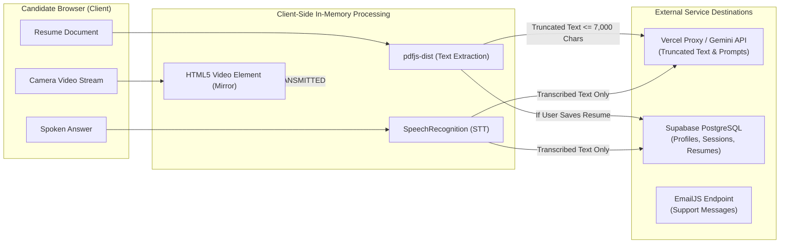

# Document 10 — Privacy & Data Processing Map

**Project**: PrepMatrix  
**Document Version**: 1.0.0  
**Status**: Technical Data Processing Review  
**Auditor**: Senior Software Architect / Data Protection Specialist  
**Last Updated**: September 24, 2026  

---

## 1. Overview & Data Philosophy

PrepMatrix is engineered with a **client-first privacy architecture**:
- **In-Memory Resume Parsing**: Resume text extraction is executed inside the user's browser using WebAssembly (`pdfjs-dist`). Unconfirmed resumes are never sent to external servers.
- **Ephemeral Audio & Video Streams**: WebRTC video mirrors (`MediaStream`) and Web Speech microphone transcripts are processed strictly in client memory. Video frames and raw audio recordings are **never recorded, stored on disk, or transmitted to any backend**.
- **Data Minimization for AI Processing**: Only plain text resume snippets (truncated to 7,000 characters) and written answer text are forwarded to Google Gemini for evaluation.

---

## 2. Comprehensive Data Inventory

| Data Element | Origin / Source | Processing Purpose | Primary Storage | Who Can Access | Retention Evidence | Processing Classification |
|---|---|---|---|---|---|---|
| **Account Email** | User input / Google OAuth | Authentication, identity verification, session restore | `auth.users`, `public.profiles` | User, Platform Admins | Retained until user deletion | **Actually Collected** |
| **Password Hash** | User input during signup | Account credential verification | `auth.users` (bcrypt hash) | Supabase Auth internal only | Retained until user deletion | **Actually Collected** |
| **Full Name** | User input / Google profile | UI personalization, certificate headers | `public.profiles(full_name)` | User, Public (on directory) | Retained until profile update/deletion | **Actually Collected** |
| **Avatar Graphic** | File upload / Google avatar | Visual profile display | Supabase Storage (`avatars`) | Public read access via URL | Retained until avatar update/deletion | **Actually Collected** |
| **Target Role & Experience** | User input on Profile screen | Tailoring interview recommendations | `public.profiles` | User, Public (on directory) | Retained until profile update/deletion | **Actually Collected** |
| **Skill Badges** | User input / parsed from resume | Displaying competencies on candidate card | `public.profiles(skills)` | User, Public (on directory) | Retained until profile update/deletion | **Actually Collected** |
| **Social Links (GitHub, LinkedIn)** | User input on Profile screen | Enabling recruiters to contact candidate | `public.profiles(social_links)` | User, Public (on directory) | Retained until profile update/deletion | **Actually Collected** |
| **Uploaded Resume PDF** | File input on Resume / AI screen | ATS benchmarking and AI question generation | Supabase Storage (`resumes`) | User only (guarded by RLS) | Retained until user deletes resume | **Actually Collected** |
| **Parsed Resume Text** | Extracted client-side via `pdfjs-dist` | ATS scoring, skill extraction, Gemini prompt | In-memory; optionally `public.resumes` | User only | Retained if saved; otherwise discarded | **Actually Collected** |
| **Interview Transcripts & Answers** | User typed / spoken responses | Evaluation, score calculation, history review | `public.interview_sessions` | User only | Retained until session deletion | **Actually Collected** |
| **AI Evaluation Feedback** | Google Gemini 2.5 Flash response | Strengths, improvements, confidence rating | `public.interview_sessions` | User only | Retained until session deletion | **Actually Collected** |
| **Leaderboard Summary Scores** | Computed session results | Public practice rankings and streaks | `public.interviews` | Public (via leaderboard RLS) | Retained indefinitely or until purge | **Actually Collected** |
| **Microphone Audio Input** | Browser MediaDevices / SpeechRec | Real-time transcription into answer field | **Client-side volatile memory only** | None (Transformed to text) | **Zero disk retention; ephemeral** | **Processed Locally Only** |
| **Webcam Video Stream** | `navigator.mediaDevices.getUserMedia` | Mirror preview simulating video interview | **Client-side video canvas only** | User only (Local preview) | **Zero disk retention; ephemeral** | **Processed Locally Only** |
| **Contact Form Messages** | User input in Footer form | Customer support inquiries | Forwarded via EmailJS | Support team email | Retained in email inbox | **Transmitted Externally** |
| **Payment / Credit Card Data** | N/A | Subscription billing | **None** | None | **Not collected** | **Not Present in Code** |

---

## 3. Third-Party Data Sharing & Sub-processors

### 3.1 Google Gemini API (Alphabet Inc.)
- **Data Transmitted**:
  - Truncated resume plaintext (maximum 7,000 characters).
  - Candidate written/transcribed answer text.
  - Contextual parameters (target domain, difficulty level, elapsed seconds).
- **Data NOT Transmitted**:
  - Raw PDF binary files.
  - Video streams or audio recordings.
  - User passwords or authentication tokens.
- **Processing Term**: Ephemeral inference execution; outputs are returned via JSON schema.

### 3.2 Supabase Inc. (AWS Infrastructure)
- **Data Transmitted**: Account credentials, profile metadata, saved resume files, completed interview sessions, leaderboard scores.
- **Protection**: Transport-layer TLS 1.3 encryption, database-level encryption at rest, and PostgreSQL Row-Level Security.

### 3.3 EmailJS
- **Data Transmitted**: Name, sender email address, and message text submitted via the contact form.

---

## 4. User Rights & Data Lifecycle Controls

1. **Right of Access & Rectification**:
   - Candidates can review and update their personal metadata, target career roles, experience, and skill tags at any time via `/profile`.
2. **Right to Erasure (Data Deletion)**:
   - *Resumes*: Users can delete uploaded resumes via `/resume-analysis`, which invokes `resumeService.deleteResume(id)` to delete both the database record and the storage file.
   - *Interview Sessions*: Users can delete past sessions from `/history`, cascading to transcripts and metrics.
   - *Account Purge*: Administrators can execute account deletions via the Admin Panel, triggering `ON DELETE CASCADE` across all child entities.
3. **Data Portability**:
   - AI interview session performance reports can be exported locally at any time as standardized PDF documents via `jspdf`.
