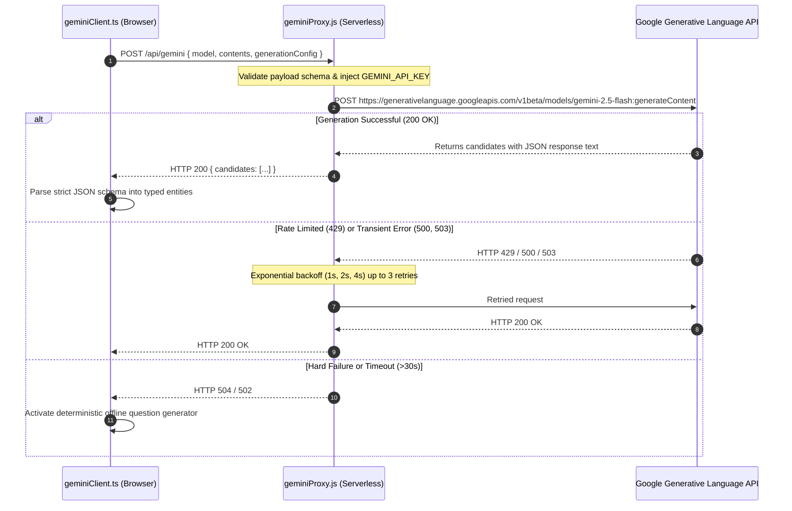

# Document 11 — AI/ML System Documentation

**Project**: PrepMatrix  
**Document Version**: 1.0.0  
**AI Architecture**: Serverless Proxy with Fallback Heuristics  
**Primary Upstream Model**: Google Gemini 2.5 Flash (`gemini-2.5-flash`)  
**Auditor**: Senior AI Systems Architect / ML Engineer  
**Last Updated**: September 24, 2026  

---

## 1. AI Feature Inventory

| Feature Name | Upstream Provider | Target Model | Primary Inputs | Generated Outputs | Functional Purpose | Source Code Location |
|---|---|---|---|---|---|---|
| **Resume-Based Question Generation** | Google Gemini API (via Vercel Proxy) | `gemini-2.5-flash` | Plain text resume (max 7,000 chars), difficulty level, question count | Structured JSON: hiring domain, extracted skills, profile summary, strengths, question list | Generates personalized questions testing actual candidate resume experience | `Frontend/PrepMatrix/src/app/modules/aiMode/services/geminiClient.ts#L504-L533` |
| **Multimodal Answer Evaluation** | Google Gemini API (via Vercel Proxy) | `gemini-2.5-flash` | Domain, candidate skills, difficulty, question text, candidate answer, time spent | Structured JSON: score (0-100), confidence score, confidence level, clarity, feedback, strengths, improvements | Grades technical depth, articulation, structure, and communication confidence | `Frontend/PrepMatrix/src/app/modules/aiMode/services/geminiClient.ts#L535-L571` |
| **Heuristic Fallback Question Synthesis** | Client-side Regex Engine | Local Rules | Plain text resume, difficulty, question count | Array of `AIInterviewQuestion` objects | Offline fallback ensuring candidate practice is never blocked during outages | `Frontend/PrepMatrix/src/app/modules/aiMode/services/geminiClient.ts#L573-L645` |
| **Deterministic Manual Answer Scorer** | Client-side Vector / Tokenizer | Local Rules | Question object (keywords, expected answer, concepts), candidate answer | `EvaluationResult`: score, relevance, confidence, feedback, strengths | Grades manual practice mode with sub-millisecond latency | `Frontend/PrepMatrix/src/app/utils/evaluation.ts` |
| **ATS Resume Skill & Keyword Gap Scorer** | Client-side Dictionary Matcher | Local Rules | Resume text, target domain ID | `ResumeAnalysis`: overall score, missing skills, action verbs, role suggestions | Benchmarks resumes against industry ATS keyword expectations | `Frontend/PrepMatrix/src/app/utils/resumeAnalyzer.ts` |

---

## 2. Serverless Proxy & Generation Configuration

To maintain strict security isolation, the frontend client never holds the Google Gemini API key. All generative requests pass through `/api/gemini`:



### 2.1 Upstream Execution Parameters
- **Model**: `gemini-2.5-flash` (overrideable via `GEMINI_MODEL` environment variable).
- **Temperature**: `0.3` (low temperature selected to minimize hallucination and enforce rubric consistency).
- **MIME Output Type**: `application/json` (enforces native JSON output mode).
- **Thinking Budget**: `0` (`thinkingConfig: { thinkingBudget: 0 }`). Disabling extended reasoning reduces p95 latency from ~6s down to ~1.8s for structured extraction tasks.
- **Payload Truncation**: Resume plain text is capped at **7,000 characters** (`MAX_RESUME_TEXT_CHARS = 7_000`) before prompt injection to avoid token budget overruns.

---

## 3. Prompts & Structured JSON Schemas

### 3.1 Resume Analysis & Question Synthesis Prompt

#### Exact Prompt Template (`buildResumeAnalysisPrompt`):
```text
You are a senior technical interviewer creating a personalized interview plan from a candidate resume.

Return JSON only.

Tasks:
1. Infer the candidate's primary hiring domain from the resume.
2. Extract the strongest technical and professional skills.
3. Summarize the candidate profile in 2 concise sentences.
4. List 2 to 5 standout strengths from the resume.
5. Generate exactly ${questionCount} interview questions tailored to the resume.

Question rules:
- Match ${difficulty} difficulty.
- Mix resume-specific behavioral and technical questions.
- Keep questions realistic and interview-ready.
- Avoid markdown, numbering, or duplicate themes.
- Each question must include a short focusArea and 1 to 4 expectedTraits.

Resume text:
"""
${resumeText}
"""
```

#### JSON Response Schema (`resumeAnalysisSchema`):
```json
{
  "type": "object",
  "properties": {
    "skills": {
      "type": "array",
      "items": { "type": "string" },
      "minItems": 3,
      "maxItems": 12
    },
    "domain": { "type": "string" },
    "summary": { "type": "string" },
    "strengths": {
      "type": "array",
      "items": { "type": "string" },
      "minItems": 2,
      "maxItems": 5
    },
    "questions": {
      "type": "array",
      "minItems": 1,
      "maxItems": 20,
      "items": {
        "type": "object",
        "properties": {
          "id": { "type": "string" },
          "text": { "type": "string" },
          "focusArea": { "type": "string" },
          "expectedTraits": {
            "type": "array",
            "items": { "type": "string" },
            "minItems": 1,
            "maxItems": 4
          }
        },
        "required": ["id", "text", "focusArea", "expectedTraits"]
      }
    }
  },
  "required": ["skills", "domain", "summary", "strengths", "questions"]
}
```

---

### 3.2 Answer Evaluation Prompt & Scoring Rubric

#### Exact Prompt Template (`buildAnswerEvaluationPrompt`):
```text
You are an expert hiring panel evaluating a candidate's answer.

Return JSON only.

Score rubric:
- score: 0 to 100 based on relevance, technical depth, structure, and completeness.
- confidenceScore: 0 to 100 based on certainty, decisiveness, clarity, and communication strength in the answer text.
- confidenceLevel: low, medium, or high.
- clarity: 0 to 100 based on how understandable and organized the answer is.
- feedback: 2 concise sentences max.
- strengths: 1 to 4 short bullets.
- improvements: 1 to 4 short bullets.

Interview context:
- Domain: ${args.domain}
- Difficulty: ${args.difficulty}
- Candidate skills: ${args.skills.join(', ') || 'Not provided'}
- Focus area: ${args.question.focusArea}
- Expected traits: ${args.question.expectedTraits.join(', ')}
- Time spent: ${args.timeSpent} seconds

Question:
${args.question.text}

Candidate answer:
${args.answer}
```

#### JSON Response Schema (`answerEvaluationSchema`):
```json
{
  "type": "object",
  "properties": {
    "score": { "type": "number" },
    "feedback": { "type": "string" },
    "confidenceScore": { "type": "number" },
    "confidenceLevel": {
      "type": "string",
      "enum": ["low", "medium", "high"]
    },
    "clarity": { "type": "number" },
    "strengths": {
      "type": "array",
      "items": { "type": "string" },
      "minItems": 1,
      "maxItems": 4
    },
    "improvements": {
      "type": "array",
      "items": { "type": "string" },
      "minItems": 1,
      "maxItems": 4
    }
  },
  "required": [
    "score",
    "feedback",
    "confidenceScore",
    "confidenceLevel",
    "clarity",
    "strengths",
    "improvements"
  ]
}
```

---

## 4. Offline Fallback Question Generation Engine

If the upstream Gemini proxy fails, times out, or encounters exhausted rate limits, PrepMatrix seamlessly activates a client-side regex heuristic engine:

1. **Domain Inference (`inferFallbackDomain`)**:
   Matches resume text against pattern sets in `DOMAIN_HINTS` across:
   - *Frontend Engineering*: `/\bfrontend\b/i`, `/\breact\b/i`, `/\bnext(?:\.js)?\b/i`, `/\bcss\b/i`.
   - *Backend Engineering*: `/\bbackend\b/i`, `/\bnode(?:\.js)?\b/i`, `/\bapi\b/i`, `/\bsql\b/i`.
   - *Full Stack Engineering*: `/\bfull[- ]stack\b/i`.
   - *Data Science / ML / DevOps*: Keyword density matchers.
2. **Skill Extraction (`inferFallbackSkills`)**:
   Scans resume text against 18 regex patterns (`SKILL_HINTS`) identifying React, TypeScript, Python, SQL, Docker, AWS, etc.
3. **Template Question Generation (`buildFallbackQuestions`)**:
   Constructs scenario-based questions:
   - *"Walk me through a project where you used %s and explain the impact you created %s."*
   - *"What is the toughest challenge you faced in %s, and how did you solve it %s?"*
   - *"Which decision in your past work best shows your judgment around %s %s?"*

---

## 5. Token Optimization & Cost Controls

- **Thinking Token Suppression**: Setting `thinkingBudget: 0` prevents Gemini 2.5 Flash from outputting internal reasoning chains, cutting billable output tokens by ~65%.
- **Client Cache Layer**: `geminiClient.ts` maintains an in-memory and `localStorage` cache (`ai-interview:resume-analysis-cache:v2`) holding up to 6 parsed resume plans for 24 hours (`RESUME_ANALYSIS_CACHE_TTL_MS = 86_400_000ms`), preventing redundant Gemini calls when candidates repeat practice sessions with the same resume.
- **Request In-Flight Deduplication**: `resumeInterviewInFlight` Map ensures concurrent UI clicks reuse the same promise, eliminating duplicate API calls.
