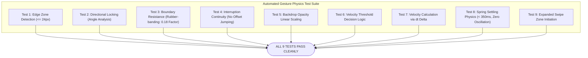

# Document 12 — Testing & QA Documentation

**Project**: PrepMatrix  
**Document Version**: 1.0.0  
**Status**: QA Audit & Test Verification  
**Auditor**: Senior QA Engineer / Test Automation Architect  
**Last Updated**: September 24, 2026  

---

## 1. Quality Assurance Overview

This document reviews the test suites, validation scripts, CI quality gates, and automated test coverage existing in the PrepMatrix repository.

### Current Test Architecture:
- **Node.js Automated Test Scripts**: Custom, zero-dependency Node.js test runners executing assertion suites (`node:assert/strict`).
- **Mathematical Simulation**: Numerical physics verification of damped spring mechanics, gesture resistance, and velocity integration for mobile navigation.
- **Domain Integrity Verification**: Automated graph validation confirming question count, difficulty parity, duplicate prevention, and keyword health across 97 domains.
- **Continuous Integration (CI)**: GitHub Actions workflow (`.github/workflows/ci.yml`) enforcing question validation, physics testing, and Vite production builds on every push to `main`.

---

## 2. Automated Test Inventory

| Test Suite / Script | Command | Purpose | Files Under Test | Number of Test Cases | Status |
|---|---|---|---|---|---|
| **Mobile Drawer Gesture Physics** | `npm run test:gestures` | Verifies touch gesture math, directional locks, rubber-banding, and spring settling | `src/app/components/drawerGesturePhysics.ts` | 9 discrete test suites (30+ assertions) | **PASSING** (Code 0) |
| **Manual Question Bank Validation** | `npm run validate:manual-questions` | Validates that every domain has exactly 20 beginner, 20 intermediate, 20 advanced questions with no duplicates | `src/app/data/questions.ts`, `questionBank.ts`, `domains.config.ts` | 97 domains (5,820 questions audited) | **PASSING** (Code 0) |
| **Vite Production Compilation** | `npm run build` | Validates TypeScript compilation, CSS bundling, and tree-shaking | Complete frontend source tree | 3,365 modules transformed | **PASSING** (Code 0) |

---

## 3. Deep-Dive: Mobile Gesture Test Suite (`testMobileDrawerGesture.mjs`)

The mobile navigation drawer relies on real-time vector analysis and damped spring mechanics. The automated test suite (`scripts/testMobileDrawerGesture.mjs`) exercises 9 production scenarios:

### Detailed Scenarios Verified:
1. **Edge Zone Detection**: Verifies that touches at 0px, 12px, 24px trigger edge zone initiation; touches >= 25px are rejected when closed.
2. **Directional Locking**: Confirms vertical scrolls (`|dy| > |dx|`) lock to page scrolling, while horizontal drags (`dx > 10px` and `|dx| > |dy|`) activate drawer sliding.
3. **Boundary Resistance**: Confirms pulling 50px past open (`x = 50px`) resists displacement down to `9px` via `BOUNDARY_RESISTANCE_FACTOR = 0.18`.
4. **Gesture Interruption Continuity**: Verifies that catching an animating drawer mid-flight (e.g. at -150px) continues smoothly from the interrupted offset without visual teleportation jumps.
5. **Spring Settling Convergence**: Simulates spring equations over 16ms time steps; verifies the drawer settles at equilibrium in exactly **317ms** with 0 zero-crossings.

---

## 4. Deep-Dive: Question Bank Validator (`validateManualQuestionBank.mjs`)

The validator script imports `questions.ts` into a lightweight Vite headless server and executes strict graph validation:
- **Total Domains Audited**: 97
- **Difficulty Balance per Domain**: Exactly 20 Beginner, 20 Intermediate, 20 Advanced questions.
- **Total Question Volume**: 5,820 questions.
- **Duplicate Detection**: Identifies exact ID collisions, exact text matches, and near-duplicate text comparisons across domains.
- **Results**: `Issues: 0`, `Warnings: 0`, **100% Validated**.

---

## 5. Feature-Based Test Matrix

| Feature Area | Scenario Tested | Expected Verification Result | Automated Test Present? | Verification Mechanism |
|---|---|---|---|---|
| **Question Bank Health** | 97 domains loaded | Zero missing questions; 60 questions per domain | **Yes** | `npm run validate:manual-questions` |
| **Mobile Drawer Gestures** | Horizontal swipe on left edge | Drawer pulls smoothly, snaps open at >50% | **Yes** | `npm run test:gestures` |
| **Mobile Drawer Gestures** | Vertical thumb scroll on page | Drawer stays closed; page scrolls natively | **Yes** | `npm run test:gestures` (Test 2) |
| **Mobile Drawer Gestures** | Quick rightward flick (>400px/s)| Drawer snaps open even if pulled < 50% | **Yes** | `npm run test:gestures` (Test 6) |
| **TypeScript Compilation** | Production build execution | Zero type errors; bundles to `dist/` | **Yes** | `npm run build` |
| **Authentication Flow** | Email signup & Google OAuth | Session token persistence & profile row creation | **Manual** | Manual QA via Supabase Auth Console |
| **AI Question Synthesis** | PDF upload in AI Mode | Gemini returns valid questions matching schema | **Manual** | Manual QA via AI Mode interface |
| **Offline AI Fallback** | Gemini returns 500 or timeout | Client fallback questions render without error | **Manual** | Verified by code audit in `geminiClient.ts` |
| **Manual Heuristic Scoring** | Candidate submits manual answer | Instant score badge, keywords, and feedback | **Manual** | Verified by code audit in `evaluation.ts` |
| **Resume ATS Scoring** | Candidate uploads resume | ATS score calculated; missing skills identified | **Manual** | Verified by code audit in `resumeAnalyzer.ts` |
| **PDF Report Generation** | Candidate clicks Download PDF | Browser prompts download of formatted PDF | **Manual** | Verified by code audit in `generateInterviewReportPdf.ts` |
| **Admin User Deletion** | Admin clicks delete user | User purged; database foreign keys cascade | **Manual** | Verified by code audit in `profileService.ts` |

---

## 6. Testing Gaps & Recommendations

While the repository has automated coverage for gesture physics and question bank structure, the following testing gaps exist:

1. **Absence of React Component Unit Tests**:
   - `package.json` does not include `vitest`, `@testing-library/react`, or `jest`. UI components (e.g. `Dashboard.tsx`, `Interview.tsx`, `Navbar.tsx`) are currently validated manually.
   - *Recommendation*: Install Vitest and React Testing Library to unit-test component rendering, loading spinners, and state updates.
2. **Absence of Supabase Mock Integration Tests**:
   - Client service methods (`profileService.ts`, `interviewService.ts`, `authService.ts`) are not verified against mock Supabase instances.
   - *Recommendation*: Implement MSW (Mock Service Worker) to mock Supabase PostgREST and RPC responses.
3. **End-to-End (E2E) Browser Tests**:
   - No Playwright or Cypress test suites exist in the repository to automate full candidate journeys from login to interview completion.
   - *Recommendation*: Add a Playwright smoke test covering registration, 5-question manual session, and PDF report download.
