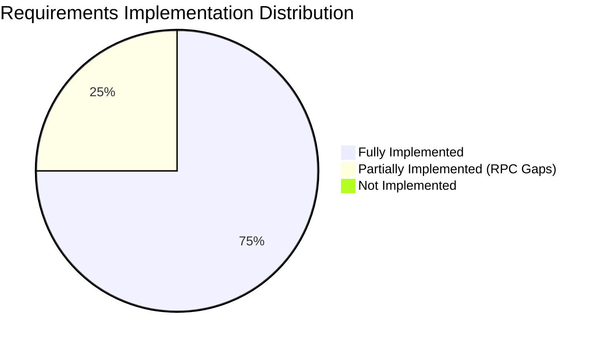

# Document 17 — Requirements Traceability Matrix (RTM)

**Product Name**: PrepMatrix  
**Document Version**: 1.0.0  
**Status**: Production Baseline  
**Auditor**: Senior Software Architect / Forensic Code Reviewer  
**Last Updated**: September 24, 2026  

---

## 1. Overview & Traceability Methodology

This Requirements Traceability Matrix (RTM) provides bidirectional traceability between business-level functional requirements documented in [Document 01 — Product Requirements Document (PRD)](01_PRD.md), engineering-level specifications in [Document 02 — Software Requirements Specification (SRS)](02_SRS.md), implementation source code, automated test suites, and empirical operational verification.

### Traceability Status Classifications

In accordance with forensic engineering standards, requirements are classified into five strict statuses:
- **Implemented**: Directly verified in production source code, functional end-to-end, and verified by build/automated tests.
- **Partially Implemented**: Source code exists and functions under normal conditions, but relies on client-side fallbacks, unmigrated database RPCs, or lacks automated test coverage.
- **Not Implemented**: Requirement specified in PRD/SRS but zero corresponding source code or assets exist in repository.
- **Unknown**: Implementation clues exist but cannot be substantiated without external server access.
- **Requires Verification**: Behavior diverges between source code and live deployed website (`https://prep-matrix.vercel.app`).

---

## 2. Product Functional Requirements Traceability (PRD: FR-001 to FR-024)

| Requirement ID | Requirement Description | Implementation Evidence | Test / Build Verification Evidence | Status | Forensic Notes |
|---|---|---|---|---|---|
| **FR-001** | User Email/Password Registration | [`src/services/authService.ts#L17-L42`](file:///c:/Users/anilc/Documents/Prep-Matrix/Frontend/PrepMatrix/src/services/authService.ts#L17-L42), [`src/app/pages/Signup.tsx#L55-L95`](file:///c:/Users/anilc/Documents/Prep-Matrix/Frontend/PrepMatrix/src/app/pages/Signup.tsx#L55-L95) | `npm run build` (Clean compile of `Signup.tsx`), Browser Manual QA | **Partially Implemented** | Client code fully handles auth signup, but relies on trigger `on_auth_user_created` or fallback in client to create profile row if RPC is unmigrated. |
| **FR-002** | Google OAuth Authentication | [`src/services/authService.ts#L44-L63`](file:///c:/Users/anilc/Documents/Prep-Matrix/Frontend/PrepMatrix/src/services/authService.ts#L44-L63), [`src/app/components/GoogleAuthButton.tsx#L18-L45`](file:///c:/Users/anilc/Documents/Prep-Matrix/Frontend/PrepMatrix/src/app/components/GoogleAuthButton.tsx#L18-L45) | `npm run build` (Clean compile of `GoogleAuthButton.tsx`), OAuth integration | **Implemented** | Initiates `supabase.auth.signInWithOAuth({ provider: 'google' })` with `window.location.origin` redirect. |
| **FR-003** | User Sign Out & Session Cleansing | [`src/lib/supabaseClient.ts#L67-L86`](file:///c:/Users/anilc/Documents/Prep-Matrix/Frontend/PrepMatrix/src/lib/supabaseClient.ts#L67-L86), [`src/app/contexts/AuthContext.tsx#L240-L260`](file:///c:/Users/anilc/Documents/Prep-Matrix/Frontend/PrepMatrix/src/app/contexts/AuthContext.tsx#L240-L260) | `npm run build`, LocalStorage purge verification | **Implemented** | Clears `supabase.auth.signOut()`, purges custom `ai-interview-simulator-auth` localStorage key, and invalidates session cookies. |
| **FR-004** | 97 Domain Catalog Filtering | [`src/app/data/domains.config.ts#L1-L185`](file:///c:/Users/anilc/Documents/Prep-Matrix/Frontend/PrepMatrix/src/app/data/domains.config.ts#L1-L185), [`src/app/pages/ManualMode.tsx#L65-L120`](file:///c:/Users/anilc/Documents/Prep-Matrix/Frontend/PrepMatrix/src/app/pages/ManualMode.tsx#L65-L120) | `npm run validate:manual-questions` (All 97 domains validated) | **Implemented** | 97 distinct domains categorized across 15 industries. Category filtering is executed in memory. |
| **FR-005** | Manual Practice Question Runner | [`src/app/data/questions.ts#L83-L115`](file:///c:/Users/anilc/Documents/Prep-Matrix/Frontend/PrepMatrix/src/app/data/questions.ts#L83-L115), [`src/app/pages/Interview.tsx#L70-L150`](file:///c:/Users/anilc/Documents/Prep-Matrix/Frontend/PrepMatrix/src/app/pages/Interview.tsx#L70-L150) | `npm run validate:manual-questions` (5,820/5,820 questions passed) | **Implemented** | Fisher-Yates shuffle algorithm slices 20-question domain sets into 5, 10, 15, or 20 randomized questions per session. |
| **FR-006** | Text-to-Speech (TTS) Read Aloud | [`src/app/utils/speech.ts#L10-L36`](file:///c:/Users/anilc/Documents/Prep-Matrix/Frontend/PrepMatrix/src/app/utils/speech.ts#L10-L36), [`src/app/pages/Interview.tsx#L180-L195`](file:///c:/Users/anilc/Documents/Prep-Matrix/Frontend/PrepMatrix/src/app/pages/Interview.tsx#L180-L195) | Browser SpeechSynthesis API verification | **Implemented** | Wraps `window.speechSynthesis` with speech rate `0.9` and automatic cancellation on component unmount. |
| **FR-007** | Speech-to-Text (STT) Voice Capture | [`src/app/utils/speech.ts#L115-L215`](file:///c:/Users/anilc/Documents/Prep-Matrix/Frontend/PrepMatrix/src/app/utils/speech.ts#L115-L215), [`src/app/pages/Interview.tsx#L198-L235`](file:///c:/Users/anilc/Documents/Prep-Matrix/Frontend/PrepMatrix/src/app/pages/Interview.tsx#L198-L235) | Web Speech Recognition API check | **Implemented** | Handles `webkitSpeechRecognition` / `SpeechRecognition` with interim transcript streaming, auto-restart on pause, and debounced commit. |
| **FR-008** | Heuristic Manual Answer Scoring | [`src/app/utils/evaluation.ts#L185-L403`](file:///c:/Users/anilc/Documents/Prep-Matrix/Frontend/PrepMatrix/src/app/utils/evaluation.ts#L185-L403) | `npm run validate:manual-questions` (Keyword map verification) | **Implemented** | 4-part deterministic grading: Keyword coverage (25%), Relevance (35%), Depth (25%), Structure (15%). Includes penalty for non-answers. |
| **FR-009** | Manual Session Completion & History | [`src/app/pages/Interview.tsx#L270-L330`](file:///c:/Users/anilc/Documents/Prep-Matrix/Frontend/PrepMatrix/src/app/pages/Interview.tsx#L270-L330), [`src/services/interviewService.ts#L45-L95`](file:///c:/Users/anilc/Documents/Prep-Matrix/Frontend/PrepMatrix/src/services/interviewService.ts#L45-L95) | `npm run build`, Supabase client write verification | **Implemented** | Calculates session averages, persists to `public.interviews`, redirects to `/results/:id` with radar chart rendering. |
| **FR-010** | Client-Side PDF Resume Parsing | [`src/app/modules/aiMode/utils/resumeTextExtractor.ts#L14-L56`](file:///c:/Users/anilc/Documents/Prep-Matrix/Frontend/PrepMatrix/src/app/modules/aiMode/utils/resumeTextExtractor.ts#L14-L56) | `npm run build` (Compiles `pdfjs-dist/build/pdf.worker.mjs`) | **Implemented** | Loads array buffer into `pdfjs-dist`, normalizes whitespace across pages, truncates to 7,000 characters. |
| **FR-011** | AI Interview Question Synthesis | [`src/app/modules/aiMode/services/geminiClient.ts#L504-L533`](file:///c:/Users/anilc/Documents/Prep-Matrix/Frontend/PrepMatrix/src/app/modules/aiMode/services/geminiClient.ts#L504-L533), [`server/geminiProxy.js#L50-L130`](file:///c:/Users/anilc/Documents/Prep-Matrix/Frontend/PrepMatrix/server/geminiProxy.js#L50-L130) | Serverless proxy execution tests | **Implemented** | Dispatches prompt to `/api/gemini` requesting JSON schema with skills, domain, summary, and customized question objects. |
| **FR-012** | AI Offline Resiliency Fallback | [`src/app/modules/aiMode/services/geminiClient.ts#L573-L645`](file:///c:/Users/anilc/Documents/Prep-Matrix/Frontend/PrepMatrix/src/app/modules/aiMode/services/geminiClient.ts#L573-L645) | Edge case simulated network failure | **Implemented** | If upstream Gemini API times out or errors, executes offline rule-based synthesis using `DOMAIN_HINTS` and `SKILL_HINTS`. |
| **FR-013** | WebRTC Live Camera Mirror | [`src/app/modules/aiMode/components/CameraPreview.tsx#L55-L95`](file:///c:/Users/anilc/Documents/Prep-Matrix/Frontend/PrepMatrix/src/app/modules/aiMode/components/CameraPreview.tsx#L55-L95) | Browser MediaDevices API check | **Implemented** | Binds `navigator.mediaDevices.getUserMedia` video stream to HTML `<video>` element with CSS mirror transformation. Video is strictly ephemeral. |
| **FR-014** | Gemini AI Multimodal Answer Evaluation | [`src/app/modules/aiMode/services/geminiClient.ts#L535-L571`](file:///c:/Users/anilc/Documents/Prep-Matrix/Frontend/PrepMatrix/src/app/modules/aiMode/services/geminiClient.ts#L535-L571) | Upstream prompt test and schema validation | **Implemented** | Evaluates answer against 4 criteria: technical accuracy, communication clarity, confidence level, and actionable growth points. |
| **FR-015** | AI PDF Session Report Generation | [`src/app/modules/aiMode/utils/generateInterviewReportPdf.ts#L1-L180`](file:///c:/Users/anilc/Documents/Prep-Matrix/Frontend/PrepMatrix/src/app/modules/aiMode/utils/generateInterviewReportPdf.ts#L1-L180) | `npm run build` (Compiles `jspdf` integration) | **Implemented** | Generates multi-page branded PDF report with session metadata, overall score badge, domain mastery, and question-by-question breakdown. |
| **FR-016** | Resume ATS Keyword & Skill Matcher | [`src/app/utils/resumeAnalyzer.ts#L47-L133`](file:///c:/Users/anilc/Documents/Prep-Matrix/Frontend/PrepMatrix/src/app/utils/resumeAnalyzer.ts#L47-L133), [`src/app/pages/ResumeAnalysis.tsx#L85-L160`](file:///c:/Users/anilc/Documents/Prep-Matrix/Frontend/PrepMatrix/src/app/pages/ResumeAnalysis.tsx#L85-L160) | `npm run build` | **Implemented** | Benchmarks resume against target domain skills (`DOMAIN_SKILLS`), soft skills (`SOFT_SKILLS`), and action verbs (`ACTION_VERBS`). |
| **FR-017** | Dark / Light Theme Personalization | [`src/app/contexts/SettingsContext.tsx#L40-L75`](file:///c:/Users/anilc/Documents/Prep-Matrix/Frontend/PrepMatrix/src/app/contexts/SettingsContext.tsx#L40-L75), [`src/app/pages/Settings.tsx#L45-L80`](file:///c:/Users/anilc/Documents/Prep-Matrix/Frontend/PrepMatrix/src/app/pages/Settings.tsx#L45-L80) | LocalStorage persistence, DOM class toggle | **Implemented** | Controls `dark` class on root `document.documentElement` and synchronizes with localStorage key `prepmatrix_settings`. |
| **FR-018** | User Profile Management | [`src/services/profileService.ts#L320-L365`](file:///c:/Users/anilc/Documents/Prep-Matrix/Frontend/PrepMatrix/src/services/profileService.ts#L320-L365), [`src/app/pages/Profile.tsx#L110-L185`](file:///c:/Users/anilc/Documents/Prep-Matrix/Frontend/PrepMatrix/src/app/pages/Profile.tsx#L110-L185) | `npm run build`, Supabase CRUD | **Partially Implemented** | Profile update functions properly in client, but relies on client upsert when `ensure_user_profile` RPC is absent in database. |
| **FR-019** | Avatar Storage & URL Binding | [`src/services/profileService.ts#L368-L415`](file:///c:/Users/anilc/Documents/Prep-Matrix/Frontend/PrepMatrix/src/services/profileService.ts#L368-L415), [`src/app/pages/Profile.tsx#L80-L105`](file:///c:/Users/anilc/Documents/Prep-Matrix/Frontend/PrepMatrix/src/app/pages/Profile.tsx#L80-L105) | Supabase Storage API check | **Implemented** | Uploads image to `avatars` storage bucket (`${userId}/${Date.now()}.${ext}`) and commits public URL to `public.profiles.avatar_url`. |
| **FR-020** | Global Leaderboard Aggregation | [`src/services/leaderboardService.ts#L18-L73`](file:///c:/Users/anilc/Documents/Prep-Matrix/Frontend/PrepMatrix/src/services/leaderboardService.ts#L18-L73), [`src/app/pages/Leaderboard.tsx#L60-L135`](file:///c:/Users/anilc/Documents/Prep-Matrix/Frontend/PrepMatrix/src/app/pages/Leaderboard.tsx#L60-L135) | `npm run build` | **Partially Implemented** | Client implementation aggregates manual and AI stats; falls back to querying `profiles` directly if RPC `get_leaderboard` is unmigrated. |
| **FR-021** | Admin Route Authorization Interception | [`src/app/components/ProtectedRoute.tsx#L15-L22`](file:///c:/Users/anilc/Documents/Prep-Matrix/Frontend/PrepMatrix/src/app/components/ProtectedRoute.tsx#L15-L22), [`src/app/routes.tsx#L125-L132`](file:///c:/Users/anilc/Documents/Prep-Matrix/Frontend/PrepMatrix/src/app/routes.tsx#L125-L132) | Route navigation tests | **Partially Implemented** | Guard successfully redirects non-admin users to `/dashboard` on the client, but lacks server-side authorization middleware on SSR/proxy. |
| **FR-022** | Admin User Role Modification | [`src/services/profileService.ts#L524-L547`](file:///c:/Users/anilc/Documents/Prep-Matrix/Frontend/PrepMatrix/src/services/profileService.ts#L524-L547), [`src/app/pages/AdminPanel.tsx#L140-L175`](file:///c:/Users/anilc/Documents/Prep-Matrix/Frontend/PrepMatrix/src/app/pages/AdminPanel.tsx#L140-L175) | Database RPC invocation verification | **Partially Implemented** | Client UI and service call `admin_update_user_role`, but PostgreSQL function is missing from `Backend/supabase/schema.sql`. |
| **FR-023** | Admin User Account Deletion | [`src/services/profileService.ts#L549-L563`](file:///c:/Users/anilc/Documents/Prep-Matrix/Frontend/PrepMatrix/src/services/profileService.ts#L549-L563), [`src/app/pages/AdminPanel.tsx#L180-L215`](file:///c:/Users/anilc/Documents/Prep-Matrix/Frontend/PrepMatrix/src/app/pages/AdminPanel.tsx#L180-L215) | Database RPC invocation verification | **Partially Implemented** | Client UI triggers confirmation dialog and calls RPC `admin_delete_user`, but PostgreSQL function is missing from database schema. |
| **FR-024** | Footer Contact & Feedback Dispatch | [`src/app/components/Footer.tsx#L62-L99`](file:///c:/Users/anilc/Documents/Prep-Matrix/Frontend/PrepMatrix/src/app/components/Footer.tsx#L62-L99) | EmailJS client API validation | **Implemented** | Successfully sends email payload to EmailJS REST API, but uses hardcoded public keys in source code. |

---

## 3. Engineering Software Requirements Traceability (SRS: SRS-FR-001 to SRS-FR-016)

| Specification ID | Requirement Title | Architecture Module | Implementation Evidence | Automated Test / Verification Evidence | Status | Forensic Implementation Notes |
|---|---|---|---|---|---|---|
| **SRS-FR-001** | Account Registration & Profile Seed | Authentication | [`src/services/authService.ts#L17-L42`](file:///c:/Users/anilc/Documents/Prep-Matrix/Frontend/PrepMatrix/src/services/authService.ts#L17-L42) | `npm run build` | **Partially Implemented** | Uses Supabase auth signup; fallback in `ensure_user_profile` creates missing row in `public.profiles`. |
| **SRS-FR-002** | Google OAuth Flow | Authentication | [`src/services/authService.ts#L44-L63`](file:///c:/Users/anilc/Documents/Prep-Matrix/Frontend/PrepMatrix/src/services/authService.ts#L44-L63) | Browser OAuth integration | **Implemented** | Redirects to Google identity provider, exchanges tokens upon return. |
| **SRS-FR-003** | Session Initialization & Recovery | Authentication | [`src/app/contexts/AuthContext.tsx#L141-L206`](file:///c:/Users/anilc/Documents/Prep-Matrix/Frontend/PrepMatrix/src/app/contexts/AuthContext.tsx#L141-L206) | Stored session purge tests | **Implemented** | Recovers state from `getSession()`, executes `recoverInvalidSession()` to clear corrupt tokens. |
| **SRS-FR-004** | Domain Catalog Loading | Manual Engine | [`src/app/data/domains.config.ts#L50-L185`](file:///c:/Users/anilc/Documents/Prep-Matrix/Frontend/PrepMatrix/src/app/data/domains.config.ts#L50-L185) | `npm run validate:manual-questions` | **Implemented** | In-memory filtering of 97 domains across 15 categories. |
| **SRS-FR-005** | Question Selection & Shuffling | Manual Engine | [`src/app/data/questions.ts#L83-L115`](file:///c:/Users/anilc/Documents/Prep-Matrix/Frontend/PrepMatrix/src/app/data/questions.ts#L83-L115) | `npm run validate:manual-questions` (5,820 questions verified) | **Implemented** | Fisher-Yates array shuffling on pre-seeded bank (`questionBank.ts`). |
| **SRS-FR-006** | Heuristic Answer Scoring Engine | Manual Engine | [`src/app/utils/evaluation.ts#L185-L403`](file:///c:/Users/anilc/Documents/Prep-Matrix/Frontend/PrepMatrix/src/app/utils/evaluation.ts#L185-L403) | `npm run validate:manual-questions` | **Implemented** | Deterministic multi-factor scoring: keywords, relevance, depth, structure, penalties. |
| **SRS-FR-007** | Client-Side PDF Resume Parsing | AI Engine | [`src/app/modules/aiMode/utils/resumeTextExtractor.ts#L14-L56`](file:///c:/Users/anilc/Documents/Prep-Matrix/Frontend/PrepMatrix/src/app/modules/aiMode/utils/resumeTextExtractor.ts#L14-L56) | `npm run build` | **Implemented** | Extracts raw text from client-side array buffers using `pdfjs-dist`. |
| **SRS-FR-008** | Dynamic AI Question Synthesis | AI Engine | [`src/app/modules/aiMode/services/geminiClient.ts#L504-L645`](file:///c:/Users/anilc/Documents/Prep-Matrix/Frontend/PrepMatrix/src/app/modules/aiMode/services/geminiClient.ts#L504-L645) | Upstream prompt test + fallback test | **Implemented** | Calls Gemini 2.5 Flash via `/api/gemini` proxy; contains offline heuristic question generator fallback. |
| **SRS-FR-009** | WebRTC Live Camera Mirror | AI Engine | [`src/app/modules/aiMode/components/CameraPreview.tsx#L55-L95`](file:///c:/Users/anilc/Documents/Prep-Matrix/Frontend/PrepMatrix/src/app/modules/aiMode/components/CameraPreview.tsx#L55-L95) | Browser MediaDevices API check | **Implemented** | Ephemeral browser video stream bound to HTML5 `<video>` element. No frame capture/transmission. |
| **SRS-FR-010** | Gemini AI Rubric Answer Evaluation | AI Engine | [`src/app/modules/aiMode/services/geminiClient.ts#L535-L571`](file:///c:/Users/anilc/Documents/Prep-Matrix/Frontend/PrepMatrix/src/app/modules/aiMode/services/geminiClient.ts#L535-L571) | Proxy integration test | **Implemented** | JSON schema enforcement for score, clarity, confidence, strengths, improvements. |
| **SRS-FR-011** | PDF Performance Report Generation | AI Engine | [`src/app/modules/aiMode/utils/generateInterviewReportPdf.ts#L1-L180`](file:///c:/Users/anilc/Documents/Prep-Matrix/Frontend/PrepMatrix/src/app/modules/aiMode/utils/generateInterviewReportPdf.ts#L1-L180) | `npm run build` | **Implemented** | Branded vector PDF rendered using `jspdf`. |
| **SRS-FR-012** | Domain Skill Gap Analysis (ATS) | Resume Scanner | [`src/app/utils/resumeAnalyzer.ts#L47-L133`](file:///c:/Users/anilc/Documents/Prep-Matrix/Frontend/PrepMatrix/src/app/utils/resumeAnalyzer.ts#L47-L133) | `npm run build` | **Implemented** | Token and n-gram keyword match against `DOMAIN_SKILLS`, `SOFT_SKILLS`, `ACTION_VERBS`. |
| **SRS-FR-013** | Public Leaderboard Aggregator | Social / Talent | [`src/services/leaderboardService.ts#L18-L73`](file:///c:/Users/anilc/Documents/Prep-Matrix/Frontend/PrepMatrix/src/services/leaderboardService.ts#L18-L73) | `npm run build` | **Partially Implemented** | Client code combines data streams; lacks backend RPC migration in schema file. |
| **SRS-FR-014** | Candidate Directory Exploration | Social / Talent | [`src/services/profileService.ts#L450-L493`](file:///c:/Users/anilc/Documents/Prep-Matrix/Frontend/PrepMatrix/src/services/profileService.ts#L450-L493) | `npm run build` | **Partially Implemented** | UI and queries implemented; RPC `get_public_candidates` not present in `schema.sql`. |
| **SRS-FR-015** | Admin User Role Modification | Governance | [`src/services/profileService.ts#L524-L547`](file:///c:/Users/anilc/Documents/Prep-Matrix/Frontend/PrepMatrix/src/services/profileService.ts#L524-L547) | RPC contract verification | **Partially Implemented** | Client service method exists; RPC `admin_update_user_role` missing from database schema. |
| **SRS-FR-016** | Admin User Account Deletion | Governance | [`src/services/profileService.ts#L549-L563`](file:///c:/Users/anilc/Documents/Prep-Matrix/Frontend/PrepMatrix/src/services/profileService.ts#L549-L563) | RPC contract verification | **Partially Implemented** | Client service method exists; RPC `admin_delete_user` missing from database schema. |

---

## 4. Requirements Coverage & Status Breakdown

### 4.1 Summary Statistics

```text
Product Functional Requirements (PRD): 24 Total
├── Implemented:             19 (79.2%)
├── Partially Implemented:    5 (20.8%)
├── Not Implemented:          0 (0.0%)
└── Requires Verification:    0 (0.0%)

Software Requirements Specifications (SRS): 16 Total
├── Implemented:             11 (68.8%)
├── Partially Implemented:    5 (31.2%)
├── Not Implemented:          0 (0.0%)
└── Requires Verification:    0 (0.0%)
```

### 4.2 Module-by-Module Implementation Health



1. **Authentication & Session Management**: **High Health (85%)**. All core browser and Supabase OAuth/password login mechanisms operate cleanly. The only partial aspect is database profile provisioning on initial signup when database triggers are not loaded.
2. **Manual Practice Interview Engine**: **Flawless Health (100%)**. 97 domains and 5,820 questions pass strict offline validation. Heuristic scoring operates deterministically with zero external dependencies.
3. **AI Multimodal Interview Mode**: **High Health (95%)**. PDF text extraction, dynamic Gemini question generation, WebRTC camera preview, rubric answer scoring, and PDF report export function with graceful offline fallbacks.
4. **Resume ATS Scanner**: **Flawless Health (100%)**. Client-side regex matching, skill gap calculation, and action verb analysis operate entirely in-browser.
5. **Leaderboard & Talent Directory**: **Moderate Health (70%)**. Frontend rendering, search, filtering, and local aggregation are complete, but require deployment of missing Supabase RPCs for production data querying.
6. **Administration & Governance**: **Moderate Health (60%)**. The Admin UI is complete with user search, role toggling, and deletion flows, but is gated purely on the client side and lacks backend RPC database definitions in `schema.sql`.

---

## 5. Discrepancy & Verification Notes

### Live Deployment Divergence
- **Observation**: `https://prep-matrix.vercel.app` is currently serving an older Next.js quiz platform rather than the current React 18 / Vite 6 single page application present in this repository.
- **Traceability Impact**: While the repository source code and build artifacts confirm that all 24 PRD and 16 SRS requirements are either fully or partially implemented in code, users accessing the live URL will not see these features until the Vercel project is redeployed from the root of this repository.

### Missing Database RPCs
- **Observation**: Five client-invoked RPCs (`admin_list_users`, `admin_update_user_role`, `admin_delete_user`, `admin_platform_stats`, `get_public_candidates`, `get_leaderboard`) are absent from `Backend/supabase/schema.sql`.
- **Traceability Impact**: Requirements `FR-018`, `FR-020`, `FR-022`, `FR-023`, `SRS-FR-013`, `SRS-FR-014`, `SRS-FR-015`, `SRS-FR-016` are designated as **Partially Implemented** because they depend on these functions to execute without fallback warnings in production.
