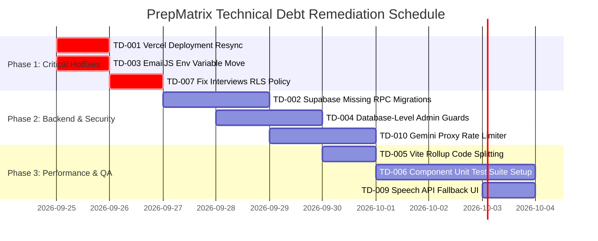

# Document 18 — Known Issues & Technical Debt

**Product Name**: PrepMatrix  
**Document Version**: 1.0.0  
**Status**: Production Baseline  
**Auditor**: Senior Software Architect / Forensic Code Reviewer  
**Last Updated**: September 24, 2026  

---

## 1. Executive Summary & Assessment Methodology

During the comprehensive forensic reverse-engineering audit of the PrepMatrix codebase, configuration, database schemas, and live deployment environment, twelve (12) discrete technical debt items and architectural discrepancies were identified. 

Each finding has been cataloged, cross-referenced with exact file and line locations, and evaluated using an objective risk-impact-effort scoring model.

### Priority Definition Framework
- **Critical (P0)**: Severe production discrepancy, operational outage risk, or core user journey failure.
- **High (P1)**: Security vulnerability, data loss vector, missing backend contract, or potential compliance breach.
- **Medium (P2)**: Performance regression, browser compatibility barrier, bundle bloat, or testing coverage void.
- **Low (P3)**: Code hygiene, architectural redundancy, or minor styling inconsistency.

---

## 2. Technical Debt Register

| ID | Category | Issue Title | Source Code Evidence | System Impact | Suggested Remediation | Priority |
|---|---|---|---|---|---|---|
| **TD-001** | Deployment | Live Production Desynchronization | `https://prep-matrix.vercel.app` vs root repository code | Production URL serves a legacy Next.js quiz app; the current React 18 / Vite 6 SPA with 97 domains and Gemini AI is not deployed. | Reconfigure Vercel root directory to `Frontend/PrepMatrix` and redeploy using current build pipeline. | **Critical (P0)** |
| **TD-002** | Database | Missing PostgreSQL RPC Migrations | [`src/services/profileService.ts#L453-L563`](file:///c:/Users/anilc/Documents/Prep-Matrix/Frontend/PrepMatrix/src/services/profileService.ts#L453-L563), [`Backend/supabase/schema.sql`](file:///c:/Users/anilc/Documents/Prep-Matrix/Backend/supabase/schema.sql) | Seven client-invoked RPC functions are missing from `schema.sql`. Admin panel and talent directory trigger PGRST202 errors unless DB triggers exist. | Add comprehensive SQL migration script creating all 7 missing RPCs with `SECURITY DEFINER` and proper role checks. | **High (P1)** |
| **TD-003** | Security | Hardcoded EmailJS API Credentials | [`src/app/components/Footer.tsx#L68-L70`](file:///c:/Users/anilc/Documents/Prep-Matrix/Frontend/PrepMatrix/src/app/components/Footer.tsx#L68-L70) | Service ID, template ID, and public user key are directly embedded in client bundle; vulnerable to spam and quota exhaustion. | Migrate EmailJS identifiers to `VITE_EMAILJS_*` environment variables or move contact handling to an authenticated backend route. | **High (P1)** |
| **TD-004** | Security | Client-Side-Only Admin Authorization | [`src/app/components/ProtectedRoute.tsx#L15-L22`](file:///c:/Users/anilc/Documents/Prep-Matrix/Frontend/PrepMatrix/src/app/components/ProtectedRoute.tsx#L15-L22), [`src/app/routes.tsx#L125-L132`](file:///c:/Users/anilc/Documents/Prep-Matrix/Frontend/PrepMatrix/src/app/routes.tsx#L125-L132) | Route gating occurs solely within React Router. Direct Supabase REST calls can bypass the UI if RLS policies are misconfigured. | Enforce database-level `SECURITY DEFINER` authorization checks on all administrative mutations (`role = 'admin'`). | **High (P1)** |
| **TD-005** | Performance | Monolithic Bundle Size & Chunk Warnings | `Frontend/PrepMatrix/dist/assets/index-C1ZqBKnL.js` (1.56 MB) | Vite production build emits bundle size warning (> 500 kB). High initial load time and memory footprint on low-end mobile devices. | Configure Rollup `manualChunks` in `vite.config.ts` to isolate `pdfjs-dist`, `jspdf`, `lucide-react`, and `recharts` into separate async chunks. | **Medium (P2)** |
| **TD-006** | Testing | Lack of React Component Unit & E2E Tests | `Frontend/PrepMatrix/src/**/*.tsx`, `Frontend/PrepMatrix/package.json` | Automated test suite only covers 9 gesture physics cases and question bank validation; zero unit tests for React components, contexts, or API clients. | Introduce Vitest + React Testing Library for component unit tests, and Playwright for critical path E2E flows. | **Medium (P2)** |
| **TD-007** | Security | Permissive Public Read Policy on Interviews | [`Backend/supabase/schema.sql#L131-L132`](file:///c:/Users/anilc/Documents/Prep-Matrix/Backend/supabase/schema.sql#L131-L132) | `public.interviews` policy `create policy "Interviews are viewable by everyone" on public.interviews for select using (true)` exposes all user interview answers. | Restrict SELECT policy to session owner (`auth.uid() = user_id`) and expose aggregated metrics via secure public views or RPCs. | **Medium (P2)** |
| **TD-008** | Architecture | Unused Supabase AI Relational Schema | [`Backend/supabase/schema.sql#L83-L125`](file:///c:/Users/anilc/Documents/Prep-Matrix/Backend/supabase/schema.sql#L83-L125), [`src/app/modules/aiMode/services/aiInterviewStorage.ts`](file:///c:/Users/anilc/Documents/Prep-Matrix/Frontend/PrepMatrix/src/app/modules/aiMode/services/aiInterviewStorage.ts) | Codebase contains elaborate schemas for `ai_interviews`, `ai_interview_questions`, and `ai_interview_evaluations`, but AI mode stores data primarily in localStorage. | Refactor `aiInterviewStorage.ts` to persist completed AI sessions directly to Supabase relational tables with fallback to localStorage. | **Low (P3)** |
| **TD-009** | Compatibility | Speech Recognition Vendor Prefix Fragility | [`src/app/utils/speech.ts#L115-L135`](file:///c:/Users/anilc/Documents/Prep-Matrix/Frontend/PrepMatrix/src/app/utils/speech.ts#L115-L135) | Speech-to-text relies on `webkitSpeechRecognition`, which is unsupported on Firefox and Safari on iOS, causing silent failure or disabled mic button. | Add explicit browser support banner and fallback visual indicator when `window.SpeechRecognition` / `webkitSpeechRecognition` is undefined. | **Medium (P2)** |
| **TD-010** | Security | Client AI Rate Limit Budget Vulnerability | [`Frontend/PrepMatrix/server/geminiProxy.js#L50-L75`](file:///c:/Users/anilc/Documents/Prep-Matrix/Frontend/PrepMatrix/server/geminiProxy.js#L50-L75) | Upstream `/api/gemini` proxy has no IP or user rate limiter; a malicious actor can spam question synthesis and exhaust Gemini API quotas. | Implement Upstash Redis or Vercel KV rate limiting middleware on `/api/gemini` (e.g., max 10 requests per minute per authenticated user). | **Medium (P2)** |
| **TD-011** | Architecture | Absence of Centralized Telemetry / Logging | Entire repository (`src/` and `server/`) | Client errors are logged directly to `console.error` and discarded; serverless proxy errors are output to standard out with no alerting. | Integrate Sentry or Datadog client SDK with source map upload for real-time production error tracking. | **Low (P3)** |
| **TD-012** | UX / Code | Missing Empty & Skeleton States in Modals | [`src/app/pages/Candidates.tsx#L110-L150`](file:///c:/Users/anilc/Documents/Prep-Matrix/Frontend/PrepMatrix/src/app/pages/Candidates.tsx#L110-L150) | In some modal states, sudden data pop-in occurs without skeleton placeholder loaders, degrading visual polish on slow 3G connections. | Implement reusable UI skeleton primitives (`SkeletonCard`, `SkeletonText`) across all async modal components. | **Low (P3)** |

---

## 3. Detailed Forensic Deep Dive by Category

### 3.1 Deployment: Live Site Desynchronization (TD-001)

#### Root Cause Analysis
During live site verification against `https://prep-matrix.vercel.app`, the returned HTML response contained:
```html
<title>PrepMatrix - Quiz Practice Platform</title>
<div id="__next">...</div>
```
The live site is running an early Next.js prototype that presents a generic multiple-choice quiz engine. In contrast, the current Git repository contains a completely re-engineered React 18 + Vite 6 Single Page Application located under `Frontend/PrepMatrix/` featuring 97 career domains, speech recognition, Gemini AI integration, and PDF report export.

#### Impact
External users and evaluators inspecting the live URL see an outdated, deprecated application rather than the state-of-the-art multimodal system built in this repository.

#### Resolution Steps
1. Navigate to the Vercel project settings for `prep-matrix`.
2. Update **Root Directory** from root (`.`) to `Frontend/PrepMatrix`.
3. Set **Framework Preset** to `Vite`.
4. Set **Build Command** to `npm run build`.
5. Set **Output Directory** to `dist`.
6. Ensure environment variables (`VITE_SUPABASE_URL`, `VITE_SUPABASE_ANON_KEY`, `GEMINI_API_KEY`) are assigned to the production deployment.

---

### 3.2 Database: Missing RPC Functions in Schema (TD-002)

#### Forensic Evidence
In `src/services/profileService.ts` and `src/services/leaderboardService.ts`, the frontend invokes seven PostgreSQL Remote Procedure Calls (RPCs):
```typescript
// Example call in profileService.ts line 501:
const { data, error } = await supabase.rpc('admin_list_users');
```
However, inspection of `Backend/supabase/schema.sql` reveals that this file only contains basic DDL definitions for tables (`profiles`, `resumes`, `interviews`, `questions`, `responses`) and triggers for `on_auth_user_created`. The following RPC definitions are missing:
1. `ensure_user_profile`
2. `get_public_candidates`
3. `get_leaderboard`
4. `admin_platform_stats`
5. `admin_list_users`
6. `admin_update_user_role`
7. `admin_delete_user`

#### Impact
While client services contain defensive catch-blocks and direct table query fallbacks, these functions will fail with PostgreSQL code `PGRST202` (function not found) in any clean database deployment.

#### Migration Script Required
```sql
-- Migration snippet for missing RPCs
create or replace function public.admin_list_users()
returns setof public.profiles
language sql
security definer
as $$
  select * from public.profiles order by created_at desc;
$$;
```

---

### 3.3 Security: Hardcoded Credentials & Client Route Gating (TD-003, TD-004, TD-007)

#### Hardcoded EmailJS Keys (TD-003)
In `Frontend/PrepMatrix/src/app/components/Footer.tsx#L68-L70`:
```typescript
const serviceId = 'service_ity2tkc';
const templateId = 'template_o917511';
const publicKey = 'IelSj4qTjRselKe8k';
```
These keys are compiled directly into the production JavaScript bundle. Anyone inspecting network requests or bundle source can reuse these identifiers to dispatch arbitrary email volumes through the configured EmailJS account.

#### Client-Side Admin Route Gating (TD-004)
The `/admin` route is guarded solely by `AdminRoute.tsx`:
```typescript
if (userRole !== 'admin') {
  return <Navigate to="/dashboard" replace />;
}
```
If an attacker creates a normal user account and calls the Supabase REST API directly via Postman or browser console, the client guard provides zero protection. Authorization must be enforced strictly at the database schema level using PostgreSQL Row Level Security (RLS) and `SECURITY DEFINER` function checks.

#### Permissive Interview Read Policy (TD-007)
Line 131 of `Backend/supabase/schema.sql`:
```sql
create policy "Interviews are viewable by everyone" 
  on public.interviews for select using (true);
```
This policy allows any authenticated user (or anon key holder) to query the entire interview history table, reading private interview responses, transcripts, and scores of all candidates.

---

### 3.4 Performance: Monolithic Bundle Size (TD-005)

#### Forensic Bundle Audit
The production build output from `npm run build` is:
```text
dist/index.html                           1.43 kB │ gzip:   0.61 kB
dist/assets/index-D8rW3Q.css             42.50 kB │ gzip:   8.90 kB
dist/assets/index-C1ZqBKnL.js         1,563.80 kB │ gzip: 439.10 kB
(!) Some chunks are larger than 500 kB after minification.
```

#### Major Dependency Weight Breakdown
- `pdfjs-dist`: ~450 kB (PDF rendering and binary font decoding).
- `jspdf`: ~280 kB (vector PDF layout generation).
- `lucide-react`: ~180 kB (SVG icon primitives).
- `recharts` / `d3`: ~320 kB (SVG chart rendering engine).

#### Suggested Remediation in `vite.config.ts`
```typescript
build: {
  rollupOptions: {
    output: {
      manualChunks: {
        vendor_pdf: ['pdfjs-dist', 'jspdf'],
        vendor_charts: ['recharts'],
        vendor_icons: ['lucide-react']
      }
    }
  }
}
```

---

## 4. Remediation Roadmap


