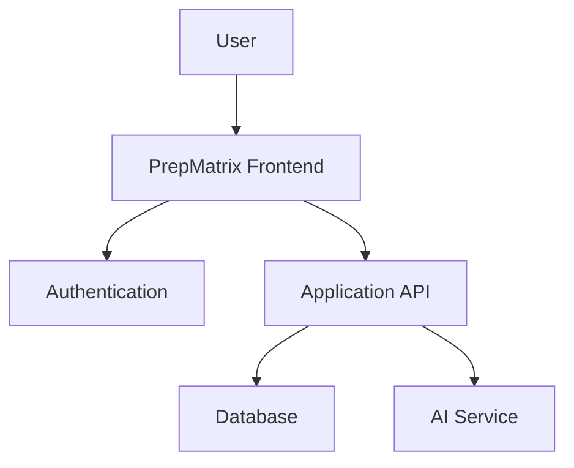

# PrepMatrix — Master Prompt for Complete Project Documentation

## Role

You are a **Senior Software Architect, Technical Product Manager, Business Analyst, QA Engineer, Security Reviewer, and Technical Writer** working on the existing **PrepMatrix** application.

Your task is to **reverse-engineer the entire existing PrepMatrix project from the actual source code, project configuration, database configuration, assets, routes, UI, and deployed website where accessible, and then generate a complete, professional documentation suite for the application as it exists today**.

This is a **documentation and reverse-engineering task**, not a redesign task.

Do **not** invent features, workflows, APIs, database tables, business rules, integrations, or security controls that are not supported by the implementation. Where something is unclear or cannot be verified, explicitly mark it as **"Unknown / Not Found / Requires Verification"** and explain what evidence was missing.

---

# 1. Primary Objective

Create a complete documentation package for PrepMatrix by inspecting:

1. The entire source-code repository.
2. Every relevant frontend and backend file.
3. Project configuration and environment configuration structure.
4. Database schemas, migrations, queries, policies, functions, and storage configuration.
5. Authentication and authorization implementation.
6. API routes, server functions, edge functions, backend services, and external integrations.
7. All UI pages, components, layouts, navigation, modals, forms, dashboards, and responsive states.
8. All user-facing workflows.
9. Admin functionality and administrative workflows.
10. AI/ML functionality and AI-related workflows.
11. Error handling, validation, loading states, empty states, success states, and failure states.
12. Tests, scripts, CI/CD configuration, deployment configuration, and build configuration.
13. Static assets and their usage.
14. Documentation that already exists in the repository.
15. The currently deployed website, where a valid URL is available and accessible.
16. Any publicly observable application behavior that can be verified from the live website.
17. Package dependencies and their actual usage.
18. Environment variables and configuration references, without exposing secret values.

The final documentation must describe **what PrepMatrix actually is and how it actually works**, rather than what a typical application of this type might contain.

---

# 2. Mandatory Investigation Rule

## DO NOT START WRITING DOCUMENTATION IMMEDIATELY

First perform a **complete repository audit and application discovery phase**.

Build an internal understanding of the system before generating the documents.

You must inspect the project systematically rather than relying on filenames alone.

### Inspect at minimum

- Root directory structure.
- `package.json`, lockfiles, workspace files, and package manager configuration.
- `README` files and existing documentation.
- All source directories.
- Components.
- Pages/screens.
- Routes.
- Layouts.
- Context/providers.
- Hooks.
- Utilities/helpers.
- Services/API clients.
- State-management logic.
- Database-related files.
- Authentication logic.
- Authorization logic.
- Middleware.
- Server-side code.
- Edge/serverless functions.
- Configuration files.
- Build/deployment configuration.
- Testing files.
- Linting and formatting configuration.
- Type definitions/interfaces.
- Schemas and validation logic.
- Static assets.
- Public assets.
- AI prompts and AI service integrations.
- Analytics/telemetry code.
- Payment/subscription logic if present.
- Email/notification logic if present.
- File upload/storage logic if present.
- Environment variable references.
- Feature flags if present.

### Also inspect

- Imports and dependency relationships.
- Route-to-page relationships.
- Component-to-component relationships.
- Frontend-to-backend relationships.
- Backend-to-database relationships.
- Authentication-to-user-data relationships.
- Admin-only functionality.
- Role/permission enforcement.
- Data creation, update, deletion, and retrieval flows.

---

# 3. Live Website Verification

If a deployed PrepMatrix website URL is available, inspect it as well.

Use the live website to verify:

- Homepage.
- Navbar.
- Sidebar/menu.
- Authentication screens.
- Dashboard.
- Interview flows.
- Domain/profession selection.
- Difficulty/level selection.
- Question count selection.
- Interview execution.
- Answer submission.
- Timer behavior.
- Voice features.
- AI features.
- Results/evaluation screens.
- Resume-related features.
- Profile.
- History.
- Leaderboard.
- Admin panel where accessible.
- Settings.
- Footer.
- Legal pages.
- Responsive/mobile behavior.
- Loading animations.
- Error states.
- Empty states.
- Navigation transitions.

### Important

The live site is a **verification source**, not a replacement for source-code analysis.

If the code and deployed website differ:

1. Document the implementation found in code.
2. Document the observable live behavior.
3. Identify the discrepancy clearly.
4. Do not silently choose one as "correct."

Use language such as:

> "Source-code implementation indicates X, while the deployed application currently exposes Y."

---

# 4. Reverse-Engineering Principles

Follow these rules throughout the entire task.

## Rule 1 — Evidence First

Every important technical or functional statement should be traceable to evidence in:

- source code,
- configuration,
- database schema,
- deployment configuration,
- tests,
- or observable application behavior.

## Rule 2 — No Hallucination

Never invent:

- requirements,
- user roles,
- APIs,
- tables,
- columns,
- relationships,
- business rules,
- security mechanisms,
- AI capabilities,
- integrations,
- performance guarantees,
- compliance claims,
- supported platforms,
- supported browsers,
- SLAs,
- uptime guarantees,
- roadmap items,
- or undocumented behavior.

## Rule 3 — Distinguish Fact from Inference

Use explicit classifications:

- **Verified from code**
- **Verified from live application**
- **Verified from configuration**
- **Verified from tests**
- **Reasonable inference**
- **Not found**
- **Requires verification**

Do not present inferred behavior as confirmed behavior.

## Rule 4 — Preserve the Current Product

Do not rewrite the application mentally into a cleaner architecture.

Document the system **as it currently exists**, including:

- technical debt,
- duplicated logic,
- unusual architecture,
- legacy code,
- incomplete features,
- inconsistent naming,
- temporary workarounds,
- missing validation,
- missing tests,
- implementation limitations.

## Rule 5 — No Secrets

Never include:

- API keys,
- passwords,
- service-role keys,
- private tokens,
- private certificates,
- secret environment-variable values,
- OAuth secrets,
- database credentials.

You may document **variable names**, purpose, and whether they appear required, but not secret values.

---

# 5. First Deliverable — System Discovery Report

Before producing the final documentation suite, create an internal or intermediate **System Discovery Report**.

It should contain:

### 5.1 Repository overview

- Project name.
- Project type.
- Primary language(s).
- Framework(s).
- Build tool(s).
- Package manager.
- Frontend architecture.
- Backend architecture.
- Database technology.
- Authentication provider.
- Storage provider.
- AI provider(s).
- Hosting/deployment platform.
- Third-party services.

### 5.2 Project structure

Produce a meaningful directory tree showing the important folders/files.

Do not dump every generated/cache/vendor file.

Explain the purpose of important directories.

### 5.3 Technology inventory

Create a table:

| Technology | Version | Purpose | Evidence | Notes |
|---|---|---|---|---|

Include:

- language
- frontend framework
- backend framework
- database
- authentication
- storage
- AI/LLM services
- styling framework
- state management
- routing
- validation
- testing
- build tooling
- deployment
- analytics
- payment systems
- monitoring
- other important dependencies

Do not list a dependency merely because it exists in `package.json`; verify how it is used where practical.

### 5.4 Feature inventory

Create a complete feature matrix:

| Feature | User Type | Implemented? | Location | Evidence | Notes |
|---|---|---|---|---|---|

---

# 6. Documentation Suite to Generate

Create **all documents below**, unless a document is genuinely not applicable.

Each document must be based on the actual implementation.

---

# DOCUMENT 01 — PRD

Create:

`01_PRD.md`

Include:

## 1. Product Overview
- Product name.
- Product purpose.
- Product summary.
- Problem addressed.
- Target users.
- Product scope.

## 2. Product Goals

Document goals that are evidenced by the application.

Separate:

- implemented product goals,
- inferred goals,
- undocumented goals.

## 3. User Personas

Only create personas that can reasonably be inferred from the product.

Clearly label inferred personas.

## 4. User Problems

Document the problems the current product is designed to address based on implementation.

## 5. Features

For every major feature:

- feature name,
- purpose,
- user,
- workflow,
- inputs,
- outputs,
- dependencies,
- business rules,
- implementation evidence.

## 6. User Journeys

Document actual user journeys such as:

- new user onboarding,
- registration,
- login,
- profile setup,
- interview setup,
- interview execution,
- answer evaluation,
- results review,
- history review,
- resume analysis,
- leaderboard usage,
- administrative workflows.

Only include journeys that actually exist.

## 7. Functional Requirements

Assign stable IDs:

- FR-001
- FR-002
- FR-003
- etc.

Each requirement should include:

- requirement,
- actor,
- trigger,
- expected behavior,
- evidence/source.

## 8. Non-Functional Requirements

Document only what can be supported.

Cover where applicable:

- performance,
- responsiveness,
- scalability,
- availability,
- usability,
- accessibility,
- security,
- maintainability,
- reliability,
- compatibility.

Distinguish **implemented characteristics** from **recommended requirements**.

## 9. Business Rules

Document actual business rules found in code.

Examples may include:

- interview selection rules,
- scoring rules,
- question selection,
- timers,
- limits,
- role permissions,
- leaderboard calculations,
- resume processing,
- subscription rules.

Do not invent missing rules.

## 10. Integrations

Document every external service and what it does.

## 11. Product Constraints

Document limitations found in the code.

## 12. Known Gaps

Document missing or incomplete capabilities.

---

# DOCUMENT 02 — SRS

Create:

`02_SRS.md`

Follow a professional Software Requirements Specification structure.

Include:

## 1. Introduction
- Purpose.
- Scope.
- Definitions.
- Acronyms.
- References.

## 2. Overall System Description

- Product perspective.
- Product functions.
- User classes.
- Operating environment.
- Constraints.
- Assumptions.
- Dependencies.

## 3. Functional Requirements

Use IDs:

- SRS-FR-001
- SRS-FR-002
- etc.

For each:

- Description.
- Preconditions.
- Inputs.
- Processing.
- Outputs.
- Postconditions.
- Errors.
- Evidence.

## 4. External Interface Requirements

### UI
Document key UI screens and interactions.

### API
Document actual APIs/endpoints/functions.

For every endpoint found:

| Method | Route | Authentication | Request | Response | Errors | Source |
|---|---|---|---|---|---|---|

### Database Interface

Document actual database interaction patterns.

### Third-party Interfaces

Document integrations.

## 5. System Features

Detailed technical requirements for every major feature.

## 6. Non-Functional Requirements

Document verified behavior and separately identify gaps.

---

# DOCUMENT 03 — Software Architecture Document

Create:

`03_ARCHITECTURE.md`

Include:

## 1. Architecture Overview

Describe the complete architecture.

## 2. High-Level Architecture

Create Mermaid diagrams where useful.

At minimum include:

- system context diagram,
- high-level component diagram,
- frontend/backend/data flow.

## 3. Frontend Architecture

Document:

- application entry points,
- pages,
- components,
- layouts,
- routing,
- contexts/providers,
- hooks,
- state management,
- utilities,
- services.

## 4. Backend Architecture

Document:

- API/serverless functions,
- services,
- middleware,
- authentication,
- authorization,
- business logic.

## 5. Data Architecture

Document:

- database,
- storage,
- data access layer,
- relationships,
- important entities.

## 6. Integration Architecture

Document external integrations.

## 7. Authentication Architecture

Show actual login/session flow.

## 8. Authorization Architecture

Document role and permission enforcement.

## 9. AI Architecture

Where AI is used, document:

- provider,
- request flow,
- prompts,
- inputs,
- outputs,
- evaluation logic,
- error handling,
- token/cost-related controls if present.

## 10. Deployment Architecture

Document:

- hosting,
- build process,
- environment configuration,
- deployment flow,
- production configuration.

## 11. Architectural Risks

Identify actual risks and technical debt.

---

# DOCUMENT 04 — Database Documentation

Create:

`04_DATABASE.md`

Include:

## 1. Database Overview

## 2. Schema

Document every relevant table.

For each table:

| Column | Type | Nullable | Default | Primary Key | Foreign Key | Description |
|---|---|---|---|---|---|---|

## 3. Relationships

Explain foreign-key and logical relationships.

## 4. Indexes

Document actual indexes.

## 5. Constraints

Document:

- unique constraints,
- check constraints,
- foreign keys,
- not-null behavior.

## 6. Row-Level Security

If RLS is used, document every relevant policy:

- table,
- policy name,
- operation,
- role,
- condition,
- enforcement behavior.

## 7. Database Functions

Document functions, triggers, procedures, or RPCs.

## 8. Storage

Document buckets, access patterns, file handling, and policies.

## 9. Data Lifecycle

Explain creation/update/deletion flow for important entities.

## 10. Backup/Recovery

Document only what is configured or explicitly known.

---

# DOCUMENT 05 — API Documentation

Create:

`05_API.md`

Document all discovered APIs.

For each:

- method,
- endpoint/function name,
- purpose,
- auth requirements,
- input schema,
- validation,
- processing,
- response schema,
- status/error handling,
- rate limiting if implemented,
- source-code location.

Also document:

- Supabase calls,
- RPCs,
- serverless functions,
- third-party APIs,
- AI APIs,
- webhook endpoints,
- upload endpoints.

Do not create imaginary REST endpoints for functionality implemented directly in the frontend.

---

# DOCUMENT 06 — UI/UX Documentation

Create:

`06_UI_UX.md`

Document every major screen/page.

For each screen include:

- purpose,
- route,
- audience,
- components,
- navigation,
- inputs,
- outputs,
- actions,
- states,
- validation,
- loading behavior,
- error behavior,
- responsive behavior,
- accessibility observations.

Create a screen inventory:

| Screen | Route | Auth | User Type | Purpose | Source |
|---|---|---|---|---|---|

Document:

- navbar,
- sidebar,
- footer,
- menus,
- modals,
- dialogs,
- forms,
- cards,
- tables,
- charts,
- notifications,
- animations.

---

# DOCUMENT 07 — User Manual

Create:

`07_USER_MANUAL.md`

Write a clear end-user guide based on the currently working product.

Include:

- getting started,
- account creation,
- login,
- profile management,
- dashboard,
- configuring interviews,
- taking interviews,
- answering questions,
- viewing evaluation,
- reviewing history,
- leaderboard,
- resume-related functionality,
- settings,
- logout,
- common errors,
- troubleshooting.

Do not document functionality that is not actually available.

---

# DOCUMENT 08 — Admin Manual

Create:

`08_ADMIN_MANUAL.md`

Only if an admin or privileged interface exists.

Document:

- administrator access,
- admin dashboard,
- user management,
- content/question management,
- monitoring,
- analytics,
- moderation,
- configuration,
- privileged actions,
- permissions,
- security considerations.

Document exactly what an administrator can and cannot do.

---

# DOCUMENT 09 — Security Documentation

Create:

`09_SECURITY.md`

Perform a code-level security review.

Document actual:

- authentication mechanisms,
- authorization checks,
- RLS,
- session management,
- password handling,
- OAuth,
- token handling,
- input validation,
- output handling,
- file upload controls,
- storage access,
- secrets handling,
- environment variables,
- API security,
- client/server boundaries,
- XSS exposure,
- injection exposure,
- CSRF considerations,
- CORS configuration,
- dependency risks,
- logging of sensitive data,
- error-message exposure.

For each issue:

| ID | Severity | Finding | Evidence | Impact | Recommendation | Status |
|---|---|---|---|---|---|---|

Do not claim compliance with a standard or law unless there is sufficient evidence.

---

# DOCUMENT 10 — Privacy & Data Processing Documentation

Create:

`10_PRIVACY_DATA_MAP.md`

Document the application's data handling.

Create a data inventory:

| Data Element | Source | Purpose | Storage | Who Can Access | Retention Evidence | Notes |
|---|---|---|---|---|---|---|

Include where applicable:

- account information,
- profile information,
- uploaded resumes,
- interview responses,
- scores,
- AI-generated evaluations,
- files,
- analytics data,
- logs,
- identifiers,
- third-party data sharing.

Clearly distinguish:

- data actually collected,
- data apparently collected,
- data not found.

Do not make legal claims.

---

# DOCUMENT 11 — AI/ML Documentation

Create:

`11_AI_SYSTEM.md`

If AI/ML functionality exists, document it in detail.

Include:

## AI feature inventory

| Feature | Provider | Model | Input | Output | Purpose | Source |
|---|---|---|---|---|---|---|

Document:

- model/provider,
- prompt construction,
- system prompts if safe to disclose,
- request flow,
- output parsing,
- evaluation logic,
- fallback behavior,
- error handling,
- data sent to the provider,
- AI-generated content,
- scoring mechanisms,
- possible nondeterminism.

Do not expose secret API keys.

---

# DOCUMENT 12 — Testing & QA Documentation

Create:

`12_TESTING_QA.md`

Inspect all existing tests and build a test inventory.

Document:

- unit tests,
- integration tests,
- end-to-end tests,
- manual QA,
- test scripts,
- test configuration.

Then create a feature-based test matrix:

| Feature | Scenario | Expected Result | Existing Test? | Source/Test Location |
|---|---|---|---|---|

Also identify testing gaps.

---

# DOCUMENT 13 — Deployment & DevOps Documentation

Create:

`13_DEPLOYMENT.md`

Document:

- local setup,
- prerequisites,
- installation,
- environment variables,
- development command,
- build command,
- preview command,
- production deployment,
- hosting,
- DNS/domain configuration if found,
- database deployment,
- migrations,
- storage configuration,
- CI/CD,
- monitoring,
- logging,
- rollback considerations.

Never include secret values.

---

# DOCUMENT 14 — Environment Variables Reference

Create:

`14_ENVIRONMENT_VARIABLES.md`

Inventory every environment variable reference.

Use:

| Variable | Required? | Used By | Purpose | Secret? | Example Placeholder | Evidence |
|---|---|---|---|---|---|---|

Do not include real credentials.

Use placeholders such as:

```text
YOUR_SUPABASE_URL
YOUR_SUPABASE_ANON_KEY
YOUR_AI_API_KEY
```

Only list variables actually found in the code/configuration.

---

# DOCUMENT 15 — Dependency & Package Documentation

Create:

`15_DEPENDENCIES.md`

Document important dependencies.

For each important dependency:

- package,
- installed version,
- purpose,
- where used,
- whether production/runtime dependency,
- notable security or maintenance concerns if verifiable.

Do not invent concerns.

---

# DOCUMENT 16 — Feature-to-Code Traceability Matrix

Create:

`16_TRACEABILITY.md`

This is mandatory.

Map product features to implementation.

Use:

| Feature ID | Feature | UI/Route | Component | Service/API | Database | Tests | Status |
|---|---|---|---|---|---|---|---|

The goal is to make it possible for another engineer to trace a requirement from documentation all the way to implementation.

---

# DOCUMENT 17 — Requirements Traceability Matrix

Create:

`17_REQUIREMENTS_TRACEABILITY.md`

For each documented requirement:

| Requirement ID | Requirement | Implementation Evidence | Test Evidence | Status | Notes |
|---|---|---|---|---|---|

Allowed statuses:

- Implemented
- Partially Implemented
- Not Implemented
- Unknown
- Requires Verification

---

# DOCUMENT 18 — Known Issues & Technical Debt

Create:

`18_TECHNICAL_DEBT.md`

Identify technical debt from the actual repository.

Categories:

- architecture,
- code quality,
- security,
- performance,
- scalability,
- database,
- testing,
- UX,
- accessibility,
- deployment,
- maintainability,
- documentation.

For each issue:

| ID | Category | Issue | Evidence | Impact | Suggested Improvement | Priority |
|---|---|---|---|---|---|---|

Do not assign arbitrary priorities without explaining the basis.

---

# DOCUMENT 19 — Change Log / Current System Baseline

Create:

`19_SYSTEM_BASELINE.md`

Document the current state of the application.

Include:

- observed product capabilities,
- architecture,
- infrastructure,
- major integrations,
- known limitations,
- implementation status,
- deployment state,
- documentation timestamp.

State clearly that this represents the system as inspected at the time of the audit.

---

# DOCUMENT 20 — Master README

Create:

`README_DOCUMENTATION.md`

This must act as the documentation index.

Include:

- PrepMatrix overview.
- Architecture summary.
- Technology stack.
- Main features.
- Documentation index.
- Setup references.
- Deployment references.
- Security references.
- Database references.
- API references.
- AI documentation.
- QA/testing documentation.
- Known issues.
- Traceability documentation.

Link to every generated Markdown document using relative links.

---

# 7. Mandatory Diagrams

Where applicable, create Mermaid diagrams.

At minimum, generate:

1. System context diagram.
2. High-level architecture diagram.
3. Frontend architecture diagram.
4. Authentication flow.
5. Authorization flow.
6. Main user journey.
7. Interview workflow.
8. AI request/evaluation workflow.
9. Database ER diagram.
10. Deployment architecture.
11. Major data flow diagram.

Example syntax:



Replace the example with diagrams representing the **actual system**.

Do not create diagrams for components that do not exist.

---

# 8. PrepMatrix Feature Analysis

Pay special attention to the application's core interview-preparation functionality.

Investigate whether the application contains and document the actual implementation of:

- user registration/login,
- dashboard,
- profession/domain selection,
- interview difficulty/level selection,
- configurable number of questions,
- question generation/selection,
- timed interview sessions,
- answering mechanism,
- question navigation,
- voice/read-aloud functionality,
- AI-generated questions,
- AI answer evaluation,
- scoring,
- feedback,
- performance metrics,
- interview history,
- leaderboards,
- profile management,
- resume upload,
- resume analysis,
- AI recommendations,
- administrative controls,
- notifications,
- subscriptions/payments if present.

Do not assume all of these exist. Verify each one.

---

# 9. Route & Page Inventory

Create a complete route map.

For every route:

| Route | Page | Auth Required | Role | Purpose | Source |
|---|---|---|---|---|---|

Also identify:

- public routes,
- authenticated routes,
- admin routes,
- protected routes,
- redirect behavior,
- fallback/404 behavior.

---

# 10. Authentication & Authorization Deep Dive

Trace authentication from start to finish.

Document:

1. Registration.
2. Login.
3. OAuth/social login if present.
4. Session creation.
5. Session persistence.
6. Logout.
7. Password reset.
8. Email verification.
9. User profile creation.
10. Role determination.
11. Protected route enforcement.
12. Database-level authorization.
13. Admin access.

Create an authentication sequence diagram.

---

# 11. Interview Engine Deep Dive

Reverse-engineer the complete interview lifecycle.

Document:

### Interview setup
- selected domain,
- selected level,
- question count,
- configuration,
- validation.

### Interview execution
- session creation,
- question ordering,
- timer,
- answer storage,
- navigation,
- completion conditions.

### Evaluation
- evaluation input,
- AI/service processing,
- evaluation criteria,
- score calculation,
- feedback generation,
- persistence.

### Results
- score,
- metrics,
- feedback,
- recommendations,
- history,
- leaderboard impact.

Document exact formulas or logic when available.

If score calculation is opaque, say so.

---

# 12. Resume / File Processing Deep Dive

If resume upload or file processing exists, document:

- supported formats,
- upload UI,
- validation,
- maximum size,
- storage location,
- processing mechanism,
- parsing,
- AI analysis,
- extracted information,
- report generation,
- persistence,
- download/view functionality,
- deletion,
- access control,
- third-party sharing.

Never expose actual uploaded personal documents or secret credentials.

---

# 13. AI Prompt and Evaluation Analysis

Find all AI prompts in the codebase.

For each prompt or prompt template, document:

- where it is defined,
- purpose,
- inputs,
- dynamic variables,
- expected output,
- output format,
- model/provider,
- downstream usage,
- error/fallback behavior.

If the prompts contain proprietary content, summarize where appropriate instead of unnecessarily reproducing large sensitive/internal prompt text.

---

# 14. Error, Loading, Empty, and Edge-State Analysis

For every major workflow identify:

### Loading states
- spinner,
- skeleton,
- disabled actions,
- progress indicator.

### Empty states
- no interviews,
- no history,
- no resume,
- no users,
- no leaderboard data,
- other applicable states.

### Error states
- validation errors,
- network errors,
- authentication errors,
- AI errors,
- database errors,
- upload errors,
- permission errors.

### Edge cases

Document only those actually handled by the implementation.

Also identify important edge cases that appear **unhandled**, clearly marked as gaps.

---

# 15. Accessibility Review

Inspect the implementation for evidence of:

- semantic HTML,
- keyboard navigation,
- focus management,
- ARIA labels,
- form labeling,
- color contrast considerations,
- screen-reader support,
- reduced motion,
- image alt text.

Do not claim WCAG compliance unless verified.

Create:

| Area | Observed Implementation | Gap | Evidence |
|---|---|---|---|

---

# 16. Performance & Scalability Review

Inspect implementation for:

- code splitting,
- lazy loading,
- caching,
- database query efficiency,
- pagination,
- N+1 patterns,
- large client-side data loading,
- image optimization,
- API efficiency,
- AI request frequency,
- repeated queries,
- unnecessary renders,
- expensive computations.

Do not invent benchmarks.

Document only observed implementation characteristics.

---

# 17. Security Review Depth

Perform a practical code-level audit for common risks including, where relevant:

- broken access control,
- insecure direct object references,
- exposed secrets,
- unsafe client-side trust,
- weak authentication handling,
- missing authorization,
- insecure file uploads,
- unrestricted database access,
- unsafe query construction,
- XSS,
- injection,
- SSRF-related patterns if applicable,
- CSRF considerations,
- insecure CORS,
- sensitive error messages,
- PII leakage,
- insecure storage policies,
- overly broad RLS policies,
- dependency risks.

Use evidence and avoid overstating findings.

---

# 18. Documentation Quality Standards

The final documentation must be:

- professional,
- precise,
- internally consistent,
- technically detailed,
- easy for another developer to understand,
- useful for maintenance,
- useful for onboarding,
- suitable as a project handover package.

Use:

- clear headings,
- tables,
- Mermaid diagrams,
- code snippets where useful,
- consistent terminology,
- stable IDs,
- cross-links.

---

# 19. Cross-Document Consistency

After generating all documents, perform a **documentation consistency audit**.

Check that:

- feature names are consistent,
- technologies are consistent,
- route names are consistent,
- database tables are consistent,
- API names are consistent,
- roles are consistent,
- requirements have traceability,
- architecture matches implementation,
- AI documentation matches code,
- security documentation matches actual controls,
- deployment documentation matches configuration.

Fix contradictions before finalizing.

---

# 20. Final Verification Pass

Before declaring the documentation complete, perform a final verification pass.

Check:

### Repository coverage
- Have all major directories been inspected?
- Have all important source files been considered?
- Have configuration files been checked?
- Have tests been checked?

### Feature coverage
- Does every major feature appear in the documentation?
- Is every documented feature actually implemented?

### Technical accuracy
- Do the architecture diagrams match the code?
- Do database docs match the schema?
- Do API docs match actual endpoints/functions?
- Do environment-variable docs match the source references?

### Security accuracy
- Are security controls supported by evidence?
- Are missing controls clearly marked?

### AI accuracy
- Are provider/model details supported by code/configuration?
- Are prompts and evaluation flows accurately documented?

### Deployment accuracy
- Does deployment documentation match actual hosting/build configuration?

---

# 21. Deliverable Directory Structure

Create the documentation in a clean directory:

```text
docs/
├── README_DOCUMENTATION.md
├── 01_PRD.md
├── 02_SRS.md
├── 03_ARCHITECTURE.md
├── 04_DATABASE.md
├── 05_API.md
├── 06_UI_UX.md
├── 07_USER_MANUAL.md
├── 08_ADMIN_MANUAL.md
├── 09_SECURITY.md
├── 10_PRIVACY_DATA_MAP.md
├── 11_AI_SYSTEM.md
├── 12_TESTING_QA.md
├── 13_DEPLOYMENT.md
├── 14_ENVIRONMENT_VARIABLES.md
├── 15_DEPENDENCIES.md
├── 16_TRACEABILITY.md
├── 17_REQUIREMENTS_TRACEABILITY.md
├── 18_TECHNICAL_DEBT.md
└── 19_SYSTEM_BASELINE.md
```

If one of the documents is genuinely not applicable, do not create meaningless filler. Instead document why it is not applicable in the master README.

---

# 22. Optional Evidence Index

Also create:

`20_EVIDENCE_INDEX.md`

This should map important claims to their implementation evidence.

Example:

| Claim | Evidence Type | File/Location | Notes |
|---|---|---|---|
| User authentication uses X | Code | `src/...` | Verified |
| Interview score stored in X | Database | `...` | Verified |
| Admin route is protected by X | Code | `...` | Verified |

This evidence index is strongly recommended for complex projects.

---

# 23. Documentation Writing Rules

Use the following style:

### Good

> The application stores interview history in the `interviews` table. The frontend retrieves records through the Supabase client from `src/...`.

### Bad

> The application provides a highly scalable interview-history architecture.

The first statement is evidence-based.

The second makes an unsupported evaluation.

Always prefer concrete technical statements.

---

# 24. Handling Missing Information

When information cannot be verified, use one of these labels:

### NOT FOUND

Use when the repository contains no clear evidence.

### UNKNOWN

Use when the implementation exists but its behavior cannot be confidently determined.

### REQUIRES VERIFICATION

Use when external infrastructure or configuration is necessary to confirm behavior.

### PARTIALLY IMPLEMENTED

Use when some portions exist but the feature is incomplete.

### OBSERVED LIVE ONLY

Use when behavior is visible on the deployed website but cannot be connected confidently to repository implementation.

---

# 25. Do Not Change the Application

This task is documentation only.

Do not:

- modify application logic,
- refactor code,
- change dependencies,
- change database schemas,
- change UI,
- fix bugs,
- deploy changes,
- rename files,
- change configuration,

unless explicitly requested in a separate instruction.

You may read and analyze everything necessary.

---

# 26. Do Not Hide Problems

A high-quality reverse-engineered documentation package must document problems honestly.

Explicitly report:

- dead code,
- unused dependencies,
- inconsistent naming,
- duplicated code,
- missing validation,
- missing tests,
- weak access controls,
- hardcoded values,
- client-side-only controls,
- incomplete features,
- broken links,
- outdated documentation,
- architecture inconsistencies,
- code/config discrepancies,
- live-vs-source discrepancies.

Do not "clean up" the documentation by pretending these do not exist.

---

# 27. Evidence-Based Confidence

For major sections, include a small confidence indicator:

- **High** — directly verified in code/configuration.
- **Medium** — supported by multiple implementation clues.
- **Low** — inferred or dependent on inaccessible infrastructure.

Never use confidence as a replacement for evidence.

---

# 28. Final Executive Summary

At the end, create a concise summary answering:

1. What PrepMatrix is.
2. Who it is for.
3. What major functionality is implemented.
4. How the architecture works.
5. What technologies are used.
6. How users authenticate.
7. How interview processing works.
8. How AI functionality works.
9. How data is stored.
10. What the major security mechanisms are.
11. What deployment architecture is used.
12. What significant technical gaps remain.

This summary must be completely consistent with the detailed documentation.

---

# 29. Final Output Requirements

When finished:

1. Generate all applicable Markdown files.
2. Ensure all Markdown links work.
3. Ensure Mermaid syntax is valid.
4. Ensure tables render correctly.
5. Ensure document IDs are consistent.
6. Ensure terminology is consistent.
7. Ensure no secrets are exposed.
8. Ensure no unsupported claims are presented as facts.
9. Ensure all major implementation areas are documented.
10. Perform the final consistency and verification audit.
11. Provide a final completion report.

The final completion report should include:

```text
Documentation Status: COMPLETE / PARTIAL

Repository Audited:
- Yes/No

Live Website Audited:
- Yes/No/Not Available

Documents Generated:
- <number>

Major Features Documented:
- <number>

Routes Documented:
- <number>

APIs/Services Documented:
- <number>

Database Entities Documented:
- <number>

Security Findings:
- <number>

Technical Debt Items:
- <number>

Known Documentation Gaps:
- <number>

Live-vs-Code Discrepancies:
- <number>
```

Then provide the location of the complete documentation directory.

---

# 30. Most Important Instruction

**Do not write generic software documentation.**

I am giving you an already completed and working project.

Your job is to perform a **forensic reverse-engineering audit of the actual PrepMatrix application** and transform the implementation into a complete documentation system.

Think like:

> "A new engineering team has received this repository with zero documentation. What documentation would they need to completely understand, operate, maintain, test, secure, deploy, and extend this application?"

Inspect the implementation first.

Document the actual system second.

Verify the documentation third.

Correct inconsistencies fourth.

Only then finalize the documentation package.

**Source code is the primary source of truth for implementation.  
Configuration is the source of truth for environment/deployment behavior.  
Database definitions are the source of truth for data structure.  
Tests are evidence of verified behavior.  
The live website is evidence of currently observable behavior.**

Where these sources disagree, explicitly document the discrepancy.

---

# START

Begin by auditing the complete PrepMatrix repository and, where available, the deployed PrepMatrix website.

Do not generate the final documentation until you have completed a systematic inspection of the codebase and application structure.
