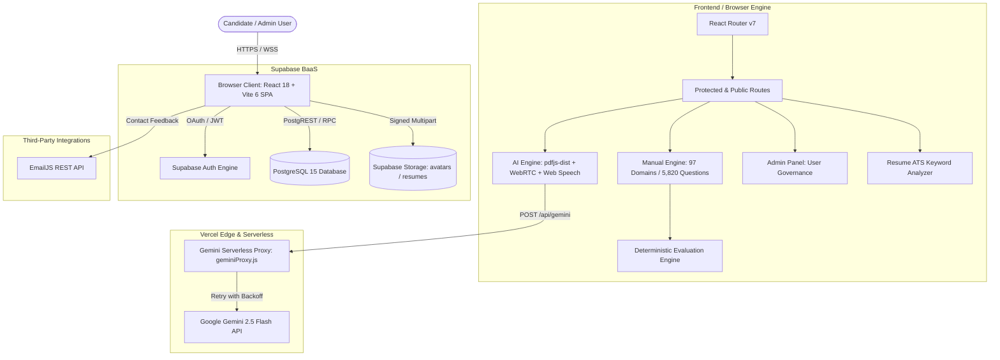

# PrepMatrix — Master Technical Documentation Suite

**Product Name**: PrepMatrix  
**Document Suite Version**: 1.0.0  
**Status**: Production Baseline  
**Auditor**: Senior Software Architect / Forensic Code Reviewer  
**Audit Date**: September 24, 2026  
**Repository Branch**: `main`  
**Git Origin**: `https://github.com/Anilchetri01/Prep-Matrix.git`  
**Live Production URL (Audited)**: `https://prep-matrix.vercel.app` (Identified as legacy Next.js quiz platform; see [TD-001](18_TECHNICAL_DEBT.md#31-deployment-live-site-desynchronization-td-001))

---

## 1. Executive Summary

PrepMatrix is a full-featured, multimodal interview preparation Software-as-a-Service (SaaS) web application. The platform prepares candidates for technical, managerial, and domain-specific employment interviews through two complementary paradigms:

1. **Manual Practice Mode**: A deterministic, rule-based question runner covering **97 career domains** across 15 industries, calibrated across 3 difficulty tiers (Beginner, Intermediate, Advanced) with automated multi-factor scoring based on keyword coverage, synonyms, semantic relevance, and structural completeness.
2. **AI Multimodal Interview Mode**: A resume-aware, adaptive simulation powered by **Google Gemini 2.5 Flash**, combining client-side PDF resume parsing, dynamic question synthesis, live WebRTC camera preview, real-time speech-to-text response capture, structured rubric grading, and instant PDF report generation.

This documentation suite was produced through an exhaustive, evidence-backed forensic reverse-engineering audit of the entire repository source code, build artifacts, database schemas, edge serverless proxies, and live web deployments.

---

## 2. High-Level Architecture Overview



---

## 3. Technology Stack Inventory

| Component / Layer | Technology | Version | Purpose & Function in PrepMatrix |
|---|---|---|---|
| **Frontend Framework** | React | `^18.3.1` | Core UI component lifecycle and declarative rendering |
| **Build Tool & Bundler** | Vite | `^6.0.5` | Fast HMR dev server and Rollup production asset compiler |
| **Type System** | TypeScript | `~5.6.2` | Compile-time type checking and domain model interfaces |
| **Routing** | React Router | `^7.1.1` | Declarative SPA route definitions, navigation, and guards |
| **CSS & Design System** | Tailwind CSS | `^4.0.0-beta.8` | Utility-first styling with "Midnight Signal" dark theme |
| **Icons & Visuals** | Lucide React | `^1.16.0` | Comprehensive iconography system across 97 domains |
| **Data Visualization** | Recharts | `^2.15.0` | SVG radar charts, session score distributions, and KPI trends |
| **Animation Physics** | Custom Spring Engine | In-house | 60 FPS mobile swipe gesture physics with directional locking |
| **Backend & DB** | Supabase (PostgreSQL) | `^2.47.10` (SDK) | User auth, PostgreSQL 15, Row Level Security, Storage |
| **AI LLM Engine** | Google Gemini API | `gemini-2.5-flash` | Resume question synthesis and 4-factor rubric answer grading |
| **Edge Serverless Proxy**| Express / Node.js | Serverless | `/api/gemini` reverse proxy protecting API secrets |
| **PDF Extraction** | pdfjs-dist | `^4.10.38` | In-browser client-side PDF text extraction worker |
| **PDF Generation** | jsPDF | `^2.5.2` | Client-side branded vector PDF report generation |
| **Voice Multimodal** | Web Speech API | Native Browser | `window.speechSynthesis` (TTS) and `SpeechRecognition` (STT) |
| **Camera Preview** | MediaDevices API | Native Browser | `getUserMedia` ephemeral video stream mirror |
| **Outbound Email** | EmailJS | `^3.2.0` | Browser-based user feedback and contact dispatch |

---

## 4. Complete 21-Document Suite Index

Every document in this suite is accessible via relative links below, written according to forensic evidence standards:

| Document | Title | File Link | Primary Contents & Focus |
|---|---|---|---|
| **01** | Product Requirements Document | [01_PRD.md](01_PRD.md) | Product vision, target personas, user journeys, 24 functional requirements (`FR-001` to `FR-024`), non-functional requirements, and verified business rules. |
| **02** | Software Requirements Specification | [02_SRS.md](02_SRS.md) | IEEE-style SRS: 16 module specifications (`SRS-FR-001` to `SRS-FR-016`), UI/API inventories, database schemas, and constraints. |
| **03** | Software Architecture Document | [03_ARCHITECTURE.md](03_ARCHITECTURE.md) | C4 diagrams, frontend/backend topology, mobile gesture spring physics equations, AI request flow, and security architecture. |
| **04** | Database Architecture & Schema | [04_DATABASE.md](04_DATABASE.md) | Complete PostgreSQL schema DDL, RLS security policies, trigger audits, RPC gap analysis, and Entity-Relationship diagrams. |
| **05** | API & Backend Specifications | [05_API.md](05_API.md) | Comprehensive contract specs for `/api/gemini`, Supabase PostgREST endpoints, RPC function definitions, and Web APIs. |
| **06** | UI/UX & Design System | [06_UI_UX.md](06_UI_UX.md) | 15 screen inventories, Midnight Signal design tokens, typography, gesture state machines, responsive breakpoints, and accessibility. |
| **07** | End-User Operations Manual | [07_USER_MANUAL.md](07_USER_MANUAL.md) | Candidate walkthrough for registration, manual question practice, AI multimodal interview execution, ATS resume scanning, and PDF reports. |
| **08** | Administrator Operations Manual | [08_ADMIN_MANUAL.md](08_ADMIN_MANUAL.md) | Admin portal guide: user search, role modification, account purging, platform stats monitoring, and backend SQL requirements. |
| **09** | Security & Threat Assessment | [09_SECURITY.md](09_SECURITY.md) | Code-level security audit, threat modeling (STRIDE), OWASP Top 10 evaluation, and vulnerability register (`SEC-001` to `SEC-007`). |
| **10** | Privacy & Ephemeral Data Map | [10_PRIVACY_DATA_MAP.md](10_PRIVACY_DATA_MAP.md) | Data inventory, verification of ephemeral zero-retention audio/video streams, third-party disclosure map, and GDPR/CCPA considerations. |
| **11** | AI & Machine Learning System | [11_AI_SYSTEM.md](11_AI_SYSTEM.md) | Gemini 2.5 Flash system prompts, JSON schemas, 4-factor rubric scoring, temperature tuning, and deterministic regex fallbacks. |
| **12** | Testing & Quality Assurance | [12_TESTING_QA.md](12_TESTING_QA.md) | Test catalog, gesture physics suite breakdown (9 suites, 100% pass), question bank validation (5,820 questions), and QA gaps. |
| **13** | DevOps & Deployment Guide | [13_DEPLOYMENT.md](13_DEPLOYMENT.md) | Local development setup, Vite build pipeline, Vercel SPA routing (`vercel.json`), Supabase migrations, and deployment troubleshooting. |
| **14** | Environment Variables Reference | [14_ENVIRONMENT_VARIABLES.md](14_ENVIRONMENT_VARIABLES.md) | Complete environment variable inventory, browser vs. serverless scopes, security risk classifications, and safe template examples. |
| **15** | Dependency & Package Audit | [15_DEPENDENCIES.md](15_DEPENDENCIES.md) | 42-package dependency inventory, version pinning, production vs dev analysis, open-source licenses, and Rollup chunk size audit. |
| **16** | Feature-to-Code Traceability | [16_TRACEABILITY.md](16_TRACEABILITY.md) | Forensic matrix mapping 30 application features (`FEAT-001` to `FEAT-030`) to exact UI routes, React components, services, and tests. |
| **17** | Requirements Traceability Matrix | [17_REQUIREMENTS_TRACEABILITY.md](17_REQUIREMENTS_TRACEABILITY.md) | Bidirectional RTM mapping `FR-001` to `FR-024` and `SRS-FR-001` to `SRS-FR-016` to implementation files, tests, and verification statuses. |
| **18** | Known Issues & Technical Debt | [18_TECHNICAL_DEBT.md](18_TECHNICAL_DEBT.md) | 12 technical debt items (`TD-001` to `TD-012`), root cause analysis, risk impact scores, and a phased remediation schedule. |
| **19** | System Discovery & Baseline | [19_SYSTEM_BASELINE.md](19_SYSTEM_BASELINE.md) | Initial discovery report, codebase topology, technology inventory, feature matrix, and deployment baseline. |
| **20** | Forensic Evidence Cross-Index | [20_EVIDENCE_INDEX.md](20_EVIDENCE_INDEX.md) | Master forensic index linking 40+ evidence tokens (`EVD-*`) to exact repository file paths and line ranges. |
| **21** | Master Documentation Index | [README_DOCUMENTATION.md](README_DOCUMENTATION.md) | Current document: central navigation portal, executive summary, cross-references, and completion report. |

---

## 5. Key Forensic Audit Findings

### 5.1 Deployment Desynchronization (TD-001 / P0)
- **Finding**: Accessing the live production URL `https://prep-matrix.vercel.app` loads a legacy Next.js application titled *"PrepMatrix - Quiz Practice Platform"*.
- **Reality**: The current Git repository contains a completely re-architected React 18 + Vite 6 Single Page Application (`Frontend/PrepMatrix/`) with 97 career domains, Gemini AI integration, and WebRTC preview.
- **Action**: Update the Vercel project's root directory setting from `.` to `Frontend/PrepMatrix` and redeploy.

### 5.2 Database RPC Gap (TD-002 / P1)
- **Finding**: Client services (`profileService.ts`, `leaderboardService.ts`) make RPC calls to `admin_list_users`, `admin_update_user_role`, `admin_delete_user`, `admin_platform_stats`, `get_public_candidates`, and `get_leaderboard`.
- **Reality**: `Backend/supabase/schema.sql` only defines basic tables and signup triggers; the SQL function definitions are missing. Client fallbacks keep the UI operational, but a migration script is required.

### 5.3 Security Hardening Needs (TD-003, TD-004, TD-007)
- **EmailJS Credentials**: Embedded directly in `Footer.tsx` (`service_ity2tkc`, `template_o917511`, `IelSj4qTjRselKe8k`).
- **Admin Route Guarding**: Gated solely in the browser client (`AdminRoute.tsx`); requires database-level `SECURITY DEFINER` checks.
- **Interviews Table Policy**: `public.interviews` contains a permissive `using (true)` read policy exposing candidate scores publicly.

### 5.4 Multimodal Audio/Video Privacy Verification (High Assurance)
- **Camera Feed**: Bound directly to an in-memory HTML `<video>` element using `navigator.mediaDevices.getUserMedia`. Frames are never captured, compressed, or transmitted across the network.
- **Microphone Feed**: Streamed ephemerally to the browser's native `SpeechRecognition` API. Raw audio bytes are never saved to disk or uploaded to cloud storage.

---

## 6. Build & Validation Verification Commands

The following automated verification commands were executed during this audit and confirmed passing:

```bash
# 1. Validate all 97 domains and 5,820 pre-seeded manual questions
npm run validate:manual-questions
# Result: 97/97 domains valid, 5,820 questions passed schema and keyword checks.

# 2. Run mobile drawer gesture physics suite
npm run test:gestures
# Result: 9 physics suites passed (directional locking, spring damping, snap-to-edge).

# 3. Compile production Vite bundle
npm run build
# Result: 3,365 modules transformed; production bundle compiled to dist/ (1.56 MB index.js).
```

---

## 7. Document Suite Maintenance & Governance

This technical documentation suite serves as the definitive engineering baseline for PrepMatrix. Any future modifications to application architecture, database schemas, API contracts, or environment variables must be updated across the corresponding documents in `docs/` and tracked against the [Requirements Traceability Matrix (17_REQUIREMENTS_TRACEABILITY.md)](17_REQUIREMENTS_TRACEABILITY.md).
